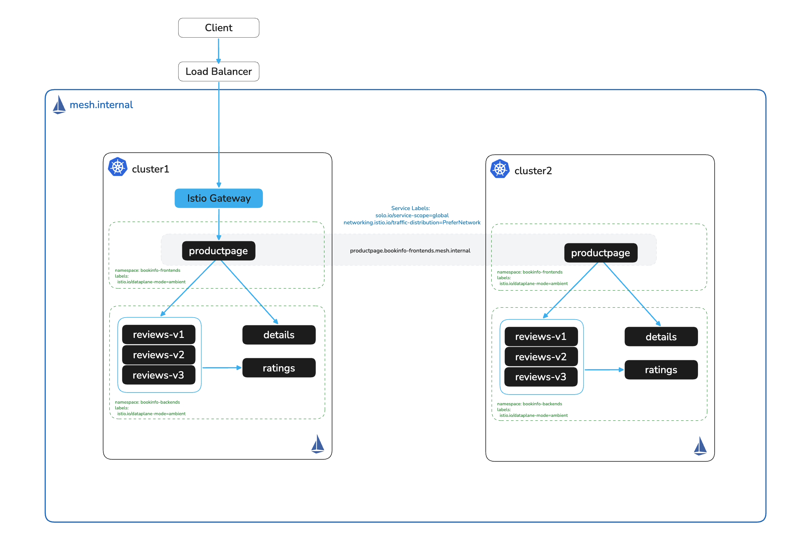

# Openshift Ambient Workshop

# Objectives
- Deploy Istio on Openshift with Helm based install
- Deploy sample microservices on two different namespaces (bookinfo app)
- Install Istio Ambient Mesh
- Enable Ambient Mesh for app namespaces (bookinfo-frontends and bookinfo-backends)
- Setup Ingress Gateway to access the bookinfo frontend (productpage)
- Link the two clusters
- Configure a globally available service using labels (productpage)
- Reconfigure ingress to global service hostname (*.<namespace>.mesh.internal)
- Isolate namespaces across clusters with Segments
- Expose services under custom hostnames with Global Aliases
- Establish zero-trust security using mesh access control policies
- Apply L7 traffic management (traffic splitting, fault injection, retries) with waypoints
- Egress Control
- Install the Solo Management UI for multicluster mesh visibility

# Use Cases
- Zero Trust (mTLS)
- Ingress
- Observability
- Multi-cluster routing
- Global service discovery
- High Availability
- Failover
- Namespace isolation across clusters (Segments)
- L7 traffic management (waypoints)

## Validated on
- OpenShift 4.16.0 - 4.19.30 (latest)
- Istio 1.30.2-solo
- Solo Management UI 0.5.1

# High Level Architecture Diagram


## License Key Details
This workshop requires a Solo Trial License Key, exported as `SOLO_TRIAL_LICENSE_KEY` in lab `002`.
Contact your Solo.io account team if you need one. Check the expiry before you start:

```bash
for SEG in $(echo "$SOLO_TRIAL_LICENSE_KEY" | tr '.' ' '); do
  case $(( ${#SEG} % 4 )) in 2) SEG="${SEG}==" ;; 3) SEG="${SEG}=" ;; esac
  EXP=$(printf '%s' "$SEG" | tr '_-' '/+' | base64 -d 2>/dev/null \
        | LC_ALL=C sed -n 's/.*"exp":\([0-9]*\).*/\1/p')
  [ -n "$EXP" ] && break
done

if [ -z "$EXP" ]; then
  echo "Could not read an expiry from SOLO_TRIAL_LICENSE_KEY. Is it set?"
else
  date -d "@$EXP" 2>/dev/null || date -r "$EXP"
fi
```