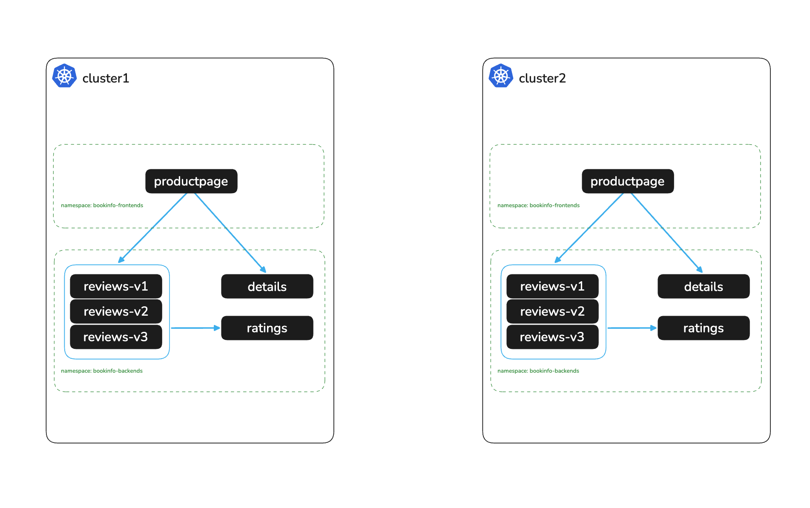

# Deploy Bookinfo Application

# Objectives
- Deploy the bookinfo sample application across two namespaces on cluster1 and cluster2
- Validate the application is accessible via port-forward



## Prerequisites
Ensure the following environment variables are set from the previous labs:
```bash
export CLUSTER1=cluster1
export CLUSTER2=cluster2
```

## Deploy Bookinfo on cluster1

Openshift SCC:
```bash
oc --context ${CLUSTER1} adm policy add-scc-to-group anyuid system:serviceaccounts:bookinfo-frontends
oc --context ${CLUSTER1} adm policy add-scc-to-group anyuid system:serviceaccounts:bookinfo-backends
```

Deploy bookinfo frontends in bookinfo-frontends namespace
```bash
kubectl apply -f bookinfo/bookinfo-frontends.yaml --context $CLUSTER1
```

Deploy bookinfo backends in bookinfo-backends namespace
```bash
kubectl apply -f bookinfo/bookinfo-backends.yaml --context $CLUSTER1
```

Wait for the applications to be deployed
```bash
for deploy in $(kubectl get deploy -n bookinfo-frontends --context $CLUSTER1 -o jsonpath='{.items[*].metadata.name}'); do
  echo "Waiting for frontend deployment '$deploy' to be ready in $CLUSTER1..."
  kubectl rollout status deploy/"$deploy" -n bookinfo-frontends --watch --timeout=90s --context $CLUSTER1
  done

for deploy in $(kubectl get deploy -n bookinfo-backends --context $CLUSTER1 -o jsonpath='{.items[*].metadata.name}'); do
  echo "Waiting for backend deployment '$deploy' to be ready in $CLUSTER1..."
  kubectl rollout status deploy/"$deploy" -n bookinfo-backends --watch --timeout=90s --context $CLUSTER1
  done
```

Update the reviews service to display which cluster it is coming from
```bash
kubectl --context ${CLUSTER1} -n bookinfo-backends set env deploy/reviews-v1 CLUSTER_NAME=${CLUSTER1}
kubectl --context ${CLUSTER1} -n bookinfo-backends set env deploy/reviews-v2 CLUSTER_NAME=${CLUSTER1}
kubectl --context ${CLUSTER1} -n bookinfo-backends set env deploy/reviews-v3 CLUSTER_NAME=${CLUSTER1}
```

Port forward to productpage in bookinfo-frontends namespace to validate application is working
```bash
kubectl port-forward svc/productpage -n bookinfo-frontends 9080:9080 --context $CLUSTER1
```
Navigate to http://localhost:9080/productpage

## Deploy Bookinfo on cluster2

Openshift SCC:
```bash
oc --context ${CLUSTER2} adm policy add-scc-to-group anyuid system:serviceaccounts:bookinfo-frontends
oc --context ${CLUSTER2} adm policy add-scc-to-group anyuid system:serviceaccounts:bookinfo-backends
```

Deploy bookinfo frontends in bookinfo-frontends namespace
```bash
kubectl apply -f bookinfo/bookinfo-frontends.yaml --context $CLUSTER2
```

Deploy bookinfo backends in bookinfo-backends namespace
```bash
kubectl apply -f bookinfo/bookinfo-backends.yaml --context $CLUSTER2
```

Wait for the applications to be deployed
```bash
for deploy in $(kubectl get deploy -n bookinfo-frontends --context $CLUSTER2 -o jsonpath='{.items[*].metadata.name}'); do
  echo "Waiting for frontend deployment '$deploy' to be ready in $CLUSTER2..."
  kubectl rollout status deploy/"$deploy" -n bookinfo-frontends --watch --timeout=90s --context $CLUSTER2
  done

for deploy in $(kubectl get deploy -n bookinfo-backends --context $CLUSTER2 -o jsonpath='{.items[*].metadata.name}'); do
  echo "Waiting for backend deployment '$deploy' to be ready in $CLUSTER2..."
  kubectl rollout status deploy/"$deploy" -n bookinfo-backends --watch --timeout=90s --context $CLUSTER2
  done
```

Update the reviews service to display which cluster it is coming from
```bash
kubectl --context ${CLUSTER2} -n bookinfo-backends set env deploy/reviews-v1 CLUSTER_NAME=${CLUSTER2}
kubectl --context ${CLUSTER2} -n bookinfo-backends set env deploy/reviews-v2 CLUSTER_NAME=${CLUSTER2}
kubectl --context ${CLUSTER2} -n bookinfo-backends set env deploy/reviews-v3 CLUSTER_NAME=${CLUSTER2}
```

Port forward to productpage in bookinfo-frontends namespace to validate application is working
```bash
kubectl port-forward svc/productpage -n bookinfo-frontends 9080:9080 --context $CLUSTER2
```
Navigate to http://localhost:9080/productpage

## Next Steps
At this point we have completed the following objectives
- Deployed the bookinfo sample application across two namespaces on cluster1 and cluster2
- Validated the application is accessible via port-forward

In the next step `002` we will install Istio on cluster1
