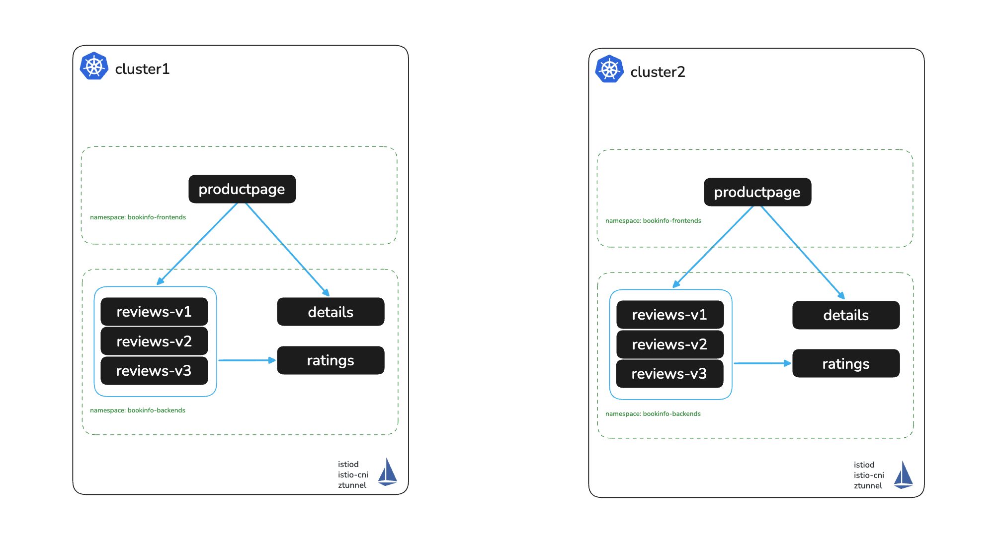

# Install Solo Istio Ambient on cluster1

# Objectives
- Deploy Istio on Openshift with Helm based install
- Install Istio Ambient Mesh



## Set cluster contexts
In this workshop, you can use your preferred cluster context. To set it, run the following command, replacing cluster1 with your desired context name
```bash
export CLUSTER1=cluster1
```

And export your Gloo Mesh license key variable and Istio version
```bash
export SOLO_TRIAL_LICENSE_KEY=$SOLO_TRIAL_LICENSE_KEY
export ISTIO_VERSION=1.29.0
```

## Install Solo istioctl
This will be required to use the `istioctl multicluster link` commands
```bash
OS=$(uname | tr '[:upper:]' '[:lower:]' | sed -E 's/darwin/osx/')
ARCH=$(uname -m | sed -E 's/aarch/arm/; s/x86_64/amd64/; s/armv7l/armv7/')

INSTALL_DIR="."
mkdir -p "$INSTALL_DIR"
curl -sSL https://storage.googleapis.com/soloio-istio-binaries/release/${ISTIO_VERSION}-solo/istioctl-${ISTIO_VERSION}-solo-${OS}-${ARCH}.tar.gz | tar xzf - -C "$INSTALL_DIR"
mv "${INSTALL_DIR}/istioctl" "${INSTALL_DIR}/solo-istioctl"
chmod +x "${INSTALL_DIR}/solo-istioctl"
```

Check the `istioctl version`
```bash
./solo-istioctl version
```

## Create istio-system namespace and shared root trust secret in cluster1
```bash
kubectl create namespace istio-system --context $CLUSTER1
kubectl apply -f shared-root-trust-secret.yaml --context $CLUSTER1
```

## Install Istio using Helm on cluster1

Install istio-base
```bash
helm upgrade --kube-context $CLUSTER1 --install istio-base oci://us-docker.pkg.dev/soloio-img/istio-helm/base -n istio-system --version $ISTIO_VERSION-solo --create-namespace

kubectl label namespace istio-system topology.istio.io/network=$CLUSTER1 --context $CLUSTER1
```

Install Kubernetes Gateway CRDs if required

**NOTE:** If you are using OpenShift >4.19 the Gateway API CRDs are already installed by default
```bash
kubectl get crd gateways.gateway.networking.k8s.io --context $CLUSTER1 &> /dev/null || \
  { kubectl --context $CLUSTER1 apply -f https://github.com/kubernetes-sigs/gateway-api/releases/download/v1.4.0/standard-install.yaml; }
```

Install istio-cni
```bash
helm upgrade --kube-context $CLUSTER1 --install istio-cni oci://us-docker.pkg.dev/soloio-img/istio-helm/cni \
-n kube-system \
--version=$ISTIO_VERSION-solo \
-f -<<EOF
profile: ambient
ambient:
  dnsCapture: true
excludeNamespaces:
  - istio-system
  - kube-system
global:
  platform: openshift
  hub: us-docker.pkg.dev/soloio-img/istio
  tag: $ISTIO_VERSION-solo
  variant: distroless
EOF
```

Wait for rollout to complete
```bash
kubectl rollout status ds/istio-cni-node -n kube-system --watch --timeout=90s --context $CLUSTER1
```

Install istiod
```bash
helm upgrade --kube-context $CLUSTER1 --install istiod oci://us-docker.pkg.dev/soloio-img/istio-helm/istiod \
-n istio-system \
--version=$ISTIO_VERSION-solo \
-f -<<EOF
profile: ambient
global:
  platform: openshift
  hub: us-docker.pkg.dev/soloio-img/istio
  tag: $ISTIO_VERSION-solo
  variant: distroless
  multiCluster:
    clusterName: $CLUSTER1
  network: $CLUSTER1
meshConfig:
  trustDomain: $CLUSTER1.local
env:
  # Enables assigning multi-cluster services an IP address
  PILOT_ENABLE_IP_AUTOALLOCATE: "true"
  # Disable selecting workload entries for local service routing.
  # Required for Gloo VirtualDestinaton functionality.
  PILOT_ENABLE_K8S_SELECT_WORKLOAD_ENTRIES: "false"
  # Required if you have distinct trust domains per-cluster
  PILOT_SKIP_VALIDATE_TRUST_DOMAIN: "true"
  # Enables experimental Gateway API features to be used
  #PILOT_ENABLE_ALPHA_GATEWAY_API: "true"
# Required to enable multi-cluster support
platforms:
  peering:
    enabled: true
license:
  value: $SOLO_TRIAL_LICENSE_KEY
EOF
```

Wait for rollout to complete
```bash
kubectl rollout status deploy/istiod -n istio-system --watch --timeout=90s --context $CLUSTER1
```

Install ztunnel
```bash
helm upgrade --kube-context $CLUSTER1 --install ztunnel oci://us-docker.pkg.dev/soloio-img/istio-helm/ztunnel \
-n kube-system \
--version=$ISTIO_VERSION-solo \
-f -<<EOF
profile: ambient
logLevel: info
global:
  platform: openshift
  hub: us-docker.pkg.dev/soloio-img/istio
  tag: $ISTIO_VERSION-solo
  variant: distroless
resources:
  requests:
      cpu: 500m
      memory: 2048Mi
istioNamespace: istio-system
env:
  L7_ENABLED: "true"
  # Required if you have distinct trust domains per-cluster
  SKIP_VALIDATE_TRUST_DOMAIN: "true"
# Must match the setting during Istio installation
network: $CLUSTER1
multiCluster:
  clusterName: $CLUSTER1
EOF
```

Wait for rollout to complete
```bash
kubectl rollout status ds/ztunnel -n kube-system --watch --timeout=90s --context $CLUSTER1
```

## Next Steps
At this point we have completed the following objectives
- Deployed Istio on Openshift with Helm based install on cluster1
- Installed Istio Ambient Mesh on cluster1

In the next step `003` we will install Istio on cluster2