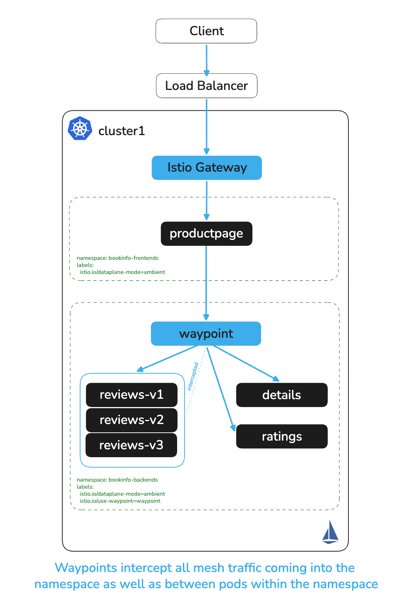
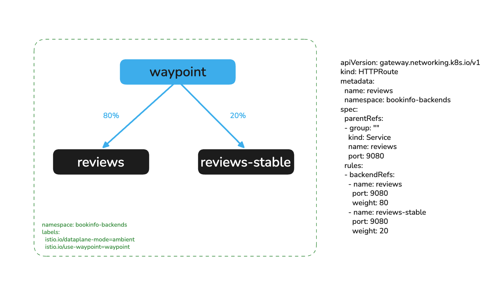
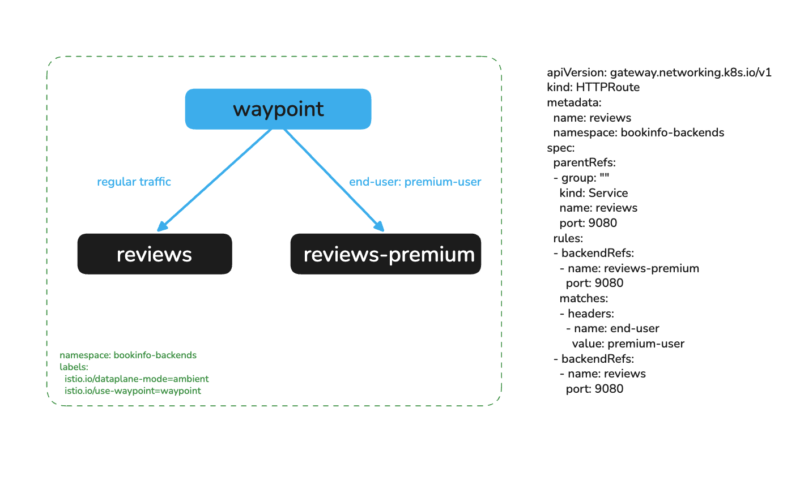
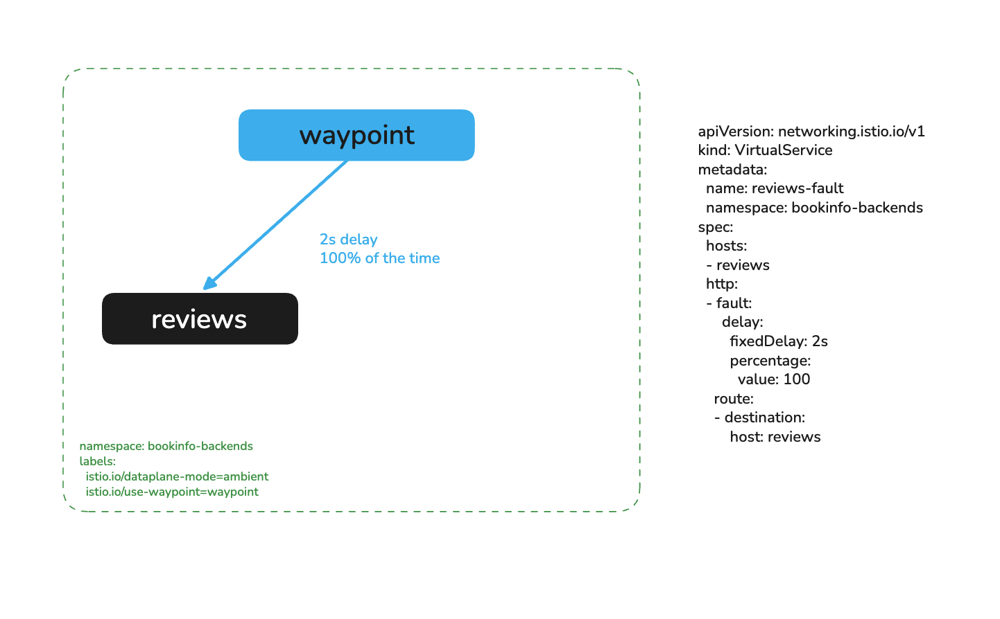
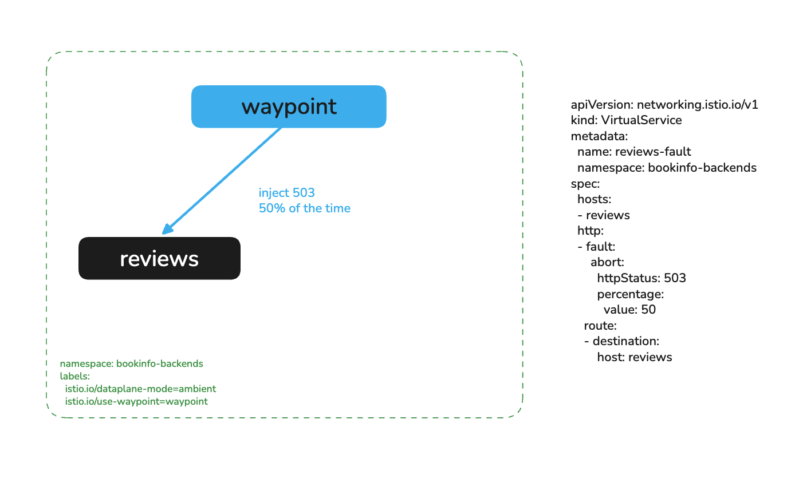
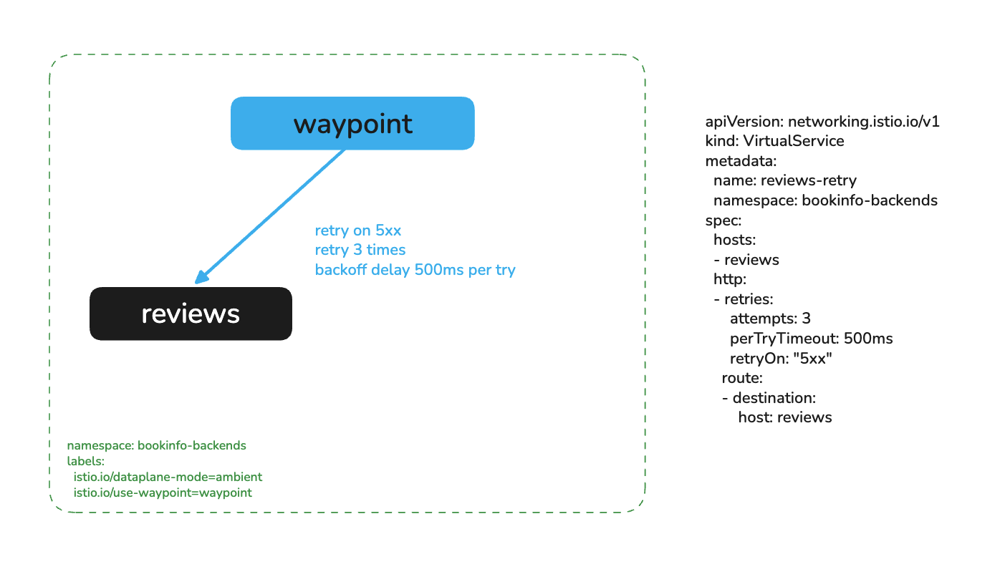

# L7 Traffic Management with Waypoints

# Objectives
- Deploy a namespace-scoped waypoint for `bookinfo-backends`
- Apply an L7 AuthorizationPolicy to enforce HTTP method restrictions
- Configure weighted traffic splitting across `reviews` service versions
- Inject faults to simulate upstream failures
- Configure retries to handle transient failures



## Prerequisites
- This lab assumes you have completed setup from labs `000-004`
- The `bookinfo-backends` namespace must be enrolled in the mesh.

Ensure the following environment variables are set:
```bash
export KUBECONTEXT_CLUSTER1=cluster1  # Replace with your actual kubectl context name
```

## Background

In Istio Ambient, ztunnel handles Layer 4 (mTLS, connection-level authorization) for all enrolled workloads. For Layer 7 capabilities — HTTP method/path authorization, traffic splitting, fault injection, retries, and timeouts — a **waypoint proxy** is required.

Waypoints are Envoy-based proxies created using the Kubernetes Gateway API. Once deployed and enrolled, all inbound traffic to services in the targeted namespace flows through the waypoint, enabling the full set of L7 features without any changes to application code.

## Deploy a namespace-scoped waypoint

Deploy a waypoint for the `bookinfo-backends` namespace:
```bash
kubectl apply --context $KUBECONTEXT_CLUSTER1 -f - <<EOF
apiVersion: gateway.networking.k8s.io/v1
kind: Gateway
metadata:
  name: waypoint
  namespace: bookinfo-backends
spec:
  gatewayClassName: istio-waypoint
  listeners:
  - name: mesh
    port: 15008
    protocol: HBONE
    allowedRoutes:
      namespaces:
        from: All
EOF
```

Wait for the waypoint to be ready:
```bash
kubectl rollout status deployment/waypoint -n bookinfo-backends --context $KUBECONTEXT_CLUSTER1
```

Label the `bookinfo-backends` namespace to route all inbound service traffic through the waypoint:
```bash
kubectl label namespace bookinfo-backends istio.io/use-waypoint=waypoint --context $KUBECONTEXT_CLUSTER1
```

Verify the waypoint pod is running alongside the bookinfo backend pods:
```bash
kubectl get pods -n bookinfo-backends --context $KUBECONTEXT_CLUSTER1
```

All inbound L7 traffic to services in `bookinfo-backends` now flows through this waypoint.

Enable access logging on the waypoint so requests are visible in the logs throughout this lab:
```bash
kubectl apply --context $KUBECONTEXT_CLUSTER1 -f - <<EOF
apiVersion: telemetry.istio.io/v1
kind: Telemetry
metadata:
  name: waypoint-access-logging
  namespace: bookinfo-backends
spec:
  targetRefs:
  - kind: Gateway
    group: gateway.networking.k8s.io
    name: waypoint
  accessLogging:
  - providers:
    - name: envoy
EOF
```

## L7 Authorization Policy

Lab `009` used L4 authorization via ztunnel — policies that allow or deny based on workload identity (SPIFFE). Because ztunnel operates at L4, it cannot inspect HTTP attributes such as method or path.

With a waypoint in place, you can enforce at the HTTP level. Apply an L7 `AuthorizationPolicy` that restricts the `reviews` service to only allow `GET` requests:
```bash
kubectl apply --context $KUBECONTEXT_CLUSTER1 -f - <<EOF
apiVersion: security.istio.io/v1
kind: AuthorizationPolicy
metadata:
  name: reviews-l7-policy
  namespace: bookinfo-backends
spec:
  targetRefs:
  - kind: Service
    group: ""
    name: reviews
  action: ALLOW
  rules:
  - to:
    - operation:
        methods: ["GET"]
EOF
```

> **Note:** L7 policies processed by a waypoint use `targetRefs` instead of `selector`.

Verify a `GET` request succeeds:
```bash
kubectl exec deploy/productpage-v1 -n bookinfo-frontends --context $KUBECONTEXT_CLUSTER1 -- \
  python3 -c "import urllib.request; print(urllib.request.urlopen('http://reviews.bookinfo-backends:9080/reviews/0').getcode())"
```

You should see `200`.

Now try a `DELETE` request, which is not in the allowed methods:
```bash
kubectl exec deploy/productpage-v1 -n bookinfo-frontends --context $KUBECONTEXT_CLUSTER1 -- \
  python3 -c "
import urllib.request, urllib.error
req = urllib.request.Request('http://reviews.bookinfo-backends:9080/reviews/0', method='DELETE')
try:
    print(urllib.request.urlopen(req).getcode())
except urllib.error.HTTPError as e:
    print(e.code)"
```

You should see `403`. The waypoint enforces the policy before the request ever reaches the reviews pod.

Check the waypoint logs to see the RBAC enforcement:
```bash
kubectl logs -n bookinfo-backends deploy/waypoint --context $KUBECONTEXT_CLUSTER1 | grep -i "rbac\|403"
```

Remove the L7 auth policy and access logging before continuing:
```bash
kubectl delete authorizationpolicy reviews-l7-policy -n bookinfo-backends --context $KUBECONTEXT_CLUSTER1
kubectl delete telemetry waypoint-access-logging -n bookinfo-backends --context $KUBECONTEXT_CLUSTER1
```


## Traffic Shifting

With the waypoint in place, the `HTTPRoute` resource can control how traffic is distributed across backend services — enabling canary deployments and user-segment routing without any application changes.

This lab uses two additional version-pinned Services that are not part of the base `bookinfo-backends` manifest:
- `reviews-stable` — selects only `reviews-v3` pods (red stars), the version engineering has deemed most stable
- `reviews-premium` — selects only `reviews-v2` pods (black stars), used to deliver a distinct experience to premium users

Apply them now:
```bash
kubectl apply --context $KUBECONTEXT_CLUSTER1 -f bookinfo/bookinfo-waypoint-services.yaml
```

### Story 1 — Canary shift to stable

The team wants to gradually shift traffic from the current production version (v1, no stars) to `reviews-stable` (v3, red stars). To make the canary signal unambiguous, patch the `reviews` Service selector to pin it to `version: v1` before starting — this eliminates the round-robin noise across all three pod versions:
```bash
kubectl patch svc reviews -n bookinfo-backends --context $KUBECONTEXT_CLUSTER1 \
  --type=merge -p '{"spec":{"selector":{"app":"reviews","version":"v1"}}}'
```

Navigate to the productpage and confirm all requests show no stars (v1):
```bash
SVC=$(kubectl -n istio-system get svc ingress-istio --context $KUBECONTEXT_CLUSTER1 --no-headers | awk '{ print $4 }')
echo http://$SVC/productpage
```

### How the waypoint enables canary shifting

In traditional Kubernetes, traffic splitting requires a service mesh sidecar or an external load balancer to intercept and weight requests. In Istio Ambient, ztunnel handles all of this at L4 — but L4 means connection-level routing only. ztunnel cannot inspect HTTP attributes or distribute individual requests across weighted backends.

The waypoint changes this. Because all inbound traffic to `bookinfo-backends` now flows through the waypoint, Envoy sits in the path of every HTTP request before it reaches a pod. The `HTTPRoute` resource programs the waypoint with weighted backend rules: when a request arrives for the `reviews` Service, the waypoint evaluates the route, selects a backend (`reviews` or `reviews-stable`) according to the configured weights, and forwards the request to a pod in that service — all transparently, with no changes to the application or the client.

This is why the waypoint is a prerequisite for canary shifting in Ambient: without it, there is no L7 proxy in the data path to enforce the weighted routing.

Now apply an HTTPRoute to introduce the canary at 20%:
```bash
kubectl apply --context $KUBECONTEXT_CLUSTER1 -f - <<EOF
apiVersion: gateway.networking.k8s.io/v1
kind: HTTPRoute
metadata:
  name: reviews
  namespace: bookinfo-backends
spec:
  parentRefs:
  - group: ""
    kind: Service
    name: reviews
    port: 9080
  rules:
  - backendRefs:
    - name: reviews
      port: 9080
      weight: 80
    - name: reviews-stable
      port: 9080
      weight: 20
EOF
```

Refresh the productpage several times — you should see mostly no stars with red stars appearing roughly 20% of the time.



Once confidence is high, complete the rollout to 100% `reviews-stable`:
```bash
kubectl apply --context $KUBECONTEXT_CLUSTER1 -f - <<EOF
apiVersion: gateway.networking.k8s.io/v1
kind: HTTPRoute
metadata:
  name: reviews
  namespace: bookinfo-backends
spec:
  parentRefs:
  - group: ""
    kind: Service
    name: reviews
    port: 9080
  rules:
  - backendRefs:
    - name: reviews-stable
      port: 9080
      weight: 100
EOF
```

All requests should now consistently show red stars — the canary is complete.

### Story 2 — Header-based routing for premium users

The team wants to route users with the `end-user: premium-user` header to `reviews-premium` (v2, black stars), while all other traffic continues to `reviews`. This lets premium users get a distinct experience without affecting the general population.

Apply an `HTTPRoute` with a header match rule:
```bash
kubectl apply --context $KUBECONTEXT_CLUSTER1 -f - <<EOF
apiVersion: gateway.networking.k8s.io/v1
kind: HTTPRoute
metadata:
  name: reviews
  namespace: bookinfo-backends
spec:
  parentRefs:
  - group: ""
    kind: Service
    name: reviews
    port: 9080
  rules:
  - backendRefs:
    - name: reviews-premium
      port: 9080
    matches:
    - headers:
      - name: end-user
        value: premium-user
  - backendRefs:
    - name: reviews
      port: 9080
EOF
```

Verify a standard request goes to the default `reviews` — still pinned to v1 (no stars):
```bash
kubectl exec deploy/productpage-v1 -n bookinfo-frontends --context $KUBECONTEXT_CLUSTER1 -- \
  python3 -c "import urllib.request, json; print(json.dumps(json.load(urllib.request.urlopen('http://reviews.bookinfo-backends:9080/reviews/0')), indent=2))"
```

Now send a request with the premium header and confirm it hits `reviews-premium` (v2, black stars):
```bash
kubectl exec deploy/productpage-v1 -n bookinfo-frontends --context $KUBECONTEXT_CLUSTER1 -- \
  python3 -c "
import urllib.request, json
req = urllib.request.Request('http://reviews.bookinfo-backends:9080/reviews/0', headers={'end-user': 'premium-user'})
print(json.dumps(json.load(urllib.request.urlopen(req)), indent=2))"
```

The response from `reviews-v2` includes a `"color": "black"` field in the ratings — confirming the header match routed the request to `reviews-premium`.

You can also verify via the productpage browser UI. The productpage forwards the `end-user` cookie as a header to downstream services. Log in as `premium-user` using the **Sign in** button (any password), then refresh — you should consistently see black stars.



Clean up the HTTPRoute before continuing:
```bash
kubectl delete httproute reviews -n bookinfo-backends --context $KUBECONTEXT_CLUSTER1 --ignore-not-found
```

## Fault Injection

Fault injection lets you introduce artificial failures to test how your application handles upstream errors. This is a waypoint-only capability — ztunnel cannot inject HTTP-level faults.

Apply a `VirtualService` that introduces a 2-second delay on 100% of requests to `reviews`:
```bash
kubectl apply --context $KUBECONTEXT_CLUSTER1 -f - <<EOF
apiVersion: networking.istio.io/v1
kind: VirtualService
metadata:
  name: reviews-fault
  namespace: bookinfo-backends
spec:
  hosts:
  - reviews
  http:
  - fault:
      delay:
        fixedDelay: 2s
        percentage:
          value: 100
    route:
    - destination:
        host: reviews
EOF
```

Time a request to `reviews` and observe the delay:
```bash
kubectl exec deploy/productpage-v1 -n bookinfo-frontends --context $KUBECONTEXT_CLUSTER1 -- \
  python3 -c "
import urllib.request, time
t = time.time()
urllib.request.urlopen('http://reviews.bookinfo-backends:9080/reviews/0')
print(f'Response time: {time.time()-t:.3f}s')"
```

You should see approximately a 2-second response time.



Now replace the delay with an HTTP abort, returning `503` on 50% of requests:
```bash
kubectl apply --context $KUBECONTEXT_CLUSTER1 -f - <<EOF
apiVersion: networking.istio.io/v1
kind: VirtualService
metadata:
  name: reviews-fault
  namespace: bookinfo-backends
spec:
  hosts:
  - reviews
  http:
  - fault:
      abort:
        httpStatus: 503
        percentage:
          value: 50
    route:
    - destination:
        host: reviews
EOF
```

Send 10 requests and observe the mix of responses:
```bash
for i in $(seq 1 10); do
  kubectl exec deploy/productpage-v1 -n bookinfo-frontends --context $KUBECONTEXT_CLUSTER1 -- \
    python3 -c "
import urllib.request, urllib.error
try: print(urllib.request.urlopen('http://reviews.bookinfo-backends:9080/reviews/0').getcode())
except urllib.error.HTTPError as e: print(e.code)"
done
```

You should see a roughly 50/50 mix of `200` and `503` responses.

Remove the fault injection before continuing:
```bash
kubectl delete virtualservice reviews-fault -n bookinfo-backends --context $KUBECONTEXT_CLUSTER1
```



## Retries

With fault injection you saw raw failures reaching the caller. Retries let the mesh absorb transient failures transparently.

Apply a single VirtualService that combines the 50% abort fault with a retry policy. Fault injection and retries must be in the same `http` rule — Istio does not support two VirtualServices for the same host:
```bash
kubectl apply --context $KUBECONTEXT_CLUSTER1 -f - <<EOF
apiVersion: networking.istio.io/v1
kind: VirtualService
metadata:
  name: reviews-fault
  namespace: bookinfo-backends
spec:
  hosts:
  - reviews
  http:
  - fault:
      abort:
        httpStatus: 503
        percentage:
          value: 50
    retries:
      attempts: 3
      perTryTimeout: 500ms
      retryOn: "5xx"
    route:
    - destination:
        host: reviews
EOF
```

Send 10 requests:
```bash
for i in $(seq 1 10); do
  kubectl exec deploy/productpage-v1 -n bookinfo-frontends --context $KUBECONTEXT_CLUSTER1 -- \
    python3 -c "
import urllib.request, urllib.error
try: print(urllib.request.urlopen('http://reviews.bookinfo-backends:9080/reviews/0').getcode())
except urllib.error.HTTPError as e: print(e.code)"
done
```

You should now see mostly `200` responses. Each retry is an independent trial against the 50% fault — the probability all 3 attempts fail is 0.5³ = 12.5%. The mesh is absorbing the majority of faults transparently before they reach the caller.



## Cleanup

Remove all VirtualServices and the HTTPRoute created in this lab:
```bash
kubectl delete virtualservice reviews-fault -n bookinfo-backends --context $KUBECONTEXT_CLUSTER1 --ignore-not-found
kubectl delete httproute reviews -n bookinfo-backends --context $KUBECONTEXT_CLUSTER1 --ignore-not-found
```

Remove the lab-specific Services:
```bash
kubectl delete -f bookinfo/bookinfo-waypoint-services.yaml --context $KUBECONTEXT_CLUSTER1 --ignore-not-found
```

Restore the `reviews` Service selector to its original state (all versions):
```bash
kubectl patch svc reviews -n bookinfo-backends --context $KUBECONTEXT_CLUSTER1 \
  --type=merge -p '{"spec":{"selector":{"app":"reviews","version":null}}}'
```

The waypoint and namespace label can remain in place for lab `011` — they do not conflict with the egress configuration.

To fully remove the waypoint if needed:
```bash
kubectl label namespace bookinfo-backends istio.io/use-waypoint- --context $KUBECONTEXT_CLUSTER1
kubectl delete gateway waypoint -n bookinfo-backends --context $KUBECONTEXT_CLUSTER1
```

## Next Steps
At this point we have completed the following objectives:
- Deployed a namespace-scoped waypoint for `bookinfo-backends`
- Applied an L7 AuthorizationPolicy to enforce HTTP method restrictions
- Configured weighted traffic splitting across `reviews` service versions
- Injected delays and HTTP aborts to simulate upstream failures
- Configured retries and timeouts to handle transient failures

In the next step `011` we will inspect ztunnel and istiod metrics
