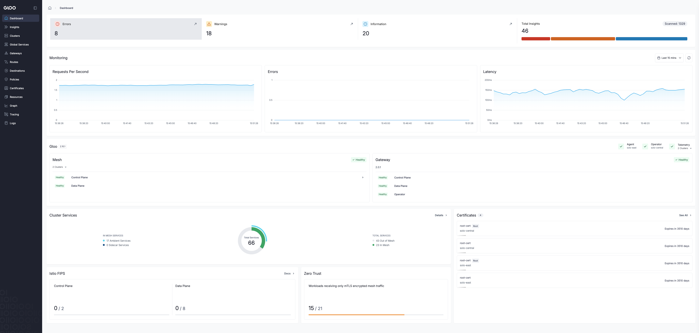
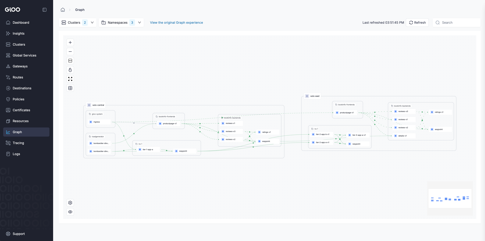

# Deploy the Gloo Mesh Control Plane on cluster1

# Objectives
- Install the Gloo Platform management plane on cluster1
- Configure OpenShift Routes to expose the Gloo UI, management server, and telemetry gateway
- Register cluster2 as a workload cluster with the management plane
- Access the Gloo Mesh UI





### Prerequisites
This lab assumes that you have completed the setup in `011`

## Set environment variables
In this workshop, we are going to use `cluster1` as the cluster where Gloo Mesh control plane lives, just as a refresh we will set all the required environment variables again
```bash
export GLOO_MESH_VERSION=2.12.0

export CLUSTER1=cluster1
export CLUSTER2=cluster2
```

Create the `gloo-mesh` namespace on cluster1
```bash
kubectl create namespace gloo-mesh --context ${CLUSTER1}
```

The Gloo Platform telemetry collector (an OpenTelemetry Collector) runs as a DaemonSet and needs to collect host-level metrics and access node network interfaces to scrape telemetry data from the mesh. On OpenShift, this requires the `privileged` Security Context Constraint (SCC) — the default `restricted` SCC prevents pods from accessing host paths and running with the elevated permissions the collector needs. The rolebinding grants the `gloo-mesh` service account permission to use the `privileged` SCC. This is applied to both clusters since each runs a telemetry collector.

```bash
kubectl apply -f scc/privileged/privileged-rolebinding.yaml --context ${CLUSTER1}
```

Discover the UID range OpenShift has assigned to the gloo-mesh namespace and use the minimum value for the Prometheus securityContext. OpenShift assigns a unique UID range per namespace — hardcoding a UID that falls outside that range will cause Prometheus pods to fail admission against the restricted-v2 SCC.
```bash
export PROM_UID=$(kubectl get namespace gloo-mesh --context ${CLUSTER1} \
  -o jsonpath='{.metadata.annotations.openshift\.io/sa\.scc\.uid-range}' \
  | cut -d'/' -f1)
```

Install the Gloo Platform CRDs
```bash
helm upgrade -i gloo-platform-crds gloo-platform/gloo-platform-crds \
  --version=${GLOO_MESH_VERSION} \
  --kube-context ${CLUSTER1} \
  --namespace=gloo-mesh
```

Install the Gloo Platform management plane on cluster1. The `glooMgmtServer` and `telemetryGateway` services are exposed as `ClusterIP` because we will set up the agent on cluster2 to reach each other using OpenShift Routes

> **Private registry users:** Each component below includes a commented-out `image` override block. Uncomment and update the `registry`, `repository`, and `tag` fields to point to your private registry before running this command.

```bash
helm upgrade --install gloo-platform gloo-platform \
  --repo https://storage.googleapis.com/gloo-platform/helm-charts \
  --namespace gloo-mesh \
  --kube-context ${CLUSTER1} \
  --version ${GLOO_MESH_VERSION} \
  -f -<<EOF
licensing:
  glooTrialLicenseKey: ${SOLO_TRIAL_LICENSE_KEY}
common:
  cluster: "${CLUSTER1}"
glooMgmtServer:
  extraEnvs:
    RELAY_DISABLE_CLIENT_CERTIFICATE_AUTHENTICATION:
      value: "true"
    RELAY_TOKEN:
      value: "relay-token"
  enabled: true
  registerCluster: true
  ports:
    healthcheck: 8091
  serviceType: ClusterIP
  floatingUserId: true
  # override
  #image:
  #  registry: gcr.io/gloo-mesh
  #  repository: gloo-mesh-mgmt-server
  #  tag: ${GLOO_MESH_VERSION}
  relay:
    serverAddress: gloo-mesh-mgmt-server:9900
glooAgent:
  enabled: true
  extraEnvs:
    RELAY_TOKEN:
      value: "relay-token"
    RELAY_DISABLE_SERVER_CERTIFICATE_VALIDATION:
      value: "true"
  runAsSidecar: false
  floatingUserId: true
  # override
  #image:
  #  registry: gcr.io/gloo-mesh
  #  repository: gloo-mesh-agent
  #  tag: ${GLOO_MESH_VERSION}
  relay:
    serverAddress: gloo-mesh-mgmt-server:9900
    authority: "gloo-mesh-mgmt-server.gloo-mesh"
glooUi:
  enabled: true
  floatingUserId: true
  serviceType: ClusterIP
  # override
  #image:
  #  registry: gcr.io/gloo-mesh
  #  repository: gloo-mesh-apiserver
  #  tag: ${GLOO_MESH_VERSION}
  #sidecars:
  #  console:
  #    image:
  #      registry: gcr.io/gloo-mesh
  #      repository: gloo-mesh-ui
  #      tag: ${GLOO_MESH_VERSION}
  #  envoy:
  #    image:
  #      registry: gcr.io/gloo-mesh
  #      repository: gloo-mesh-envoy
  #      tag: ${GLOO_MESH_VERSION}
redis:
  deployment:
    enabled: true
    floatingUserId: true
    podSecurityContext: {}
    # override
    #image:
    #  registry: docker.io
    #  repository: redis
    #  tag: 7.4.2-alpine
prometheus:
  enabled: true
  server:
    securityContext:
      fsGroup: ${PROM_UID}
      runAsGroup: ${PROM_UID}
      runAsNonRoot: true
      runAsUser: ${PROM_UID}
    # override
    #image:
    #  registry: gcr.io/gloo-mesh/prometheus
    #  tag: v3.5.0
  prometheus-server-migration:
    # override
    #image:
    #  pullPolicy: IfNotPresent
    #  registry: gcr.io/gloo-mesh
    #  repository: kubectl
    #  tag: 1.18.0-rc1
telemetryGateway:
  enabled: true
  # override
  #image:
  #  repository: gcr.io/gloo-mesh/gloo-otel-collector
  #  tag: 0.2.4
  service:
    type: ClusterIP
telemetryCollector:
  enabled: true
  mode: deployment
  replicaCount: 1
  config:
    exporters:
      otlp:
        endpoint: gloo-telemetry-gateway:4317
telemetryCollectorCustomization:
  pipelines:
    logs/ui:
      enabled: true
      pipeline:
        exporters:
        - redisstream/ui
    metrics/ui:
      enabled: true
      pipeline:
        exporters:
        - prometheus
featureGates:
  insightsConfiguration: true
glooInsightsEngine:
  enabled: true
glooAnalyzer:
  enabled: true
  runAsSidecar: true
EOF
```

Check to see that the pods are running in the gloo-mesh namespace
```bash
kubectl get pods -n gloo-mesh --context ${CLUSTER1}
```

The output should look similar to below
```
% k get pods -n gloo-mesh
NAME                                       READY   STATUS    RESTARTS   AGE
gloo-mesh-agent-7749dd9c97-k6jr2           1/1     Running   0          60s
gloo-mesh-mgmt-server-7ccc68f4b-7mmd6      1/1     Running   0          60s
gloo-mesh-redis-698d5cb6cd-5tggk           1/1     Running   0          60s
gloo-mesh-ui-7cdfdf4d9c-w2ngk              3/3     Running   0          60s
gloo-telemetry-collector-fd59fb7bc-t6cqd   1/1     Running   0          60s
gloo-telemetry-gateway-b64f54bcf-r6rtf     1/1     Running   0          60s
prometheus-server-5d6657746d-h7qgq         2/2     Running   0          60s
```

## Configure OpenShift Routes

Expose the Gloo UI an OpenShift Route
```bash
kubectl apply --context ${CLUSTER1} -f - <<EOF
kind: Route
apiVersion: route.openshift.io/v1
metadata:
  name: gloo-mesh-ui
  namespace: gloo-mesh
spec:
  subdomain: gloo-mesh-ui
  to:
    kind: Service
    name: gloo-mesh-ui
    weight: 100
  port:
    targetPort: console
  tls:
    termination: edge
    insecureEdgeTerminationPolicy: Redirect
  wildcardPolicy: None
EOF
```

Get the URL for our Gloo UI OCP Route. It may take a moment before the Gloo UI is fully up and running and accessible through the route. Feel free to continue with the lab
```bash
export GLOO_UI_ADDRESS=$(oc get route gloo-mesh-ui -n gloo-mesh --context ${CLUSTER1} -o jsonpath='{.status.ingress[0].host}')

echo https://$GLOO_UI_ADDRESS
```

Expose the `gloo-mesh-mgmt-server` using an OpenShift Route. This will allow the agent in our second workload cluster to reach the gloo mesh management server
```bash
kubectl apply --context ${CLUSTER1} -f - <<EOF
kind: Route
apiVersion: route.openshift.io/v1
metadata:
  name: gloo-mesh-mgmt-server
  namespace: gloo-mesh
  annotations:
    # Needed for the different agents to connect to different replica instance of the management server deployment
    haproxy.router.openshift.io/balance: roundrobin
spec:
  subdomain: gloo-mesh-mgmt-server
  to:
    kind: Service
    name: gloo-mesh-mgmt-server
    weight: 100
  port:
    targetPort: grpc
  tls:
    termination: passthrough
    insecureEdgeTerminationPolicy: Redirect
  wildcardPolicy: None
EOF
```

Expose the `gloo-telemetry-gateway` using an OpenShift Route. This will allow the telemetry collectors in our second workload cluster to reach the telemetry gateway
```bash
kubectl apply --context ${CLUSTER1} -f - <<EOF
kind: Route
apiVersion: route.openshift.io/v1
metadata:
  name: gloo-telemetry-gateway
  namespace: gloo-mesh
spec:
  subdomain: gloo-telemetry-gateway
  to:
    kind: Service
    name: gloo-telemetry-gateway
    weight: 100
  port:
    targetPort: otlp
  tls:
    termination: passthrough
    insecureEdgeTerminationPolicy: Redirect
  wildcardPolicy: None
EOF
```

Then, you need to set the environment variable to tell the Gloo Mesh agents how to communicate with the management plane:

```bash
export ENDPOINT_GLOO_MESH=$(oc get route gloo-mesh-mgmt-server -n gloo-mesh --context ${CLUSTER1} -o jsonpath='{.status.ingress[0].host}')
export ENDPOINT_TELEMETRY_GATEWAY=$(oc get route gloo-telemetry-gateway -n gloo-mesh --context ${CLUSTER1} -o jsonpath='{.status.ingress[0].host}')


echo "Mgmt Plane Address: $ENDPOINT_GLOO_MESH"
echo "Metrics Gateway Address: $ENDPOINT_TELEMETRY_GATEWAY"
```

# Register our second workload cluster
```bash
kubectl apply --context ${CLUSTER1} -f - <<EOF
apiVersion: admin.gloo.solo.io/v2
kind: KubernetesCluster
metadata:
  name: ${CLUSTER2}
  namespace: gloo-mesh
spec:
  clusterDomain: cluster.local
EOF

kubectl --context ${CLUSTER2} create ns gloo-mesh

kubectl apply -f scc/privileged/privileged-rolebinding.yaml --context ${CLUSTER2}

kubectl get secret relay-root-tls-secret -n gloo-mesh --context ${CLUSTER1} -o jsonpath='{.data.ca\.crt}' | base64 -d > ca.crt
kubectl create secret generic relay-root-tls-secret -n gloo-mesh --context ${CLUSTER2} --from-file ca.crt=ca.crt
rm ca.crt

kubectl get secret relay-identity-token-secret -n gloo-mesh --context ${CLUSTER1} -o jsonpath='{.data.token}' | base64 -d > token
kubectl create secret generic relay-identity-token-secret -n gloo-mesh --context ${CLUSTER2} --from-file token=token
rm token

helm upgrade --install gloo-platform-crds gloo-platform-crds \
  --repo https://storage.googleapis.com/gloo-platform/helm-charts \
  --namespace gloo-mesh \
  --kube-context ${CLUSTER2} \
  --version ${GLOO_MESH_VERSION}

helm upgrade --install gloo-agent gloo-platform \
  --repo https://storage.googleapis.com/gloo-platform/helm-charts \
  --namespace gloo-mesh \
  --kube-context ${CLUSTER2} \
  --version ${GLOO_MESH_VERSION} \
  -f -<<EOF
common:
  cluster: ${CLUSTER2}
glooAgent:
  enabled: true
  extraEnvs:
    RELAY_TOKEN:
      value: "relay-token"
    RELAY_DISABLE_SERVER_CERTIFICATE_VALIDATION:
      value: "true"
  relay:
    serverAddress: "${ENDPOINT_GLOO_MESH}:443"
    authority: "${ENDPOINT_GLOO_MESH}"
  floatingUserId: true
telemetryCollector:
  enabled: true
  config:
    exporters:
      otlp:
        endpoint: "${ENDPOINT_TELEMETRY_GATEWAY}:443"
telemetryCollectorCustomization:
  skipVerify: true
  serverName: "${ENDPOINT_TELEMETRY_GATEWAY}"
glooAnalyzer:
  enabled: true
  runAsSidecar: true
EOF
```

# Access the Gloo UI

Using the OpenShift route
```bash
export GLOO_UI_ADDRESS=$(oc get route gloo-mesh-ui -n gloo-mesh --context ${CLUSTER1} -o jsonpath='{.status.ingress[0].host}')

echo https://$GLOO_UI_ADDRESS
```

Using port-forward
```bash
kubectl port-forward svc/gloo-mesh-ui -n gloo-mesh 8090:8090 --context ${CLUSTER1}
```

# Uninstall

```bash
kubectl delete routes -n gloo-mesh --all --context ${CLUSTER1}
kubectl delete kubernetescluster --all -n gloo-mesh --context ${CLUSTER1}

helm uninstall gloo-agent -n gloo-mesh --kube-context ${CLUSTER1}
helm uninstall gloo-agent -n gloo-mesh --kube-context ${CLUSTER2}

helm uninstall gloo-platform-crds -n gloo-mesh --kube-context ${CLUSTER1}
helm uninstall gloo-platform-crds -n gloo-mesh --kube-context ${CLUSTER2}

kubectl delete ns gloo-mesh --context ${CLUSTER1}
kubectl delete ns gloo-mesh --context ${CLUSTER2}
```

## Congratulations!

You have completed the workshop! You have successfully:
- Deployed the bookinfo application across two clusters
- Installed Istio Ambient Mesh on both clusters
- Enrolled workloads into the mesh and validated mTLS with ztunnel
- Exposed the bookinfo application via an Ingress Gateway
- Configured multicluster connectivity and failover
- Isolated namespaces across clusters with Segments
- Enforced zero-trust access control policies
- Configured egress with a waypoint
- Deployed the Gloo Mesh Enterprise control plane

If you would like to clean up all workshop resources, see `012` for cleanup instructions.