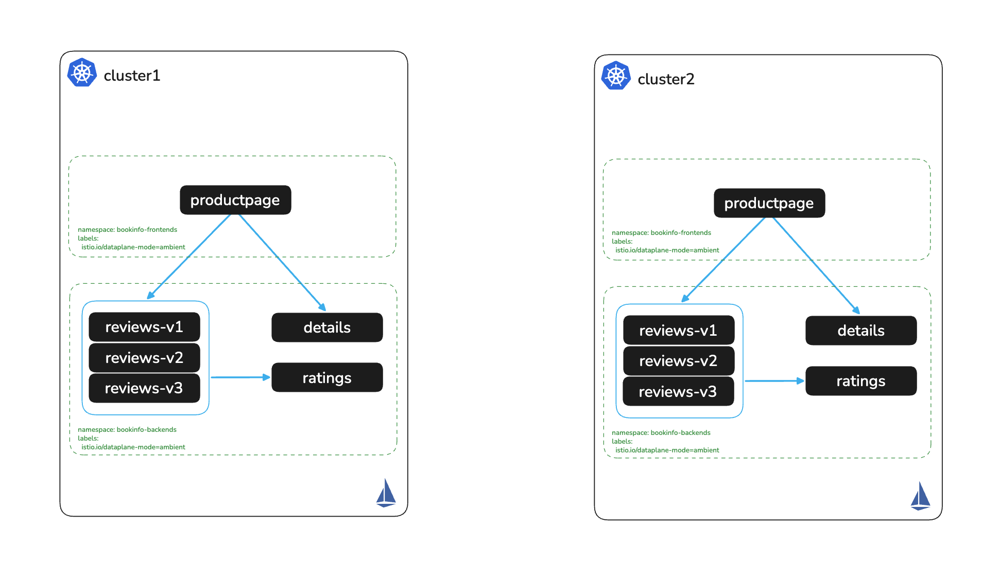

# Enroll Apps in the Mesh

# Objectives
- Enroll the bookinfo namespaces into Ambient Mesh on cluster1 and cluster2
- Validate workloads are enrolled in the mesh using `istioctl`



## Prerequisites
- This lab assumes you have completed setup from labs `000-003`

## Background

One of the key operational advantages of Istio Ambient mode is how effortlessly workloads join the mesh. In traditional sidecar-based Istio, enrolling an application requires injecting an Envoy proxy into every pod — which means rolling restarts, increased resource overhead, and per-pod lifecycle management.

With Ambient, enrollment is a single namespace label. ztunnel, running as a DaemonSet on each node, transparently intercepts all traffic for labeled namespaces without touching the application pods. No sidecar injection, no restarts, no changes to application manifests. The moment the label is applied, all pod-to-pod traffic in the namespace is automatically secured with mTLS — the workloads themselves are unaware.

## Prerequisites
Ensure the following environment variables are set:
```bash
export CLUSTER1=cluster1
export CLUSTER2=cluster2
```

## Enroll Apps to Ambient Mesh on cluster1

Before enrolling, check the current workload status for the bookinfo namespaces. You should see `TCP` as the protocol, indicating workloads are not yet part of the mesh
```bash
./solo-istioctl zc workloads -n istio-system --context $CLUSTER1 | grep "bookinfo"
```

Expected output (TCP — not yet enrolled):
```
NAMESPACE            POD NAME                              ADDRESS      NODE    WAYPOINT PROTOCOL
bookinfo-backends    details-v1-74658b4f9b-9jgq6           10.130.0.21  ...     None     TCP
bookinfo-backends    ratings-v1-5d896f87b-tn5lf            10.129.0.38  ...     None     TCP
bookinfo-backends    reviews-v1-78b6cf6d-w8nxl             10.130.0.22  ...     None     TCP
bookinfo-backends    reviews-v2-8dbdc6fdd-f6s9h            10.129.0.39  ...     None     TCP
bookinfo-backends    reviews-v3-59958c554d-8sxqh           10.130.0.23  ...     None     TCP
bookinfo-frontends   productpage-v1-59c74584cf-5fvhq       10.129.0.37  ...     None     TCP
```

Enable ambient with namespace label
```bash
kubectl label namespace bookinfo-frontends istio.io/dataplane-mode=ambient --context $CLUSTER1
kubectl label namespace bookinfo-backends istio.io/dataplane-mode=ambient --context $CLUSTER1
```

Check workload status again. The protocol should now show `HBONE`, confirming the workloads are enrolled in the ambient mesh and traffic will be encrypted with mTLS. Note that there is no sidecar, and applications are not required to be restarted to enroll in the mesh!
```bash
./solo-istioctl zc workloads -n istio-system --context $CLUSTER1 | grep "bookinfo"
```

Expected output (HBONE — enrolled in ambient mesh):
```
NAMESPACE            POD NAME                              ADDRESS      NODE    WAYPOINT PROTOCOL
bookinfo-backends    details-v1-74658b4f9b-9jgq6           10.130.0.21  ...     None     HBONE
bookinfo-backends    ratings-v1-5d896f87b-tn5lf            10.129.0.38  ...     None     HBONE
bookinfo-backends    reviews-v1-78b6cf6d-w8nxl             10.130.0.22  ...     None     HBONE
bookinfo-backends    reviews-v2-8dbdc6fdd-f6s9h            10.129.0.39  ...     None     HBONE
bookinfo-backends    reviews-v3-59958c554d-8sxqh           10.130.0.23  ...     None     HBONE
bookinfo-frontends   productpage-v1-59c74584cf-5fvhq       10.129.0.37  ...     None     HBONE
```

## Enroll Apps to Ambient Mesh on cluster2

Before enrolling, check the current workload status for the bookinfo namespaces. You should see `TCP` as the protocol, indicating workloads are not yet part of the mesh
```bash
./solo-istioctl zc workloads -n istio-system --context $CLUSTER2 | grep "bookinfo"
```

Enable ambient with namespace label
```bash
kubectl label namespace bookinfo-frontends istio.io/dataplane-mode=ambient --context $CLUSTER2
kubectl label namespace bookinfo-backends istio.io/dataplane-mode=ambient --context $CLUSTER2
```

Check workload status again. The protocol should now show `HBONE`, confirming the workloads are enrolled in the ambient mesh
```bash
./solo-istioctl zc workloads -n istio-system --context $CLUSTER2 | grep "bookinfo"
```

## Next Steps
At this point we have completed the following objectives
- Enrolled the bookinfo namespaces into Ambient Mesh on cluster1 and cluster2
- Validated workloads are enrolled in the mesh using `istioctl zc workloads`

In the next step `005` we will expose the bookinfo application on cluster1 via an Ingress Gateway
