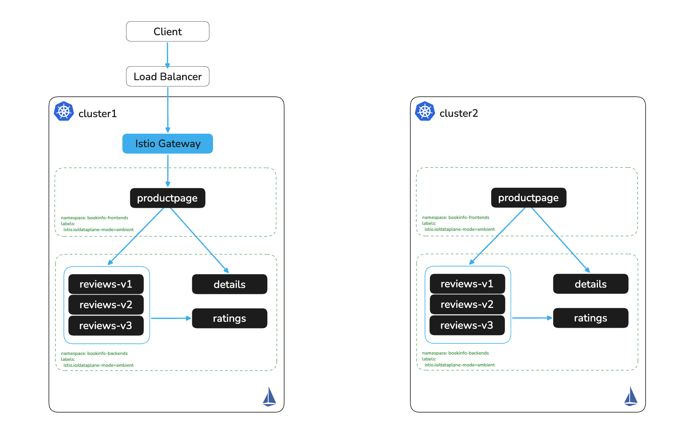

# Expose Bookinfo on cluster1

# Objectives
- Deploy an Istio Ingress Gateway on cluster1
- Expose the bookinfo application via an HTTPRoute



## Configure Ingress Gateway and Expose Application on cluster1

Deploy an Istio Ingressgateway
```bash
kubectl apply --context $CLUSTER1 -f - <<EOF
apiVersion: gateway.networking.k8s.io/v1
kind: Gateway
metadata:
  name: ingress
  namespace: istio-system
spec:
  gatewayClassName: istio
  listeners:
  - name: http
    port: 80
    protocol: HTTP
    allowedRoutes:
      namespaces:
        from: All
EOF
```

Check to see that the `ingress-istio` gateway pod has been deployed in istio-system
```bash
kubectl get pods -n istio-system --context $CLUSTER1
kubectl get svc -n istio-system --context $CLUSTER1
```

Output should look similar to below
```
NAME                            READY   STATUS    RESTARTS   AGE
ingress-istio-78b4f97bb-k6k4b   1/1     Running   0          14s
istiod-5ccd964945-9kbjg         1/1     Running   0          7m46s
```

We should also see a service with type LoadBalancer has been created for our gateway
```
NAME            TYPE           CLUSTER-IP      EXTERNAL-IP                                                               PORT(S)                                 AGE
ingress-istio   LoadBalancer   10.96.133.188   a21376026888048ae88008147d54814b-1566454636.us-west-1.elb.amazonaws.com   15021:30534/TCP,80:31705/TCP            14s
istiod          ClusterIP      10.96.128.33    <none>                                                                    15010/TCP,15012/TCP,443/TCP,15014/TCP   7m46s
```

Expose the bookinfo application using an HTTPRoute
```bash
kubectl apply --context $CLUSTER1 -f - <<EOF
apiVersion: gateway.networking.k8s.io/v1beta1
kind: HTTPRoute
metadata:
  name: bookinfo-route
  namespace: bookinfo-frontends
spec:
  parentRefs:
    - name: ingress
      namespace: istio-system
  rules:
    - matches:
      - path:
          type: PathPrefix
          value: /
      backendRefs:
      - name: productpage
        port: 9080
EOF
```

Get the external IP of the ingress gateway service and navigate to the URL in your browser
```bash
SVC=$(kubectl -n istio-system get svc ingress-istio --context $CLUSTER1 --no-headers | awk '{ print $4 }')
echo http://$SVC/productpage
```

Or verify with curl
```bash
curl http://$SVC/productpage
```

### No LoadBalancer? Use port-forward

If your cluster does not have LoadBalancer integration (e.g. kind, minikube, or bare-metal without MetalLB), the `EXTERNAL-IP` field will remain `<pending>`. Port-forward directly to the productpage service instead:
```bash
kubectl port-forward svc/productpage -n bookinfo-frontends 9080:9080 --context $CLUSTER1
```

Navigate to http://localhost:9080/productpage or verify with curl
```bash
curl http://localhost:9080/productpage
```

## Next Steps
At this point we have completed the following objectives
- Deployed an Istio Ingress Gateway on cluster1
- Exposed the bookinfo application via an HTTPRoute

In the next step `006` we will configure multicluster connectivity between the two clusters
