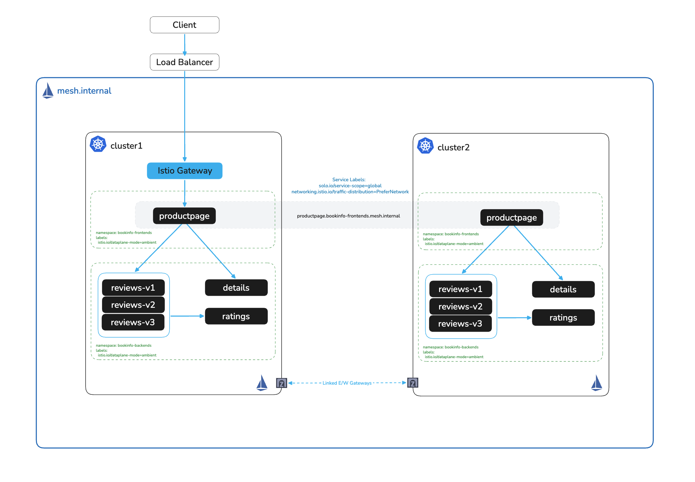

# Multicluster - Global Mesh

# Objectives
- Link the two clusters
- Configure a globally available service using labels (productpage)
- Reconfigure ingress to global service hostname (*.<namespace>.mesh.internal)



## Set cluster contexts
In this workshop, you can use your preferred cluster context. To set it, run the following command, replacing cluster1 and cluster2 with your desired context name
```bash
export CLUSTER1=cluster1
export CLUSTER2=cluster2
```
Linking clusters enables cross-cluster service discovery and enables traffic to traverse across cluster boundaries. Before linking clusters, you should ensure each cluster you want to configure is set in you kubeconfig file. You can view the list of clusters currently configured with `kubectl config get-contexts`.

If you have multiple kubeconfig files you need to join into one, you can run `KUBECONFIG=kubeconfig1.yaml:kubeconfig2.yaml:kubeconfig3.yaml kubectl config view --flatten` to get a merge file.

## Link Clusters
Now that we have set up two clusters with Istio Ambient mode and our sample Bookinfo application, next we are going to explore Gloo Mesh Enterprise multicluster features by linking our clusters together 

Create istio-gateways namespace
```bash
kubectl create ns istio-gateways --context $CLUSTER1
kubectl create ns istio-gateways --context $CLUSTER2
```

Use solo `istioctl` to create e/w peering gateways
```bash
./solo-istioctl multicluster expose --namespace istio-gateways --context $CLUSTER1

./solo-istioctl multicluster expose --namespace istio-gateways --context $CLUSTER2
```

Wait for the e/w gateways to be deployed
```bash
for deploy in $(kubectl get deploy -n istio-gateways --context $CLUSTER1 -o jsonpath='{.items[*].metadata.name}'); do
  echo "Waiting for e/w gateway deployment '$deploy' to be ready in $CLUSTER1..."
  kubectl rollout status deploy/"$deploy" -n istio-gateways --watch --timeout=90s --context $CLUSTER1
  done

for deploy in $(kubectl get deploy -n istio-gateways --context $CLUSTER2 -o jsonpath='{.items[*].metadata.name}'); do
  echo "Waiting for e/w gateway deployment '$deploy' to be ready in $CLUSTER2..."
  kubectl rollout status deploy/"$deploy" -n istio-gateways --watch --timeout=90s --context $CLUSTER2
  done
```

Check to see that the e/w gateways have been deployed and an LB service has been generated
```bash
kubectl get pods,svc -n istio-gateways --context $CLUSTER1
kubectl get pods,svc -n istio-gateways --context $CLUSTER2
```

> **Note:** The cloud load balancers for the e/w gateways may take a few minutes to be provisioned. If `EXTERNAL-IP` shows `<pending>`, wait and re-run the `kubectl get svc` command until addresses are assigned on both clusters before proceeding to link them.

Link the e/w gateways
```bash
./solo-istioctl multicluster link --contexts=$CLUSTER1,$CLUSTER2 --namespace istio-gateways
```

## Configure a global service

To make `productpage` available across both clusters, we apply two things to the service in each cluster:

- **`solo.io/service-scope=global`** — This label marks the service as globally scoped. Istio's multicluster controller detects this and automatically generates a `ServiceEntry` in each cluster, giving the service a stable cross-cluster hostname in the form `<service>.<namespace>.mesh.internal`. This allows workloads in either cluster to reach the service without needing to know which cluster it lives on.

- **`networking.istio.io/traffic-distribution=PreferNetwork`** — This annotation instructs Istio to prefer routing to instances in the same network (i.e. the local cluster) before failing over to the remote cluster. This avoids unnecessary cross-cluster traffic when a healthy local instance is available.

```bash
for context in ${CLUSTER1} ${CLUSTER2}; do
  kubectl --context ${context}  -n bookinfo-frontends label service productpage solo.io/service-scope=global --overwrite
  kubectl --context ${context}  -n bookinfo-frontends annotate service productpage  networking.istio.io/traffic-distribution=PreferNetwork --overwrite
done
```

We should now see an automatically generated ServiceEntry referencing our global service in each cluster
```bash
for CTX in "$CLUSTER1" "$CLUSTER2"; do
  echo "Checking for autogen global ServiceEntry in $CTX"
  kubectl --context $CTX get serviceentry -n istio-system
done
```

## Configure Ingress Gateway in cluster1 to route to the global service

Reconfigure the bookinfo application to use the global service hostname `*.<namespace>.mesh.internal`
```bash
kubectl apply --context $CLUSTER1 -f - <<EOF
apiVersion: gateway.networking.k8s.io/v1beta1
kind: HTTPRoute
metadata:
  name: bookinfo-route
  namespace: bookinfo-frontends
spec:
  parentRefs:
    - name: ingress
      namespace: istio-system
  rules:
    - matches:
      - path:
          type: PathPrefix
          value: /
      backendRefs:
      - kind: Hostname
        group: networking.istio.io
        name: productpage.bookinfo-frontends.mesh.internal
        port: 9080
EOF
```

Refresh the browser to confirm the application is still routable. Or verify with curl
```bash
SVC=$(kubectl -n istio-system get svc ingress-istio --context $CLUSTER1 --no-headers | awk '{ print $4 }')
curl http://$SVC/productpage
```

> **No LoadBalancer?** If you are using port-forward, replace `http://$SVC` with `http://localhost:9080` in the curl commands throughout this lab, and keep the port-forward to `svc/productpage` from lab 005 running in a separate terminal.

At this point all traffic is being served from cluster1. You can confirm this in the browser by looking at the **Reviews** section on the productpage — the reviewer cluster name will show `cluster1`, since we configured the `CLUSTER_NAME` environment variable on the reviews deployments earlier.

## Failover productpage on cluster1

Scale down productpage-v1 in the `bookinfo-frontends` namespace on cluster1
```bash
kubectl scale deploy/productpage-v1 -n bookinfo-frontends --replicas 0 --context $CLUSTER1
```

Refresh the browser or curl to confirm traffic has failed over to cluster2. The **Reviews** section on the productpage will now show `cluster2` as the reviewer cluster

Or you can use curl
```bash
SVC=$(kubectl -n istio-system get svc ingress-istio --context $CLUSTER1 --no-headers | awk '{ print $4 }')
curl http://$SVC/productpage
```

Tail logs of ztunnel on `cluster2` in a new terminal to watch logs
```bash
kubectl logs -n istio-system -l app=ztunnel --context $CLUSTER2 -f --prefix
```
You should see traffic going to cluster2

## Restore productpage on cluster1

Scale productpage-v1 back up in the `bookinfo-frontends` namespace on cluster1
```bash
kubectl scale deploy/productpage-v1 -n bookinfo-frontends --replicas 1 --context $CLUSTER1
```
In the ztunnel logs of cluster2 we should see that traffic is no longer routing there because productpage-v1 on cluster1 is healthy


Tail logs of ztunnel on `cluster1` in a new terminal to watch logs
```bash
kubectl logs -n istio-system -l app=ztunnel --context $CLUSTER1 -f --prefix
```
If you retry the curl command you should now see traffic going to back to cluster1

## Next Steps
At this point we have completed the following objectives
- Linked the two clusters
- Configured a globally available service using labels (productpage)
- Reconfigured ingress to global service hostname

In the next step `007` we will use Segments to enforce namespace isolation across clusters