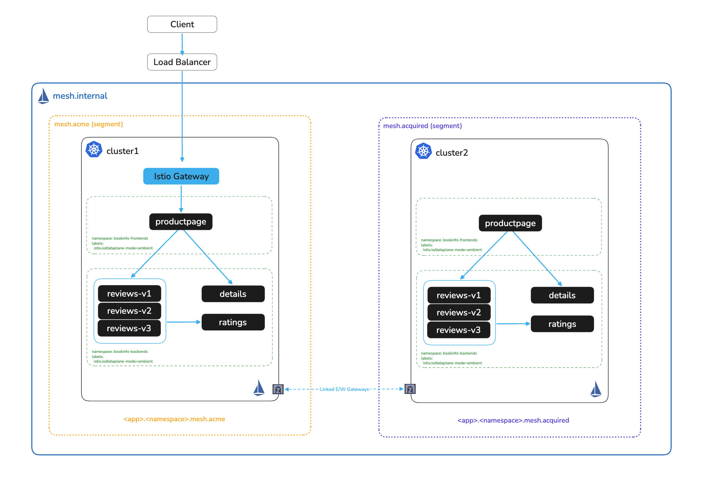
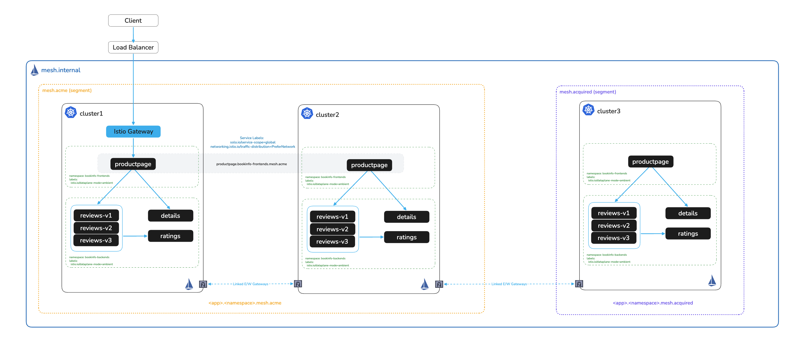

# Segments — Namespace Isolation Across Clusters

# Objectives
- Expose backend services globally to surface the namespace conflict
- Demonstrate the problem: ACME's productpage silently calls Acquired Company's backend services
- Define Segment CRs to create isolated mesh domains per company
- Assign each cluster to its own segment via a namespace label
- Verify that ACME's productpage can no longer reach Acquired Company's endpoints



## Prerequisites
This lab assumes you have completed the multicluster setup in lab `006`. Both clusters must be linked and the clusters' backend services (`details`, `reviews`, `ratings`) must be running in the `bookinfo-backends` namespace.

Ensure the following environment variables are set:
```bash
export CLUSTER1=cluster1
export CLUSTER2=cluster2
```

## Background

In a typical post-acquisition scenario, two companies run identical workloads in namespaces with the same names. When clusters are linked in a shared Istio mesh, services from both companies are aggregated under the same `mesh.internal` hostname — meaning ACME's `productpage` can silently call Acquired Company's `details`, `reviews`, and `ratings` backends.

**Segments** solve this by partitioning the mesh into isolated DNS domains. Each company's services are reachable only within their own segment, preventing unintended cross-company calls without requiring any application changes.

## Expose backend services globally

Lab `006` made `productpage` globally available so traffic can fail over across clusters. To surface the namespace conflict, we also need the backend services — `details`, `reviews`, and `ratings` — to be globally exposed. This merges their endpoints from both clusters under a shared `mesh.internal` hostname, which is the condition that creates the conflict.

Label the backend services as globally scoped on both clusters:
```bash
for context in $CLUSTER1 $CLUSTER2; do
  kubectl label svc/details svc/reviews svc/ratings \
    -n bookinfo-backends solo.io/service-scope=global \
    --overwrite --context $context
done
```

Wait for ServiceEntries to be generated, then verify both clusters' endpoints are aggregated under the same `mesh.internal` hostname:
```bash
echo "ServiceEntries on $CLUSTER1:"
kubectl get serviceentry -n istio-system --context $CLUSTER1 | grep -E "details|reviews|ratings"

echo ""
echo "ServiceEntries on $CLUSTER2:"
kubectl get serviceentry -n istio-system --context $CLUSTER2 | grep -E "details|reviews|ratings"
```

You should see `details.bookinfo-backends.mesh.internal`, `reviews.bookinfo-backends.mesh.internal`, and `ratings.bookinfo-backends.mesh.internal` on both clusters. Both companies' endpoints are pooled together — ACME cannot distinguish its own backends from Acquired Company's.

Update `productpage` on `cluster1` to use the `mesh.internal` hostname so it can reach cross-cluster endpoints:
```bash
kubectl set env deploy/productpage-v1 -n bookinfo-frontends \
  DETAILS_HOSTNAME=details.bookinfo-backends.mesh.internal \
  --context $CLUSTER1
kubectl rollout status deploy/productpage-v1 -n bookinfo-frontends --context $CLUSTER1
```

## Demonstrate the namespace conflict

Scale down `details-v1` on `cluster1` to remove all of ACME's details endpoints:
```bash
kubectl scale deploy/details-v1 -n bookinfo-backends --replicas 0 --context $CLUSTER1
kubectl rollout status deploy/details-v1 -n bookinfo-backends --context $CLUSTER1 --timeout=60s || true
kubectl get deploy/details-v1 -n bookinfo-backends --context $CLUSTER1
```

Now navigate to the bookinfo productpage:
```bash
SVC=$(kubectl -n istio-system get svc ingress-istio --context $CLUSTER1 --no-headers | awk '{ print $4 }')
echo http://$SVC/productpage
```

> **No LoadBalancer?** If you are using port-forward, set `SVC=localhost:9080` instead and keep the port-forward to `svc/productpage` from lab `005` running in a separate terminal.

Even with `details-v1` scaled to zero on `cluster1`, the **Book Details** section should still be populated. The `productpage` service is silently pulling from `cluster2` (Acquired Company) because both clusters' endpoints are merged under the same `mesh.internal` hostname.

Tail the logs in a separate terminal to confirm `cluster2` is receiving the requests:
```bash
# Application logs
kubectl logs -n bookinfo-backends -l app=details --context $CLUSTER2 --prefix --tail=10 -f

# Or ztunnel logs (shows the SPIFFE identity of the caller)
kubectl logs ds/ztunnel -n istio-system --context $CLUSTER2 --prefix -f | grep details
```

Restore `details-v1` on `cluster1` before continuing:
```bash
kubectl scale deploy/details-v1 -n bookinfo-backends --replicas 1 --context $CLUSTER1
kubectl rollout status deploy/details-v1 -n bookinfo-backends --context $CLUSTER1 --timeout=60s
```

## Apply Segment CRs

A `Segment` CR defines an isolated mesh domain with its own DNS suffix. We define two segments — one for ACME (`mesh.acme`) and one for Acquired Company (`mesh.acquired`).

Apply both Segment CRs to each cluster so that each cluster is aware of both domains:
```bash
for context in $CLUSTER1 $CLUSTER2; do
  kubectl apply --context $context -f - <<EOF
apiVersion: admin.solo.io/v1alpha1
kind: Segment
metadata:
  name: acme-segment
  namespace: istio-system
spec:
  domain: mesh.acme
---
apiVersion: admin.solo.io/v1alpha1
kind: Segment
metadata:
  name: acquired-segment
  namespace: istio-system
spec:
  domain: mesh.acquired
EOF
done
```

Confirm the Segments are present on both clusters:
```bash
echo "Segments on $CLUSTER1:"
kubectl get segments -n istio-system --context $CLUSTER1

echo ""
echo "Segments on $CLUSTER2:"
kubectl get segments -n istio-system --context $CLUSTER2
```

## Assign each cluster to its segment

Segments are activated by labeling the `istio-system` namespace with `admin.solo.io/segment=<segment-name>`. This tells the mesh which DNS domain each cluster belongs to.

Assign `cluster1` (ACME) to `acme-segment` and `cluster2` (Acquired Company) to `acquired-segment`:
```bash
kubectl label namespace istio-system admin.solo.io/segment=acme-segment --context $CLUSTER1
kubectl label namespace istio-system admin.solo.io/segment=acquired-segment --context $CLUSTER2
```

Now update `productpage` on `cluster1` to resolve `details` via the segment-scoped hostname. The ambient profile sets `DETAILS_HOSTNAME` to `mesh.internal` by default; we replace it with the ACME-scoped hostname:
```bash
kubectl set env deploy/productpage-v1 -n bookinfo-frontends \
  DETAILS_HOSTNAME=details.bookinfo-backends.mesh.acme \
  --context $CLUSTER1
```

Update the ingress `HTTPRoute` on `cluster1` to route to `productpage` via the segment-scoped hostname:
```bash
kubectl apply --context $CLUSTER1 -f - <<EOF
apiVersion: gateway.networking.k8s.io/v1beta1
kind: HTTPRoute
metadata:
  name: bookinfo-route
  namespace: bookinfo-frontends
spec:
  parentRefs:
    - name: ingress
      namespace: istio-system
  rules:
    - matches:
      - path:
          type: PathPrefix
          value: /
      backendRefs:
      - kind: Hostname
        group: networking.istio.io
        name: productpage.bookinfo-frontends.mesh.acme
        port: 9080
EOF
```

Wait for `productpage` to roll out with the updated environment variable:
```bash
kubectl rollout status deploy/productpage-v1 -n bookinfo-frontends --context $CLUSTER1
```

## Verify segment-scoped ServiceEntries

Wait for segment-scoped ServiceEntries to be generated, then confirm each cluster now has its own domain:
```bash
echo "ServiceEntries on $CLUSTER1 (should show mesh.acme):"
kubectl get serviceentry -n istio-system --context $CLUSTER1 | grep -E "details|reviews|ratings"

echo ""
echo "ServiceEntries on $CLUSTER2 (should show mesh.acquired):"
kubectl get serviceentry -n istio-system --context $CLUSTER2 | grep -E "details|reviews|ratings"
```

The `mesh.internal` entries should now be replaced by segment-specific hostnames:
- `details.bookinfo-backends.mesh.acme` — cluster1 endpoints only
- `details.bookinfo-backends.mesh.acquired` — cluster2 endpoints only

Each company's backends are now isolated to their own DNS domain. Neither company can resolve the other's segment-scoped hostnames.

## Verify traffic isolation

Scale down `details-v1` on `cluster1` again. This time, `productpage` is using `mesh.acme`, which contains only `cluster1`'s endpoints:
```bash
kubectl scale deploy/details-v1 -n bookinfo-backends --replicas 0 --context $CLUSTER1
sleep 5
kubectl get deploy/details-v1 -n bookinfo-backends --context $CLUSTER1
```

Navigate to the bookinfo productpage:
```bash
SVC=$(kubectl -n istio-system get svc ingress-istio --context $CLUSTER1 --no-headers | awk '{ print $4 }')
echo http://$SVC/productpage
```

The **Book Details** section should now show an error. With segments in place, `productpage` cannot reach `cluster2`'s `details` endpoints — they are in a different segment (`mesh.acquired`).

Confirm `cluster2` received no traffic in a separate terminal:
```bash
# Application logs
kubectl logs -n bookinfo-backends -l app=details --context $CLUSTER2 --prefix --tail=10 -f

# Or ztunnel logs
kubectl logs ds/ztunnel -n istio-system --context $CLUSTER2 --prefix -f | grep details
```

Restore `details-v1` on `cluster1`:
```bash
kubectl scale deploy/details-v1 -n bookinfo-backends --replicas 1 --context $CLUSTER1
kubectl rollout status deploy/details-v1 -n bookinfo-backends --context $CLUSTER1 --timeout=60s
```

## Summary

Post-acquisition environments commonly share namespace names across companies — `bookinfo-backends` in ACME's cluster and `bookinfo-backends` in Acquired Company's cluster are identical from the mesh's perspective. Without isolation, linking these clusters merges their service endpoints under the same `mesh.internal` hostname, allowing ACME's workloads to silently consume Acquired Company's backends (and vice versa). This is not a misconfiguration — it is the expected behavior of a flat, multi-cluster mesh.

**Segments** solve this by assigning each cluster its own DNS domain. Once labeled, each cluster's services are only reachable via its segment-scoped hostname (`mesh.acme` or `mesh.acquired`). Services in one segment cannot resolve hostnames in another, so cross-company traffic is blocked at the DNS level without requiring any changes to application code or network policy.

Key properties of Segments:
- **Scoped by cluster** — a single namespace label on `istio-system` activates a segment for the entire cluster
- **DNS-based isolation** — services are unreachable across segment boundaries, not merely deprioritized
- **Application-transparent** — workloads reference hostnames; the mesh enforces the boundary

## Additional Scenarios with Segments

Segments and global mesh connectivity are not mutually exclusive. It is possible to combine them: clusters within the same segment can still fail over to each other, while clusters in a different segment remain fully isolated.

In the diagram below, ACME's two clusters share a segment and can fail over between themselves, while Acquired Company's cluster remains in its own isolated segment with no cross-company reachability.



## Cleanup (Skip this step if evaluating global-aliases next)
Follow the cleanup steps below to remove segments and return to a single flat global mesh. You can skip this cleanup step if moving forward to evaluate global aliases using segments.

Restore `productpage` to use the original `DETAILS_HOSTNAME`:
```bash
kubectl set env deploy/productpage-v1 -n bookinfo-frontends \
  DETAILS_HOSTNAME=details.bookinfo-backends.svc.cluster.local \
  --context $CLUSTER1
```

Restore the `bookinfo-route` to use the `mesh.internal` productpage hostname:
```bash
kubectl apply --context $CLUSTER1 -f - <<EOF
apiVersion: gateway.networking.k8s.io/v1beta1
kind: HTTPRoute
metadata:
  name: bookinfo-route
  namespace: bookinfo-frontends
spec:
  parentRefs:
    - name: ingress
      namespace: istio-system
  rules:
    - matches:
      - path:
          type: PathPrefix
          value: /
      backendRefs:
      - kind: Hostname
        group: networking.istio.io
        name: productpage.bookinfo-frontends.mesh.internal
        port: 9080
EOF
```

Remove the segment labels from both clusters' `istio-system` namespaces:
```bash
kubectl label namespace istio-system admin.solo.io/segment- --context $CLUSTER1
kubectl label namespace istio-system admin.solo.io/segment- --context $CLUSTER2
```

Delete the Segment CRs from both clusters:
```bash
for context in $CLUSTER1 $CLUSTER2; do
  kubectl delete segment acme-segment acquired-segment -n istio-system --context $context
done
```

Remove the `solo.io/service-scope=global` labels from backend services if you applied them in this lab (skip if they were already present before this lab):
```bash
for context in $CLUSTER1 $CLUSTER2; do
  kubectl label svc/details svc/reviews svc/ratings \
    -n bookinfo-backends solo.io/service-scope- --context $context
done
```

## Next Steps
At this point we have completed the following objectives:
- Exposed backend services globally to surface the namespace conflict
- Demonstrated that without segments, ACME's productpage silently calls Acquired Company's backends
- Defined Segment CRs to create isolated DNS domains per company
- Assigned each cluster to its own segment via a namespace label
- Verified that ACME's productpage can no longer reach Acquired Company's endpoints

In the next step `008` we will add global service aliases to the Segment CRs
