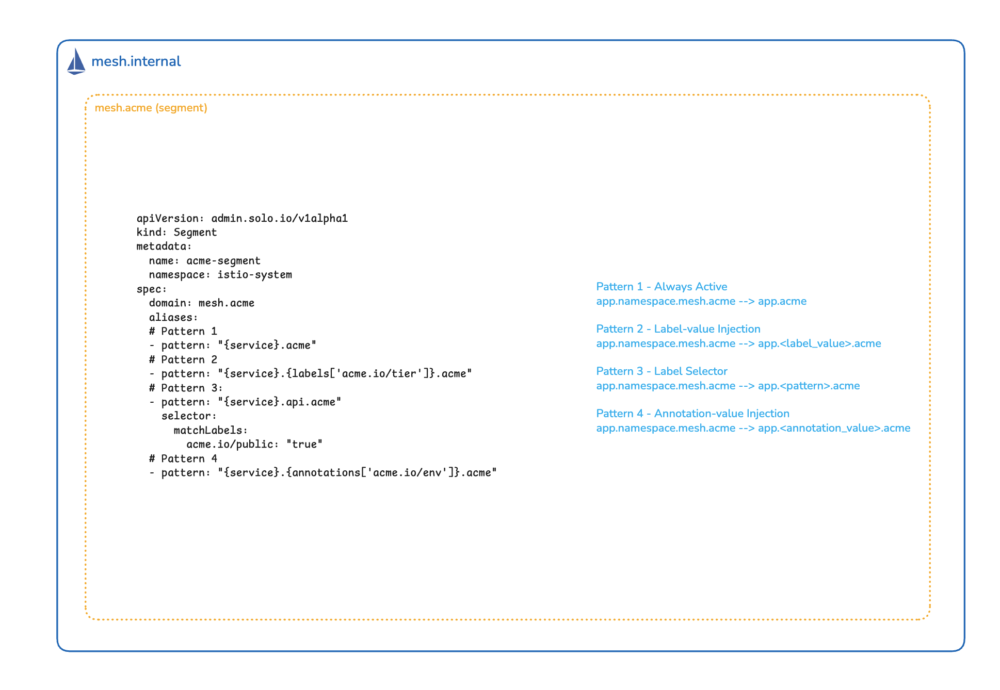

# Segments — Global Service Aliases

# Objectives
- Add alias patterns to the existing Segment CRs
- Verify that Pattern 1 (simple overwrite) activates immediately with no service changes
- Activate Pattern 2 (label-value injection) by labeling the `reviews` service
- Activate Pattern 3 (label selector) by labeling the `details` service
- Activate Pattern 4 (annotation-value injection) by annotating the `ratings` service
- Confirm that Acquired Company's aliases on `cluster2` are fully independent of ACME's patterns



## Prerequisites
- This lab assumes you have completed setup from labs `000-007`
- The Segment CRs (`acme-segment`, `acquired-segment`) and their namespace labels must be in place — if you ran the cleanup in `007`, re-apply the Segment CRs and namespace labels from that lab before continuing.

Ensure the following environment variables are set:
```bash
export CLUSTER1=cluster1
export CLUSTER2=cluster2
```

## Background

Once segments are in place, services are reachable at hostnames like `details.bookinfo-backends.mesh.acme`. For large organizations these names are verbose and hard to communicate. **Global service aliases** let each segment define custom hostname patterns for its globally-exposed services using URI template syntax (RFC 6570).

Four pattern types are available:

| Pattern type | Template example | Alias generated |
|---|---|---|
| Simple overwrite | `{service}.acme` | `details.acme` |
| Label-value injection | `{service}.{labels['acme.io/tier']}.acme` | `reviews.frontend.acme` |
| Label selector | `{service}.api.acme` (with selector `acme.io/public=true`) | `details.api.acme` |
| Annotation-value injection | `{service}.{annotations['acme.io/env']}.acme` | `ratings.prod.acme` |

Aliases are **additive** — both the default segment hostname and all alias hostnames resolve simultaneously. If a label or annotation referenced in a pattern is absent from a service, that alias is silently skipped.

## Update Segment CRs with alias patterns

Update `acme-segment` on `cluster1` to include all four alias patterns:
```bash
kubectl apply --context $CLUSTER1 -f - <<EOF
apiVersion: admin.solo.io/v1alpha1
kind: Segment
metadata:
  name: acme-segment
  namespace: istio-system
spec:
  domain: mesh.acme
  aliases:
  # Pattern 1: always active — {service}.acme
  - pattern: "{service}.acme"
  # Pattern 2: label-value injection — {service}.{tier}.acme
  - pattern: "{service}.{labels['acme.io/tier']}.acme"
  # Pattern 3: label selector — only services labeled acme.io/public=true
  - pattern: "{service}.api.acme"
    selector:
      matchLabels:
        acme.io/public: "true"
  # Pattern 4: annotation-value injection — {service}.{env}.acme
  - pattern: "{service}.{annotations['acme.io/env']}.acme"
EOF
```

Update `acquired-segment` on `cluster2` with a simple alias for the Acquired Company's naming convention:
```bash
kubectl apply --context $CLUSTER2 -f - <<EOF
apiVersion: admin.solo.io/v1alpha1
kind: Segment
metadata:
  name: acquired-segment
  namespace: istio-system
spec:
  domain: mesh.acquired
  aliases:
  - pattern: "{service}.acquired"
EOF
```

## Verify Pattern 1 — simple overwrite

Pattern 1 requires no service labels and is active immediately after the Segment CR is updated. Wait for the ServiceEntries to regenerate, then inspect the `solo.io/service-aliases` annotation:
```bash
sleep 5
kubectl get serviceentry -n istio-system --context $CLUSTER1 \
  -o yaml | grep -A5 "solo.io/service-aliases"
```

You should see `details.acme`, `reviews.acme`, and `ratings.acme` listed as aliases on their respective ServiceEntries.

Capture the productpage pod name to use for in-mesh connectivity tests:
```bash
PRODUCTPAGE_POD=$(kubectl get pod -n bookinfo-frontends -l app=productpage \
  --context $CLUSTER1 -o jsonpath='{.items[0].metadata.name}')
echo $PRODUCTPAGE_POD
```

Verify the alias resolves from inside the mesh:
```bash
kubectl exec -n bookinfo-frontends $PRODUCTPAGE_POD --context $CLUSTER1 -- \
  python3 -c "
import urllib.request, json
resp = urllib.request.urlopen('http://details.acme:9080/details/0')
print(json.dumps(json.loads(resp.read().decode()), indent=2))
"
```

You should receive a valid JSON response. The alias is resolved by the mesh — no application change is needed.

Now verify the default segment hostname still works alongside the alias:
```bash
kubectl exec -n bookinfo-frontends $PRODUCTPAGE_POD --context $CLUSTER1 -- \
  python3 -c "
import urllib.request, json
resp = urllib.request.urlopen('http://details.bookinfo-backends.mesh.acme:9080/details/0')
print(json.dumps(json.loads(resp.read().decode()), indent=2))
"
```

Both `details.acme` and `details.bookinfo-backends.mesh.acme` return the same response — aliases are additive.

## Activate Pattern 2 — label-value injection

Pattern 2 injects the value of the `acme.io/tier` label into the alias hostname at runtime. Label the `reviews` service:
```bash
kubectl label svc/reviews -n bookinfo-backends acme.io/tier=frontend \
  --overwrite --context $CLUSTER1
```

Wait for the ServiceEntry annotation to update:
```bash
sleep 5
kubectl get serviceentry autogen.acme-segment.bookinfo-backends.reviews \
  -n istio-system --context $CLUSTER1 \
  -o jsonpath='{.metadata.annotations.solo\.io/service-aliases}'
echo
```

The annotation should include `reviews.frontend.acme` — the label value `frontend` was injected into the pattern. Test it:
```bash
kubectl exec -n bookinfo-frontends $PRODUCTPAGE_POD --context $CLUSTER1 -- \
  python3 -c "
import urllib.request, json
resp = urllib.request.urlopen('http://reviews.frontend.acme:9080/reviews/0')
print(json.dumps(json.loads(resp.read().decode()), indent=2))
"
```

Changing the label value to a different string (e.g. `backend`) immediately produces a different alias without any Segment CR update.

## Activate Pattern 3 — label selector

Pattern 3 generates an alias only for services that match the label selector `acme.io/public=true`. Label the `details` service:
```bash
kubectl label svc/details -n bookinfo-backends acme.io/public=true \
  --overwrite --context $CLUSTER1
```

Wait for the ServiceEntry annotation to update, then confirm the new alias is present:
```bash
sleep 5
kubectl get serviceentry autogen.acme-segment.bookinfo-backends.details \
  -n istio-system --context $CLUSTER1 \
  -o jsonpath='{.metadata.annotations.solo\.io/service-aliases}'
echo
```

You should now see `details.api.acme` alongside `details.acme`. Test it:
```bash
kubectl exec -n bookinfo-frontends $PRODUCTPAGE_POD --context $CLUSTER1 -- \
  python3 -c "
import urllib.request, json
resp = urllib.request.urlopen('http://details.api.acme:9080/details/0')
print(json.dumps(json.loads(resp.read().decode()), indent=2))
"
```

Because `reviews` and `ratings` do not have `acme.io/public=true`, they do not receive a `.api.acme` alias — the selector scopes the pattern to matching services only.

## Activate Pattern 4 — annotation-value injection

Pattern 4 works identically to Pattern 2 but reads from an annotation instead of a label. Annotate the `ratings` service:
```bash
kubectl annotate svc/ratings -n bookinfo-backends acme.io/env=prod \
  --overwrite --context $CLUSTER1
```

Wait for the ServiceEntry annotation to update:
```bash
sleep 5
kubectl get serviceentry autogen.acme-segment.bookinfo-backends.ratings \
  -n istio-system --context $CLUSTER1 \
  -o jsonpath='{.metadata.annotations.solo\.io/service-aliases}'
echo
```

The annotation should include `ratings.prod.acme`. Test it:
```bash
kubectl exec -n bookinfo-frontends $PRODUCTPAGE_POD --context $CLUSTER1 -- \
  python3 -c "
import urllib.request, json
resp = urllib.request.urlopen('http://ratings.prod.acme:9080/ratings/0')
print(json.dumps(json.loads(resp.read().decode()), indent=2))
"
```

## Verify segment independence — Acquired Company

Check the ServiceEntry annotations on `cluster2`. Even though `details` on `cluster1` carries `acme.io/public=true`, that label has no effect on `cluster2`'s `acquired-segment`:
```bash
kubectl get serviceentry -n istio-system --context $CLUSTER2 \
  -o yaml | grep -A5 "solo.io/service-aliases"
```

The only alias shown for `details` on `cluster2` is `details.acquired`. ACME's patterns do not bleed across segment boundaries.

Verify the Acquired Company alias resolves on `cluster2`:
```bash
PRODUCTPAGE_POD_C2=$(kubectl get pod -n bookinfo-frontends -l app=productpage \
  --context $CLUSTER2 -o jsonpath='{.items[0].metadata.name}')

kubectl exec -n bookinfo-frontends $PRODUCTPAGE_POD_C2 --context $CLUSTER2 -- \
  python3 -c "
import urllib.request, json
resp = urllib.request.urlopen('http://details.acquired:9080/details/0')
print(json.dumps(json.loads(resp.read().decode()), indent=2))
"
```

## Summary

Global service aliases give each segment independent control over the hostname conventions used to reach its services. Key properties:

- **Additive** — alias hostnames coexist with the default `<service>.<namespace>.<domain>` hostname
- **Segment-scoped** — patterns in `acme-segment` apply only to ACME's clusters; Acquired Company's cluster is unaffected
- **Label/annotation-driven** — Patterns 2, 3, and 4 are activated by adding or changing a label or annotation on the Kubernetes Service object, with no mesh configuration change needed
- **Silently skipped** — if a label or annotation referenced in a pattern is absent, that alias is not generated (no error)
- **Live** — alias changes take effect immediately without restarting any pods

## Cleanup

Remove the alias labels and annotation from backend services on `cluster1`:
```bash
kubectl label svc/details -n bookinfo-backends acme.io/public- --context $CLUSTER1
kubectl label svc/reviews -n bookinfo-backends acme.io/tier- --context $CLUSTER1
kubectl annotate svc/ratings -n bookinfo-backends acme.io/env- --context $CLUSTER1
```

Restore `productpage` to use the original `DETAILS_HOSTNAME`:
```bash
kubectl set env deploy/productpage-v1 -n bookinfo-frontends \
  DETAILS_HOSTNAME=details.bookinfo-backends.svc.cluster.local \
  --context $CLUSTER1
```

Restore the `bookinfo-route` to use the `mesh.internal` productpage hostname:
```bash
kubectl apply --context $CLUSTER1 -f - <<EOF
apiVersion: gateway.networking.k8s.io/v1beta1
kind: HTTPRoute
metadata:
  name: bookinfo-route
  namespace: bookinfo-frontends
spec:
  parentRefs:
    - name: ingress
      namespace: istio-system
  rules:
    - matches:
      - path:
          type: PathPrefix
          value: /
      backendRefs:
      - kind: Hostname
        group: networking.istio.io
        name: productpage.bookinfo-frontends.mesh.internal
        port: 9080
EOF
```

Remove the segment labels from both clusters' `istio-system` namespaces:
```bash
kubectl label namespace istio-system admin.solo.io/segment- --context $CLUSTER1
kubectl label namespace istio-system admin.solo.io/segment- --context $CLUSTER2
```

Delete the Segment CRs from both clusters:
```bash
for context in $CLUSTER1 $CLUSTER2; do
  kubectl delete segment acme-segment acquired-segment -n istio-system --context $context
done
```

Remove the `solo.io/service-scope=global` labels from backend services if you applied them in lab `007` (skip if they were already present before that lab):
```bash
for context in $CLUSTER1 $CLUSTER2; do
  kubectl label svc/details svc/reviews svc/ratings \
    -n bookinfo-backends solo.io/service-scope- --context $context
done
```

## Next Steps
At this point we have completed the following objectives:
- Added alias patterns to Segment CRs covering all four pattern types
- Verified that Pattern 1 is active immediately without any service label changes
- Activated Patterns 2, 3, and 4 using service labels and annotations
- Confirmed that each segment's aliases are independent

In the next step `009` we will enforce mesh access control policies
