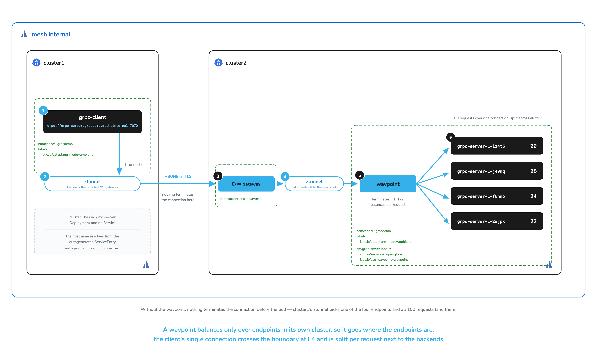

# Cross-Cluster gRPC Load Balancing

# Objectives
- Deploy a gRPC client and a 4-replica server across `cluster1` and `cluster2`
- Expose the server as a global service
- Reproduce gRPC connection pinning across the cluster boundary
- Attach a waypoint to the `grpc-server` Service in the cluster that holds the endpoints
- Restore per-request load balancing across the boundary and trace the path

## Prerequisites
- This lab assumes you have completed setup from labs `000-006`. The two clusters must be linked and `./solo-istioctl multicluster check` must pass. Traffic in this lab uses the east-west gateways created in lab `006`.

Ensure the following environment variables are set:
```bash
export KUBECONTEXT_CLUSTER1=cluster1  # Replace with your actual kubectl context name

export KUBECONTEXT_CLUSTER2=cluster2  # Replace with your actual kubectl context name
```

## Background

gRPC multiplexes many requests over one long-lived HTTP/2 connection, and Kubernetes load balances
*connections*, so every request a client sends over that connection lands on the same pod. The
[single-cluster version of this lab](../istio-ambient-single-cluster/010-grpc-loadbalancing.md) reproduces
that pinning in detail and fixes it with a waypoint on a single-cluster environment

This lab runs the same experiment across a global mesh. The client runs on `cluster1` and the 4-replica server on `cluster2`, where a
single `solo.io/service-scope=global` label publishes the server at `grpc-server.grpcdemo.mesh.internal` in
every peered cluster. A waypoint can then be used to enable per-request load balancing.

Both workloads use **Istio's echo app** (`docker.io/istio/app`), the same app Istio's own multicluster integration tests drive. Two of its properties do the work in this lab:

- Its responses carry `Hostname=`, so the client output tells you which pod served each request.
- Its responses also carry `Cluster=`, so you can confirm each request crossed the cluster boundary.

## Deploy the client and server across two clusters

Create the `grpcdemo` namespace on both clusters and enroll it in the ambient mesh:
```bash
for context in $KUBECONTEXT_CLUSTER1 $KUBECONTEXT_CLUSTER2; do
  kubectl create ns grpcdemo --context $context --dry-run=client -o yaml | kubectl apply --context $context -f -
  kubectl label ns grpcdemo istio.io/dataplane-mode=ambient --overwrite --context $context
done
```

Deploy the client on `cluster1`:
```bash
kubectl apply -f grpc/grpc-client.yaml -n grpcdemo --context $KUBECONTEXT_CLUSTER1
kubectl rollout status deploy/grpc-client -n grpcdemo --context $KUBECONTEXT_CLUSTER1
```

Deploy the 4-replica server on `cluster2`. The manifest passes `--cluster=$(CLUSTER_NAME)`, which Kubernetes expands from the container's environment, so the serving cluster shows up in every response:
```bash
kubectl apply -f grpc/grpc-server.yaml -n grpcdemo --context $KUBECONTEXT_CLUSTER2
kubectl set env deploy/grpc-server -n grpcdemo CLUSTER_NAME=$KUBECONTEXT_CLUSTER2 --context $KUBECONTEXT_CLUSTER2
kubectl rollout status deploy/grpc-server -n grpcdemo --context $KUBECONTEXT_CLUSTER2
```

> **The `grpc-server` Service port has to declare gRPC.** The manifest sets `appProtocol: grpc` and names
> the port `grpc`. Either signal tells Istio to parse HTTP/2 off the connection. Without one, a waypoint
> treats the stream as opaque TCP and pins every request to one pod. A global service carries the port
> definition to the peered clusters, so you set this only where the Service is defined.

`cluster1` holds only the client, with no `grpc-server` Deployment or Service at all:
```bash
kubectl get pods,svc -n grpcdemo --context $KUBECONTEXT_CLUSTER1
```

## Make the server reachable

### Neither hostname resolves

There is no `grpc-server` on `cluster1`, so the ordinary cluster-local name has nothing to resolve to:
```bash
kubectl exec -n grpcdemo deploy/grpc-client --context $KUBECONTEXT_CLUSTER1 -- \
  /usr/local/bin/client --count 1 grpc://grpc-server:7070
```

```sh
fatal	Error 1/1 requests had errors; first error: rpc error: code = Unavailable desc = connection error:
desc = "transport: Error while dialing: dial tcp: lookup grpc-server on 10.109.68.100:53: no such host"
```

Dialing the global hostname `grpc-server.grpcdemo.mesh.internal:7070` fails the same way. Peering the clusters in lab `006` did not make their services mutually reachable: services stay cluster-scoped until you label them global.

### Expose it as a global service

Apply the `solo.io/service-scope=global` label to the `grpc-server` service on `cluster2`. This generates a `ServiceEntry` for the hostname `grpc-server.grpcdemo.mesh.internal` in **every** peered cluster, aggregating the endpoints of each cluster that hosts the service:
```bash
kubectl label svc grpc-server -n grpcdemo solo.io/service-scope=global --overwrite --context $KUBECONTEXT_CLUSTER2
```

Confirm the global `ServiceEntry` reached both clusters:
```bash
for context in $KUBECONTEXT_CLUSTER1 $KUBECONTEXT_CLUSTER2; do
  echo "--- $context ---"
  kubectl get serviceentry -n istio-system --context $context | grep -E "NAME|grpc-server"
done
```

Both clusters report it, even though only `cluster2` has a `grpc-server` Service. Consuming a global
service requires no local copy, so `cluster1` needs no `grpc-server` Deployment and no placeholder
Service. It learns the hostname over the peering established in lab `006` and generates the
`ServiceEntry` itself:
```sh
NAME                         HOSTS                                    LOCATION        RESOLUTION   AGE
autogen.grpcdemo.grpc-server ["grpc-server.grpcdemo.mesh.internal"]   MESH_INTERNAL   STATIC       5s
```

Dial the global hostname and count by cluster:
```bash
kubectl exec -n grpcdemo deploy/grpc-client --context $KUBECONTEXT_CLUSTER1 -- \
  /usr/local/bin/client --count 100 grpc://grpc-server.grpcdemo.mesh.internal:7070 \
  | grep Cluster= | sed 's/.*Cluster=//' | sort | uniq -c
```

All 100 requests cross the boundary. `cluster2` here is the `CLUSTER_NAME` value you set on the server deployment, echoed back in every response:
```sh
 100 cluster2
```

## Pinned at L4, across the boundary

Reachability works. Now look at *which* pods serve the traffic.

A typical gRPC client connects once and multiplexes every request over that connection. Send 100 requests and count by server pod; piping through `sort | uniq -c` collapses the output:
```bash
kubectl exec -n grpcdemo deploy/grpc-client --context $KUBECONTEXT_CLUSTER1 -- \
  /usr/local/bin/client --count 100 \
  grpc://grpc-server.grpcdemo.mesh.internal:7070 \
  | grep Hostname= | sed 's/.*Hostname=//' | sort | uniq -c | sort -rn
```

All 100 requests land on a single pod:
```sh
 100 grpc-server-54f6774b64-j49mq
```

No L7 proxy sits anywhere in this path. ztunnel balances at L4, per *connection*, and the client opened exactly one. ztunnel gives that connection mTLS and L4 authorization, then forwards the whole stream to a single endpoint, so the four-replica deployment serves like one pod.

Tools like `grpcurl` open a fresh connection per invocation, so each probe lands on a different pod and a quick test looks healthy. The pinning shows only under a client that holds its connection open.

## Configure a waypoint for load balancing

In Ambient, a waypoint load balances only over endpoints in its own cluster, so put it where the endpoints
are: in `cluster2`, alongside the four pods. Deploy it into `grpcdemo` there and attach it to the
`grpc-server` Service:
```bash
kubectl apply --context $KUBECONTEXT_CLUSTER2 -f - <<EOF
apiVersion: gateway.networking.k8s.io/v1
kind: Gateway
metadata:
  name: waypoint
  namespace: grpcdemo
spec:
  gatewayClassName: istio-waypoint
  listeners:
  - name: mesh
    port: 15008
    protocol: HBONE
    allowedRoutes:
      namespaces:
        from: All
EOF
kubectl rollout status deploy/waypoint -n grpcdemo --context $KUBECONTEXT_CLUSTER2
kubectl label svc grpc-server -n grpcdemo istio.io/use-waypoint=waypoint --overwrite --context $KUBECONTEXT_CLUSTER2
```

The `istio.io/use-waypoint=waypoint` label marks `grpc-server` on `cluster2` as reached through that waypoint, and the global hostname resolves to that same Service. `cluster1`'s ztunnel still sends the client's connection across the boundary at L4, and `cluster2` now delivers it to the waypoint instead of straight to a pod.

> **Granular control.** `istio.io/use-waypoint` applies at the namespace level or per service. In this case we
> know which component needs request-level load balancing, so we scope the label to `grpc-server` and leave everything
> else in `grpcdemo` on ztunnel's L4 path, without an L7 hop it has no use for. A Service label overrides a
> namespace label in either direction, so you can carve a single service out of a namespace-wide waypoint, or
> into one.

Re-run the test that pinned all 100 requests. You have not reconfigured or restarted the client:
```bash
kubectl exec -n grpcdemo deploy/grpc-client --context $KUBECONTEXT_CLUSTER1 -- \
  /usr/local/bin/client --count 100 grpc://grpc-server.grpcdemo.mesh.internal:7070 \
  | grep Hostname= | sed 's/.*Hostname=//' | sort | uniq -c | sort -rn
```

One connection carrying 100 multiplexed requests now reaches four pods in another cluster:
```sh
  29 grpc-server-54f6774b64-lz4t5
  25 grpc-server-54f6774b64-j49mq
  24 grpc-server-54f6774b64-f6nm6
  22 grpc-server-54f6774b64-2wjpk
```

`cluster2` reports the endpoints its waypoint balances across:
```bash
./solo-istioctl ztunnel-config service --service-namespace grpcdemo --context $KUBECONTEXT_CLUSTER2
```

```sh
NAMESPACE SERVICE NAME                 SERVICE VIP             WAYPOINT ENDPOINTS
grpcdemo  autogen.grpcdemo.grpc-server 240.240.0.19,2001:2::13 waypoint 4/4
grpcdemo  autogen.grpcdemo.waypoint    240.240.0.20,2001:2::14 None     1/1
grpcdemo  grpc-server                  10.110.219.34           waypoint 4/4
grpcdemo  waypoint                     10.109.159.166          None     1/1
```

`ENDPOINTS 4/4`, one per backend pod, and the waypoint balances evenly across all of them.

## Trace the path

The request path is now: client pod → `cluster1` ztunnel → `cluster2` east-west gateway → `cluster2` ztunnel → **`cluster2` waypoint** → server pod. The source ztunnel dials the *remote* cluster's east-west gateway directly, so the client's connection crosses the boundary at L4 and nothing terminates it until it reaches the waypoint next to the backends.



Send another 100 requests, then read the `cluster2` ztunnel log:
```bash
kubectl exec -n grpcdemo deploy/grpc-client --context $KUBECONTEXT_CLUSTER1 -- \
  /usr/local/bin/client --count 100 grpc://grpc-server.grpcdemo.mesh.internal:7070 > /dev/null

# The waypoint holds its backend connections open for a 5s idle timeout after the
# client exits. Without this wait the log lines below do not exist yet.
sleep 8

kubectl logs -n istio-system -l app=ztunnel --context $KUBECONTEXT_CLUSTER2 --since=60s --prefix \
  | grep "connection complete" | grep 'src.workload="waypoint'
```

One connection per server pod, each carrying the **`cluster2`** waypoint's SPIFFE identity in `src.identity`. The waypoint terminated the client's connection and opened its own to each backend:
```sh
src.workload="waypoint-77f666585d-csj8l" src.identity="spiffe://cluster2.local/ns/grpcdemo/sa/waypoint" dst.workload="grpc-server-54f6774b64-j49mq" bytes_sent=12255
src.workload="waypoint-77f666585d-csj8l" src.identity="spiffe://cluster2.local/ns/grpcdemo/sa/waypoint" dst.workload="grpc-server-54f6774b64-2wjpk" bytes_sent=12255
src.workload="waypoint-77f666585d-csj8l" src.identity="spiffe://cluster2.local/ns/grpcdemo/sa/waypoint" dst.workload="grpc-server-54f6774b64-lz4t5" bytes_sent=11776
src.workload="waypoint-77f666585d-csj8l" src.identity="spiffe://cluster2.local/ns/grpcdemo/sa/waypoint" dst.workload="grpc-server-54f6774b64-f6nm6" bytes_sent=12734
```

`connection complete` logs only when a connection closes, which is what the `sleep` above waits for: the waypoint keeps each backend connection open for a 5s idle timeout after the client exits, so the lines carry `duration="5s"` and appear about five seconds late. Before the waypoint, this same log showed a single line carrying the *client's* identity, `spiffe://cluster1.local/ns/grpcdemo/sa/default`, to one pod: the connection reached the backend untouched. The waypoint now terminates it and opens its own to each of the four.

## Bonus: Migrate a service between clusters without changing hostnames

*Optional. The lab's objectives are complete; skip to Cleanup if you only came for the load balancing.*

The client dials `grpc-server.grpcdemo.mesh.internal`, a hostname you had to give it because the server lives in another cluster. Plenty of applications hardcode a cluster-local hostname such as `grpc-server` in a compiled binary, where changing it means a rebuild you may not control.

In this bonus, `grpc-server` starts on `cluster1` next to the client, behind its own waypoint, and you migrate it to the 4-replica deployment on `cluster2`. With `solo.io/service-takeover=true`, the client keeps dialing `grpc-server` for the whole migration. One connection stays balanced per request on whichever cluster serves it, and you can roll back until you delete the `cluster1` Service.

### Start with the service on cluster1

Deploy a 2-replica `grpc-server` on `cluster1`. The `sed` sets the cluster name and replica count before the first rollout:
```bash
sed -e "s/value: unset/value: $KUBECONTEXT_CLUSTER1/" -e 's/replicas: 4/replicas: 2/' grpc/grpc-server.yaml \
  | kubectl apply -n grpcdemo --context $KUBECONTEXT_CLUSTER1 -f -
kubectl rollout status deploy/grpc-server -n grpcdemo --context $KUBECONTEXT_CLUSTER1
```

Give it a waypoint on `cluster1`, the same way you did on `cluster2`, so a single gRPC connection is balanced across the local pods:
```bash
kubectl apply --context $KUBECONTEXT_CLUSTER1 -f - <<EOF
apiVersion: gateway.networking.k8s.io/v1
kind: Gateway
metadata:
  name: waypoint
  namespace: grpcdemo
spec:
  gatewayClassName: istio-waypoint
  listeners:
  - name: mesh
    port: 15008
    protocol: HBONE
    allowedRoutes:
      namespaces:
        from: All
EOF
kubectl rollout status deploy/waypoint -n grpcdemo --context $KUBECONTEXT_CLUSTER1
kubectl label svc grpc-server -n grpcdemo istio.io/use-waypoint=waypoint --overwrite --context $KUBECONTEXT_CLUSTER1

# ztunnel learns the new endpoints and waypoint a few seconds after they are ready.
sleep 10
```

Send 100 requests over one connection to the short name, and count by cluster and pod. You run this same test after each step below:
```bash
kubectl exec -n grpcdemo deploy/grpc-client --context $KUBECONTEXT_CLUSTER1 -- \
  /usr/local/bin/client --count 100 grpc://grpc-server:7070 \
  | awk -F= '/Cluster=/{c=$2} /Hostname=/{print c, $2}' | sort | uniq -c | sort -rn
```

The `cluster1` waypoint balances the connection across both local pods:
```sh
  52 cluster1 grpc-server-85c8869bd9-hfh4k
  48 cluster1 grpc-server-85c8869bd9-68lnh
```

### Prepare the migration

Label the `cluster1` Service `global`, and add the takeover label to the Services in both clusters. Each takeover label applies only to the Service in its own cluster:
```bash
kubectl label svc grpc-server -n grpcdemo solo.io/service-scope=global solo.io/service-takeover=true --overwrite --context $KUBECONTEXT_CLUSTER1
kubectl label svc grpc-server -n grpcdemo solo.io/service-takeover=true --overwrite --context $KUBECONTEXT_CLUSTER2
```

Re-run the test. The short name now covers the pods in both clusters, but traffic stays on `cluster1`:
```sh
  51 cluster1 grpc-server-85c8869bd9-hfh4k
  49 cluster1 grpc-server-85c8869bd9-68lnh
```

A takeover Service with no `networking.istio.io/traffic-distribution` annotation defaults to `PreferNetwork`: requests go to healthy endpoints in the caller's own network while any exist. Traffic moves to `cluster2` only when you drain `cluster1`.

### Cut over to cluster2

Detach the `cluster1` waypoint first, while the `cluster1` pods still serve:
```bash
kubectl label svc grpc-server -n grpcdemo istio.io/use-waypoint- --context $KUBECONTEXT_CLUSTER1

# ztunnel stops sending to the waypoint a few seconds after the label change.
sleep 10
```

Re-run the test. ztunnel now handles the connection alone and picks one endpoint for it, so all 100 requests land on one `cluster1` pod. No requests fail:
```sh
 100 cluster1 grpc-server-85c8869bd9-68lnh
```

Scale `cluster1` to zero:
```bash
kubectl scale deploy/grpc-server -n grpcdemo --replicas=0 --context $KUBECONTEXT_CLUSTER1
kubectl wait --for=delete pod -l app=grpc-server -n grpcdemo --context $KUBECONTEXT_CLUSTER1 --timeout=90s
```

Re-run the test. The client still dials `grpc-server`, and the connection now goes to `cluster2`, where the `cluster2` waypoint balances it across all four pods:
```sh
  26 cluster2 grpc-server-54f6774b64-wg5vf
  25 cluster2 grpc-server-54f6774b64-tvmdm
  25 cluster2 grpc-server-54f6774b64-qsqzj
  24 cluster2 grpc-server-54f6774b64-xxzkf
```

> **Detach the waypoint before you scale down.** For the taken-over `svc.cluster.local` hostname, the `cluster1`
> waypoint holds only `cluster1`'s endpoints. If you scale `cluster1` to zero while the waypoint is still attached,
> requests fail until you remove the `istio.io/use-waypoint` label. The same applies if the `cluster1` pods crash
> while the waypoint is attached, so use this procedure for planned migrations only.

### Roll back

Scale `cluster1` back up first, then re-attach its waypoint:
```bash
kubectl scale deploy/grpc-server -n grpcdemo --replicas=2 --context $KUBECONTEXT_CLUSTER1
kubectl rollout status deploy/grpc-server -n grpcdemo --context $KUBECONTEXT_CLUSTER1
sleep 10
kubectl label svc grpc-server -n grpcdemo istio.io/use-waypoint=waypoint --overwrite --context $KUBECONTEXT_CLUSTER1
sleep 10
```

Re-run the test. Traffic is back on `cluster1`, balanced across both pods:
```sh
  51 cluster1 grpc-server-85c8869bd9-2jbnk
  49 cluster1 grpc-server-85c8869bd9-bg8tw
```

### Finish the migration

Cut over again, then remove the server, its Service, and the waypoint from `cluster1`:
```bash
kubectl label svc grpc-server -n grpcdemo istio.io/use-waypoint- --context $KUBECONTEXT_CLUSTER1
kubectl delete deploy/grpc-server -n grpcdemo --context $KUBECONTEXT_CLUSTER1
kubectl wait --for=delete pod -l app=grpc-server -n grpcdemo --context $KUBECONTEXT_CLUSTER1 --timeout=90s
kubectl delete svc/grpc-server gateway/waypoint -n grpcdemo --context $KUBECONTEXT_CLUSTER1
sleep 10
```

Re-run the test. `cluster1` has no `grpc-server` Service now, so the mesh resolves the name from the global service that the `cluster2` takeover label publishes. The client still reaches all four `cluster2` pods:
```sh
  27 cluster2 grpc-server-54f6774b64-qsqzj
  25 cluster2 grpc-server-54f6774b64-wg5vf
  25 cluster2 grpc-server-54f6774b64-tvmdm
  23 cluster2 grpc-server-54f6774b64-xxzkf
```

> **Takeover applies to every caller.** It changes the cluster-local hostname for all clients in the cluster,
> so one client cannot reach remote endpoints while another stays local. The
> `networking.istio.io/traffic-distribution` annotation still applies to a takeover Service. For example, `Any`
> spreads traffic across both clusters while both serve and no `cluster1` waypoint is attached. Confirm the
> application can handle cross-cluster requests before you apply the label. See
> [Takeover](https://docs.solo.io/istio/1.30.x/ambient/multicluster/multi-apps/overview/#takeover) in the Solo docs.

To undo the bonus, remove the takeover label from `cluster2`. The short name then stops resolving on `cluster1`, as before the bonus:
```bash
kubectl label svc grpc-server -n grpcdemo solo.io/service-takeover- --context $KUBECONTEXT_CLUSTER2
```

## Cleanup

Remove the namespace from both clusters, which takes the waypoints, the apps, and the labels with it:
```bash
for context in $KUBECONTEXT_CLUSTER1 $KUBECONTEXT_CLUSTER2; do
  kubectl delete ns grpcdemo --context $context --ignore-not-found
done
```

Istio garbage collects the autogenerated `ServiceEntry` objects in `istio-system` once the services are gone. Confirm:
```bash
for context in $KUBECONTEXT_CLUSTER1 $KUBECONTEXT_CLUSTER2; do
  kubectl get serviceentry -n istio-system --context $context | grep grpc-server
done
```

Both commands should return nothing.

If you would like to clean up all workshop resources, see `016` for cleanup instructions.