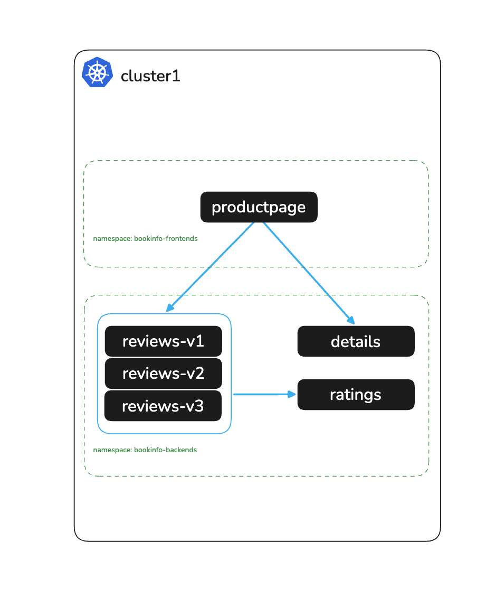

# Deploy Bookinfo Application

# Objectives
- Deploy the Bookinfo sample application across two namespaces on a single cluster
- Validate the application is accessible via port-forward



## Prerequisites
- This lab assumes you have read through and completed any setup from the `000` labs

## Set environment variables

`CLUSTER1` is the logical cluster name — set it to `cluster1` to match the convention used throughout this workshop and the multicluster workshop it is designed to extend to:
```bash
export KUBECONTEXT_CLUSTER1=cluster1  # Replace with your actual kubectl context name
export MESH_NAME_CLUSTER1=cluster1    # Recommended to keep as cluster1 for POC
```

## Deploy Bookinfo

Apply OpenShift SCCs to allow the Bookinfo pods to run:
```bash
oc --context $KUBECONTEXT_CLUSTER1 adm policy add-scc-to-group anyuid system:serviceaccounts:bookinfo-frontends
oc --context $KUBECONTEXT_CLUSTER1 adm policy add-scc-to-group anyuid system:serviceaccounts:bookinfo-backends
```

Deploy Bookinfo frontends (productpage) into the `bookinfo-frontends` namespace:
```bash
kubectl apply -f bookinfo/bookinfo-frontends.yaml --context $KUBECONTEXT_CLUSTER1
```

Deploy Bookinfo backends (details, ratings, reviews) into the `bookinfo-backends` namespace:
```bash
kubectl apply -f bookinfo/bookinfo-backends.yaml --context $KUBECONTEXT_CLUSTER1
```

Wait for all deployments to be ready:
```bash
for deploy in $(kubectl get deploy -n bookinfo-frontends --context $KUBECONTEXT_CLUSTER1 -o jsonpath='{.items[*].metadata.name}'); do
  echo "Waiting for frontend deployment '$deploy' to be ready..."
  kubectl rollout status deploy/"$deploy" -n bookinfo-frontends --watch --timeout=90s --context $KUBECONTEXT_CLUSTER1
done

for deploy in $(kubectl get deploy -n bookinfo-backends --context $KUBECONTEXT_CLUSTER1 -o jsonpath='{.items[*].metadata.name}'); do
  echo "Waiting for backend deployment '$deploy' to be ready..."
  kubectl rollout status deploy/"$deploy" -n bookinfo-backends --watch --timeout=90s --context $KUBECONTEXT_CLUSTER1
done
```

Stamp the reviews deployments with the cluster name. In the multicluster workshop this label makes it visible in the productpage UI which cluster served each request:
```bash
kubectl --context $KUBECONTEXT_CLUSTER1 -n bookinfo-backends set env deploy/reviews-v1 CLUSTER_NAME=$MESH_NAME_CLUSTER1
kubectl --context $KUBECONTEXT_CLUSTER1 -n bookinfo-backends set env deploy/reviews-v2 CLUSTER_NAME=$MESH_NAME_CLUSTER1
kubectl --context $KUBECONTEXT_CLUSTER1 -n bookinfo-backends set env deploy/reviews-v3 CLUSTER_NAME=$MESH_NAME_CLUSTER1
```

Port-forward to productpage to validate the application is working:
```bash
kubectl port-forward svc/productpage -n bookinfo-frontends 9080:9080 --context $KUBECONTEXT_CLUSTER1
```

Navigate to http://localhost:9080/productpage — you should see the Bookinfo product page with reviews and ratings.

## Next Steps
At this point we have completed the following objectives:
- Deployed the Bookinfo sample application across `bookinfo-frontends` and `bookinfo-backends` namespaces
- Validated the application is accessible via port-forward

In the next step `002` we will install Solo Istio Ambient on the cluster.
