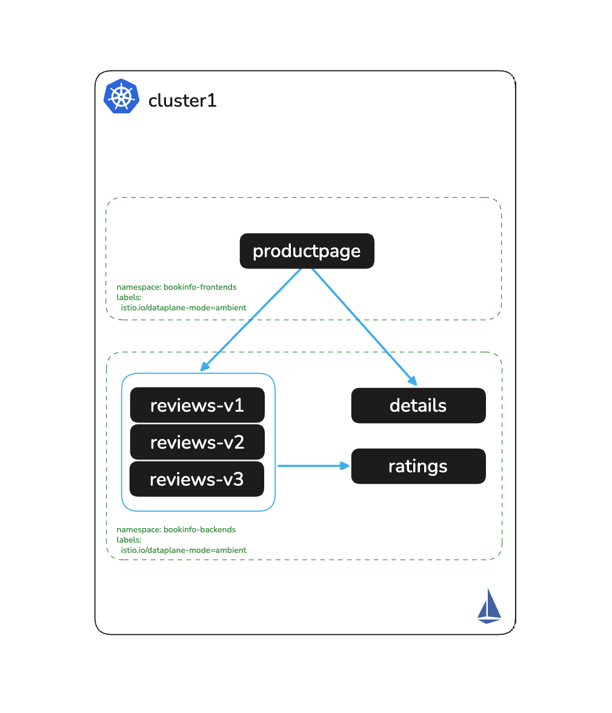

# Enroll Apps in the Mesh

# Objectives
- Enroll the Bookinfo namespaces into Ambient Mesh
- Validate workloads are enrolled using `istioctl`



## Prerequisites
- This lab assumes you have completed setup from labs `000-002`

## Background

One of the key operational advantages of Istio Ambient mode is how effortlessly workloads join the mesh. In traditional sidecar-based Istio, enrolling an application requires injecting an Envoy proxy into every pod — which means rolling restarts, increased resource overhead, and per-pod lifecycle management.

With Ambient, enrollment is a single namespace label. ztunnel, running as a DaemonSet on each node, transparently intercepts all traffic for labeled namespaces without touching the application pods. No sidecar injection, no restarts, no changes to application manifests. The moment the label is applied, all pod-to-pod traffic in the namespace is automatically secured with mTLS — the workloads themselves are unaware.

## Set environment variables

```bash
export KUBECONTEXT_CLUSTER1=cluster1  # Replace with your actual kubectl context name
export MESH_NAME_CLUSTER1=cluster1    # Recommended to keep as cluster1 for POC
```

## Check workload status before enrollment

Before enrolling, check the current workload status. You should see `TCP` as the protocol, indicating workloads are not yet part of the mesh:
```bash
./solo-istioctl zc workloads -n kube-system --context $KUBECONTEXT_CLUSTER1 | grep "bookinfo"
```

Expected output (TCP — not yet enrolled):
```
NAMESPACE            POD NAME                              ADDRESS      NODE    WAYPOINT PROTOCOL
bookinfo-backends    details-v1-74658b4f9b-9jgq6           10.130.0.21  ...     None     TCP
bookinfo-backends    ratings-v1-5d896f87b-tn5lf            10.129.0.38  ...     None     TCP
bookinfo-backends    reviews-v1-78b6cf6d-w8nxl             10.130.0.22  ...     None     TCP
bookinfo-backends    reviews-v2-8dbdc6fdd-f6s9h            10.129.0.39  ...     None     TCP
bookinfo-backends    reviews-v3-59958c554d-8sxqh           10.130.0.23  ...     None     TCP
bookinfo-frontends   productpage-v1-59c74584cf-5fvhq       10.129.0.37  ...     None     TCP
```

## Enroll the namespaces

Apply the `istio.io/dataplane-mode=ambient` label to both namespaces:
```bash
kubectl label namespace bookinfo-frontends istio.io/dataplane-mode=ambient --context $KUBECONTEXT_CLUSTER1
kubectl label namespace bookinfo-backends istio.io/dataplane-mode=ambient --context $KUBECONTEXT_CLUSTER1
```

## Validate enrollment

Check the workload status again. The protocol should now show `HBONE`, confirming the workloads are enrolled in the Ambient Mesh and all pod-to-pod traffic is encrypted with mTLS. Note that no pods were restarted:
```bash
./solo-istioctl zc workloads -n kube-system --context $KUBECONTEXT_CLUSTER1 | grep "bookinfo"
```

Expected output (HBONE — enrolled in Ambient Mesh):
```
NAMESPACE            POD NAME                              ADDRESS      NODE    WAYPOINT PROTOCOL
bookinfo-backends    details-v1-74658b4f9b-9jgq6           10.130.0.21  ...     None     HBONE
bookinfo-backends    ratings-v1-5d896f87b-tn5lf            10.129.0.38  ...     None     HBONE
bookinfo-backends    reviews-v1-78b6cf6d-w8nxl             10.130.0.22  ...     None     HBONE
bookinfo-backends    reviews-v2-8dbdc6fdd-f6s9h            10.129.0.39  ...     None     HBONE
bookinfo-backends    reviews-v3-59958c554d-8sxqh           10.130.0.23  ...     None     HBONE
bookinfo-frontends   productpage-v1-59c74584cf-5fvhq       10.129.0.37  ...     None     HBONE
```

All workloads are now enrolled in the mesh with zero restarts and zero changes to application manifests.

## Next Steps
At this point we have completed the following objectives:
- Enrolled the Bookinfo namespaces into Ambient Mesh
- Validated workloads show `HBONE` protocol confirming mTLS is active

In the next step `004` we will expose the Bookinfo application via an Ingress Gateway.
