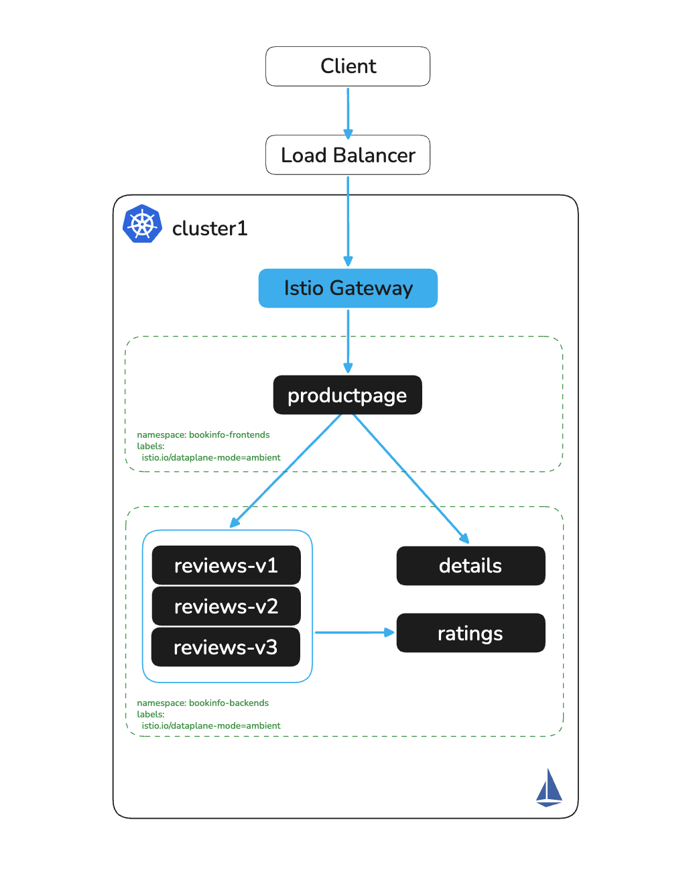

# Expose Bookinfo

# Objectives
- Deploy an Istio Ingress Gateway
- Expose the Bookinfo application via an HTTPRoute
- Observe ztunnel intercepting and securing traffic across the call chain



## Prerequisites
- This lab assumes you have completed setup from labs `000-003`

## Set environment variables

```bash
export CLUSTER1=cluster1
```

## Deploy an Ingress Gateway

Create an Istio Gateway using the Kubernetes Gateway API:
```bash
kubectl apply --context $CLUSTER1 -f - <<EOF
apiVersion: gateway.networking.k8s.io/v1
kind: Gateway
metadata:
  name: ingress
  namespace: istio-system
spec:
  gatewayClassName: istio
  listeners:
  - name: http
    port: 80
    protocol: HTTP
    allowedRoutes:
      namespaces:
        from: All
EOF
```

Verify the gateway pod and service have been created in `istio-system`:
```bash
kubectl get pods -n istio-system --context $CLUSTER1
kubectl get svc -n istio-system --context $CLUSTER1
```

Expected output for pods:
```
NAME                            READY   STATUS    RESTARTS   AGE
ingress-istio-78b4f97bb-k6k4b   1/1     Running   0          14s
istiod-5ccd964945-9kbjg         1/1     Running   0          7m46s
```

Expected output for services:
```
NAME            TYPE           CLUSTER-IP       EXTERNAL-IP     PORT(S)                                 AGE
ingress-istio   LoadBalancer   172.30.133.188   <external-ip>   15021:30534/TCP,80:31705/TCP            14s
istiod          ClusterIP      172.30.128.33    <none>          15010/TCP,15012/TCP,443/TCP,15014/TCP   7m46s
```

> **Note:** The cloud load balancer may take a few minutes to be provisioned. If `EXTERNAL-IP` shows `<pending>`, wait and re-run the `kubectl get svc` command until an address is assigned before proceeding.

## Expose Bookinfo via HTTPRoute

Create an HTTPRoute to route incoming traffic to the productpage service:
```bash
kubectl apply --context $CLUSTER1 -f - <<EOF
apiVersion: gateway.networking.k8s.io/v1beta1
kind: HTTPRoute
metadata:
  name: bookinfo-route
  namespace: bookinfo-frontends
spec:
  parentRefs:
    - name: ingress
      namespace: istio-system
  rules:
    - matches:
      - path:
          type: PathPrefix
          value: /
      backendRefs:
      - name: productpage
        port: 9080
EOF
```

## Access the application

Get the external IP of the ingress gateway service and open the application in your browser:
```bash
SVC=$(kubectl -n istio-system get svc ingress-istio --context $CLUSTER1 --no-headers | awk '{ print $4 }')
echo http://$SVC/productpage
```

Or verify with curl:
```bash
curl http://$SVC/productpage
```

## Observe ztunnel Intercepting Traffic

Generate a request to the application and inspect ztunnel logs to confirm it is intercepting and securing traffic. Open a second terminal and start tailing the ztunnel logs:

```bash
kubectl logs -n kube-system -l app=ztunnel --context $CLUSTER1 -f --prefix
```

In your original terminal, send a request through the ingress gateway using curl (not a browser — see note below):
```bash
SVC=$(kubectl -n istio-system get svc ingress-istio --context $CLUSTER1 --no-headers | awk '{ print $4 }')
curl http://$SVC/productpage -s -o /dev/null -w "%{http_code}"
```

> **Why curl and not a browser?** A browser load of `/productpage` triggers several additional requests for static assets (CSS, images, fonts). Those requests are all intercepted by ztunnel and logged the same way, which adds noise. Using curl issues a single HTTP request that produces a clean, minimal set of log entries.

You should see `200` printed in your terminal, and in the ztunnel log window you will see entries for each hop in the Bookinfo call chain.

### Understanding the log structure

A single `curl /productpage` triggers three backend calls: ingress → productpage, productpage → details, and productpage → reviews. ztunnel logs **two entries per hop** — one from the source node (`direction="outbound"`) and one from the destination node (`direction="inbound"`). It also logs a `connection complete` entry when each TCP connection closes.

The log entries are organized below by hop. Note that the productpage→reviews hop shows entries from **two different ztunnel pods** (`ztunnel-qfrmt` and `ztunnel-4xc94`), because productpage and reviews-v1 landed on different nodes. The `direction="outbound"` entry comes from the node where productpage runs; `direction="inbound"` comes from the node where reviews-v1 runs.

**Hop 1 — ingress-istio → productpage** (`http access` + `connection complete`):
```
[pod/ztunnel-qfrmt/istio-proxy] 2026-02-27T17:16:04.946312Z     info    http access     request complete     src.addr=10.129.0.27:40900 src.workload="ingress-istio-68bd49d649-rrbt5" src.namespace="istio-system" src.identity="spiffe://cluster1.local/ns/istio-system/sa/ingress-istio" dst.addr=10.129.0.21:15008 dst.hbone_addr=productpage.bookinfo-frontends.svc.cluster.local:9080 dst.service="productpage.bookinfo-frontends.svc.cluster.local" dst.workload="productpage-v1-59c74584cf-95tqx" dst.namespace="bookinfo-frontends" dst.identity="spiffe://cluster1.local/ns/bookinfo-frontends/sa/bookinfo-productpage" direction="inbound" method=GET path="/productpage" protocol=HTTP1 response_code=200 duration="35ms"
[pod/ztunnel-qfrmt/istio-proxy] 2026-02-27T17:16:07.012837Z     info    access  connection complete  src.addr=10.129.0.27:40900 src.workload="ingress-istio-68bd49d649-rrbt5" src.namespace="istio-system" src.identity="spiffe://cluster1.local/ns/istio-system/sa/ingress-istio" dst.addr=10.129.0.21:15008 dst.hbone_addr=productpage.bookinfo-frontends.svc.cluster.local:9080 dst.service="productpage.bookinfo-frontends.svc.cluster.local" dst.workload="productpage-v1-59c74584cf-95tqx" dst.namespace="bookinfo-frontends" dst.identity="spiffe://cluster1.local/ns/bookinfo-frontends/sa/bookinfo-productpage" direction="inbound" bytes_sent=9960 bytes_recv=1551 duration="2102ms"
```

**Hop 2 — productpage → details** (inbound + outbound `http access` pair, then `connection complete` pair):
```
[pod/ztunnel-qfrmt/istio-proxy] 2026-02-27T17:16:04.920155Z     info    http access     request complete     src.addr=10.129.0.21:56738 src.workload="productpage-v1-59c74584cf-95tqx" src.namespace="bookinfo-frontends" src.identity="spiffe://cluster1.local/ns/bookinfo-frontends/sa/bookinfo-productpage" dst.addr=10.129.0.22:15008 dst.hbone_addr=10.129.0.22:9080 dst.service="details.bookinfo-backends.svc.cluster.local" dst.workload="details-v1-74658b4f9b-2xkdt" dst.namespace="bookinfo-backends" dst.identity="spiffe://cluster1.local/ns/bookinfo-backends/sa/bookinfo-details" direction="inbound" method=GET path="/details/0" protocol=HTTP1 response_code=200 duration="0ms"
[pod/ztunnel-qfrmt/istio-proxy] 2026-02-27T17:16:04.920424Z     info    http access     request complete     src.addr=10.129.0.21:43198 src.workload="productpage-v1-59c74584cf-95tqx" src.namespace="bookinfo-frontends" src.identity="spiffe://cluster1.local/ns/bookinfo-frontends/sa/bookinfo-productpage" dst.addr=10.129.0.22:15008 dst.hbone_addr=10.129.0.22:9080 dst.service="details.bookinfo-backends.svc.cluster.local" dst.workload="details-v1-74658b4f9b-2xkdt" dst.namespace="bookinfo-backends" dst.identity="spiffe://cluster1.local/ns/bookinfo-backends/sa/bookinfo-details" direction="outbound" method=GET path="/details/0" protocol=HTTP1 response_code=200 duration="1ms"
[pod/ztunnel-qfrmt/istio-proxy] 2026-02-27T17:16:04.921888Z     info    access  connection complete  src.addr=10.129.0.21:56738 src.workload="productpage-v1-59c74584cf-95tqx" src.namespace="bookinfo-frontends" src.identity="spiffe://cluster1.local/ns/bookinfo-frontends/sa/bookinfo-productpage" dst.addr=10.129.0.22:15008 dst.hbone_addr=10.129.0.22:9080 dst.service="details.bookinfo-backends.svc.cluster.local" dst.workload="details-v1-74658b4f9b-2xkdt" dst.namespace="bookinfo-backends" dst.identity="spiffe://cluster1.local/ns/bookinfo-backends/sa/bookinfo-details" direction="inbound" bytes_sent=358 bytes_recv=335 duration="3ms"
[pod/ztunnel-qfrmt/istio-proxy] 2026-02-27T17:16:04.922336Z     info    access  connection complete  src.addr=10.129.0.21:43198 src.workload="productpage-v1-59c74584cf-95tqx" src.namespace="bookinfo-frontends" src.identity="spiffe://cluster1.local/ns/bookinfo-frontends/sa/bookinfo-productpage" dst.addr=10.129.0.22:15008 dst.hbone_addr=10.129.0.22:9080 dst.service="details.bookinfo-backends.svc.cluster.local" dst.workload="details-v1-74658b4f9b-2xkdt" dst.namespace="bookinfo-backends" dst.identity="spiffe://cluster1.local/ns/bookinfo-backends/sa/bookinfo-details" direction="outbound" bytes_sent=335 bytes_recv=358 duration="3ms"
```

**Hop 3 — productpage → reviews** (cross-node: outbound from `ztunnel-qfrmt`, inbound from `ztunnel-4xc94`):
```
[pod/ztunnel-qfrmt/istio-proxy] 2026-02-27T17:16:04.927282Z     info    http access     request complete     src.addr=10.129.0.21:57438 src.workload="productpage-v1-59c74584cf-95tqx" src.namespace="bookinfo-frontends" src.identity="spiffe://cluster1.local/ns/bookinfo-frontends/sa/bookinfo-productpage" dst.addr=10.130.0.27:15008 dst.hbone_addr=10.130.0.27:9080 dst.service="reviews.bookinfo-backends.svc.cluster.local" dst.workload="reviews-v1-78b6cf6d-xf9mg" dst.namespace="bookinfo-backends" dst.identity="spiffe://cluster1.local/ns/bookinfo-backends/sa/bookinfo-reviews" direction="outbound" method=GET path="/reviews/0" protocol=HTTP1 response_code=200 duration="2ms"
[pod/ztunnel-4xc94/istio-proxy] 2026-02-27T17:16:04.926934Z     info    http access     request complete     src.addr=10.129.0.21:50684 src.workload="productpage-v1-59c74584cf-95tqx" src.namespace="bookinfo-frontends" src.identity="spiffe://cluster1.local/ns/bookinfo-frontends/sa/bookinfo-productpage" dst.addr=10.130.0.27:15008 dst.hbone_addr=10.130.0.27:9080 dst.service="reviews.bookinfo-backends.svc.cluster.local" dst.workload="reviews-v1-78b6cf6d-xf9mg" dst.namespace="bookinfo-backends" dst.identity="spiffe://cluster1.local/ns/bookinfo-backends/sa/bookinfo-reviews" direction="inbound" method=GET path="/reviews/0" protocol=HTTP1 response_code=200 duration="2ms"
[pod/ztunnel-qfrmt/istio-proxy] 2026-02-27T17:16:04.928717Z     info    access  connection complete  src.addr=10.129.0.21:57438 src.workload="productpage-v1-59c74584cf-95tqx" src.namespace="bookinfo-frontends" src.identity="spiffe://cluster1.local/ns/bookinfo-frontends/sa/bookinfo-productpage" dst.addr=10.130.0.27:15008 dst.hbone_addr=10.130.0.27:9080 dst.service="reviews.bookinfo-backends.svc.cluster.local" dst.workload="reviews-v1-78b6cf6d-xf9mg" dst.namespace="bookinfo-backends" dst.identity="spiffe://cluster1.local/ns/bookinfo-backends/sa/bookinfo-reviews" direction="outbound" bytes_sent=335 bytes_recv=521 duration="4ms"
[pod/ztunnel-4xc94/istio-proxy] 2026-02-27T17:16:04.928417Z     info    access  connection complete  src.addr=10.129.0.21:50684 src.workload="productpage-v1-59c74584cf-95tqx" src.namespace="bookinfo-frontends" src.identity="spiffe://cluster1.local/ns/bookinfo-frontends/sa/bookinfo-productpage" dst.addr=10.130.0.27:15008 dst.hbone_addr=10.130.0.27:9080 dst.service="reviews.bookinfo-backends.svc.cluster.local" dst.workload="reviews-v1-78b6cf6d-xf9mg" dst.namespace="bookinfo-backends" dst.identity="spiffe://cluster1.local/ns/bookinfo-backends/sa/bookinfo-reviews" direction="inbound" bytes_sent=521 bytes_recv=335 duration="4ms"
```

### Reading the log fields

**`src.identity` and `dst.identity`** — these are the SPIFFE workload identities ztunnel has cryptographically verified on each end of the mTLS connection. Both are present on every entry — ztunnel knows the identity of both source and destination for every connection:

```
src.identity="spiffe://cluster1.local/ns/bookinfo-frontends/sa/bookinfo-productpage"
dst.identity="spiffe://cluster1.local/ns/bookinfo-backends/sa/bookinfo-details"
```

The format is `spiffe://<trust-domain>/ns/<namespace>/sa/<service-account>`. istiod issues X.509 certificates to each workload encoding this identity; ztunnel performs the mTLS handshake and verifies the certificates on both ends for every connection. Neither workload has a sidecar — the cryptographic identity enforcement is entirely in ztunnel.

**`dst.addr` port `15008` and `dst.hbone_addr`** — `dst.addr` always points to port `15008`, which is ztunnel's HBONE listener on the destination node. This is where the encrypted tunnel terminates. `dst.hbone_addr` is the actual pod IP (or service hostname on the ingress→productpage hop) and application port that ztunnel forwards the decrypted traffic to.

**`direction="inbound"` vs `direction="outbound"`** — ztunnel logs both sides of every connection. For each hop you will see a pair: the `outbound` entry from the source node's ztunnel (encrypting and tunneling the traffic) and the `inbound` entry from the destination node's ztunnel (receiving, decrypting, and forwarding to the pod). On a single-node cluster both entries come from the same ztunnel pod; on multi-node clusters they come from different ztunnel pods, as visible in Hop 3 above where the outbound entry is from `ztunnel-qfrmt` and the inbound entry is from `ztunnel-4xc94`.

**`http access` vs `connection complete`** — there are two log types. `http access` is emitted once per HTTP request with request-level fields (`method`, `path`, `response_code`). `connection complete` is emitted when the underlying TCP connection closes, with byte counts (`bytes_sent`, `bytes_recv`) and the total connection duration. A single keep-alive TCP connection can carry multiple HTTP requests, so you may see several `http access` entries before the corresponding `connection complete`.

These log fields are the evidence that ztunnel is providing zero-trust mTLS between every service pair in the call chain — with cryptographic workload identity verified at every hop, and no changes to any application.


## Next Steps
At this point we have completed the following objectives:
- Deployed an Istio Ingress Gateway
- Exposed the Bookinfo application via an HTTPRoute
- Verified external access to the productpage
- Observed ztunnel logging cryptographic workload identity and HBONE tunnel details for every hop in the call chain

In the next step `005` we will configure egress control using a waypoint.
