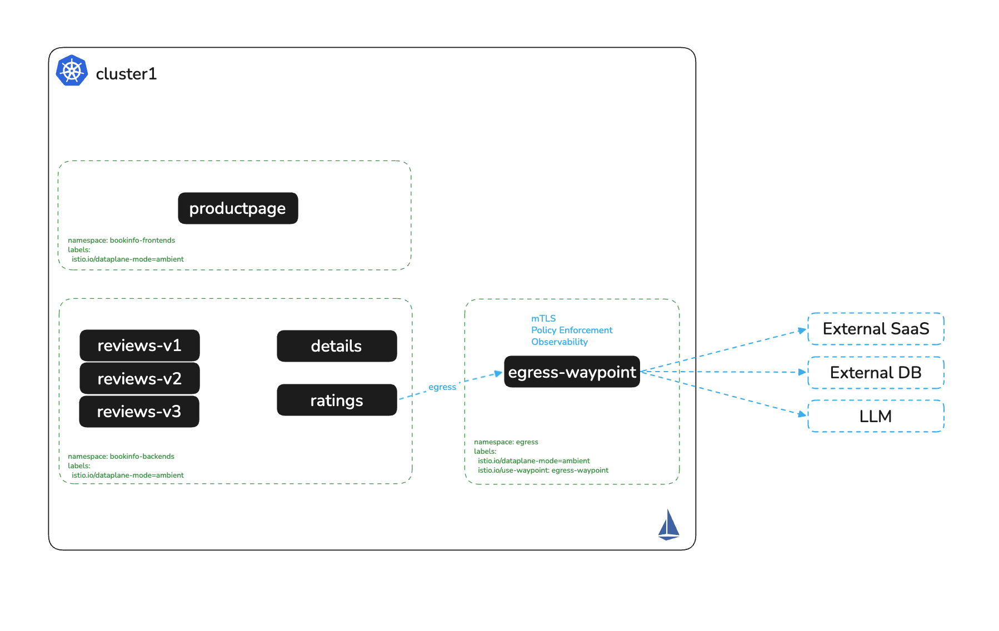

# Egress with Waypoint

# Objectives
- Deploy a shared egress waypoint in a dedicated `egress` namespace
- Route outbound traffic to an external service through the waypoint
- Enable access logging on the egress waypoint
- Enforce egress authorization policies to restrict allowed paths and source principals



## Prerequisites
- This lab assumes you have completed setup from labs `000-003`

## Set environment variables

```bash
export CLUSTER1=cluster1
```

## Deploy the egress namespace and waypoint

Create a dedicated `egress` namespace and deploy a shared Waypoint. This Waypoint serves as a centralized control point for outbound traffic from across the mesh:
```bash
kubectl apply --context ${CLUSTER1} -f - <<EOF
apiVersion: v1
kind: Namespace
metadata:
  labels:
    istio.io/dataplane-mode: ambient
    istio.io/use-waypoint: egress-waypoint
  name: egress
---
apiVersion: gateway.networking.k8s.io/v1
kind: Gateway
metadata:
  name: egress-waypoint
  namespace: egress
spec:
  gatewayClassName: istio-waypoint
  listeners:
  - name: mesh
    port: 15008
    protocol: HBONE
    allowedRoutes:
      namespaces:
        from: All
EOF
```

Wait for the waypoint deployment to be ready:
```bash
kubectl -n egress rollout status deployment/egress-waypoint --context ${CLUSTER1}
```

Verify the waypoint pod is running:
```bash
kubectl get pods -n egress --context ${CLUSTER1}
```

Expected output:
```
NAME                               READY   STATUS    RESTARTS   AGE
egress-waypoint-54dbfd59bd-sqwd9   1/1     Running   0          8s
```

## Enable access logging on the egress waypoint

```bash
kubectl apply --context ${CLUSTER1} -f - <<EOF
apiVersion: telemetry.istio.io/v1
kind: Telemetry
metadata:
  name: enable-access-logging
  namespace: egress
spec:
  targetRefs:
  - kind: Gateway
    group: gateway.networking.k8s.io
    name: egress-waypoint
  accessLogging:
    - providers:
      - name: envoy
EOF
```

## Define the external service and route traffic through the waypoint

Create a ServiceEntry to represent the external service `jsonplaceholder.typicode.com`. The labels `istio.io/use-waypoint` and the placement in the `egress` namespace configure traffic to this service to be routed through the shared egress waypoint:
```bash
kubectl apply --context ${CLUSTER1} -f - <<EOF
apiVersion: networking.istio.io/v1
kind: ServiceEntry
metadata:
  labels:
    istio.io/use-waypoint: egress-waypoint
  name: jsonplaceholder.typicode.com
  namespace: egress
spec:
  hosts:
  - jsonplaceholder.typicode.com
  ports:
  - name: http
    number: 80
    protocol: HTTP
  resolution: DNS
EOF
```

## Verify traffic flows through the waypoint

Open a terminal to watch egress waypoint logs in real time:
```bash
kubectl logs -n egress deploy/egress-waypoint -f --context ${CLUSTER1}
```

In a second terminal, exec into `reviews-v1` and send a request to the external service:
```bash
kubectl exec deploy/reviews-v1 -n bookinfo-backends --context ${CLUSTER1} -- \
  curl -sI jsonplaceholder.typicode.com/posts | grep envoy
```

Expected output — Envoy headers confirm traffic passed through the waypoint:
```
server: istio-envoy
x-envoy-upstream-service-time: 255
x-envoy-decorator-operation: :80/*
```

You should also see a corresponding access log entry in the waypoint:
```
[2025-05-22T01:52:13.224Z] "HEAD /posts HTTP/1.1" 200 - via_upstream - "-" 0 0 206 206 "-" "curl/7.81.0" "..." "jsonplaceholder.typicode.com" "104.21.48.1:80" inbound-vip|80|http|jsonplaceholder.typicode.com ...
```

## Enforce egress policy controls

Apply an egress authorization policy that allows only the `reviews` service account to call `GET /posts` on `jsonplaceholder.typicode.com`:
```bash
cat auth-policy/egress-auth.yaml
echo
kubectl apply -f auth-policy/egress-auth.yaml --context ${CLUSTER1}
```

**Test 1 — Allowed:** `reviews-v1` calling the allowed path `/posts`:
```bash
kubectl exec -it deploy/reviews-v1 -n bookinfo-backends --context ${CLUSTER1} -- \
  curl jsonplaceholder.typicode.com/posts
```
This request should succeed with a 200 response.

**Test 2 — Denied by path:** `reviews-v1` calling a disallowed path `/comments`:
```bash
kubectl exec -it deploy/reviews-v1 -n bookinfo-backends --context ${CLUSTER1} -- \
  curl jsonplaceholder.typicode.com/comments
```
Expected: `RBAC: access denied` — the policy only permits `/posts`.

**Test 3 — Denied by principal:** `ratings-v1` calling the allowed path:
```bash
kubectl exec -it deploy/ratings-v1 -n bookinfo-backends --context ${CLUSTER1} -- \
  curl jsonplaceholder.typicode.com/posts
```
Expected: `RBAC: access denied` — the policy only permits requests from the `bookinfo-reviews` service account.

Check the egress waypoint logs to see the RBAC deny entries:
```
[2025-05-22T01:57:28.209Z] "GET /posts HTTP/1.1" 403 - rbac_access_denied_matched_policy[none] ...
```

## Cleanup

```bash
kubectl delete authorizationpolicies -n egress --all --context ${CLUSTER1}
kubectl delete serviceentry --all -n egress --context ${CLUSTER1}
kubectl delete telemetry enable-access-logging -n egress --context ${CLUSTER1}
kubectl delete gateway egress-waypoint -n egress --context ${CLUSTER1}
kubectl delete namespace egress --context ${CLUSTER1}
```

## Next Steps
At this point we have completed the following objectives:
- Deployed a shared egress waypoint
- Forced outbound traffic through the waypoint and verified via Envoy headers and access logs
- Enforced egress authorization policies by source principal and path

In the next step `006` we will inspect Istio Ambient metrics for observability.
