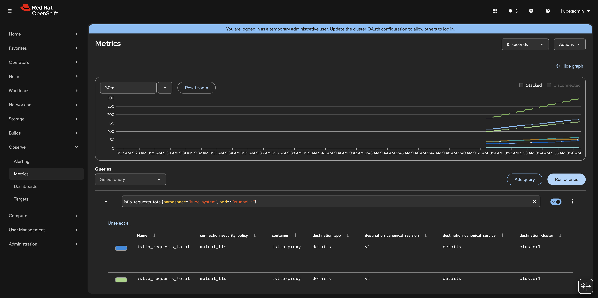
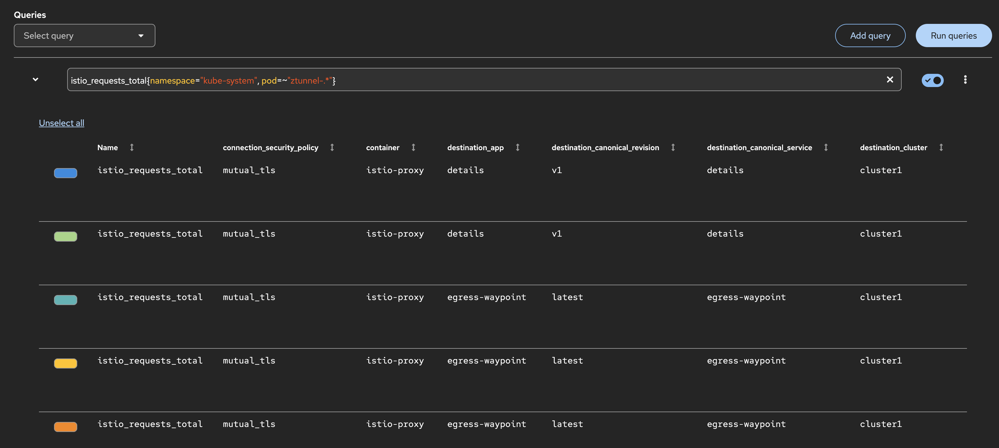
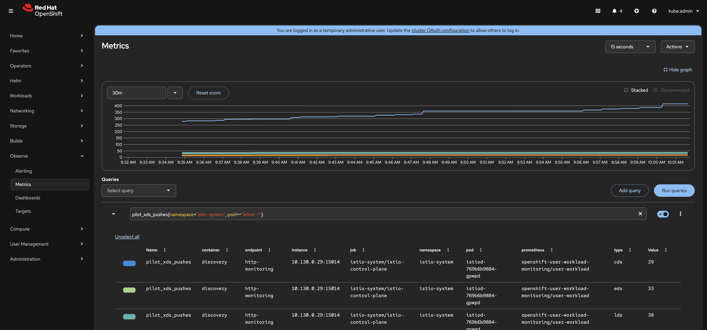
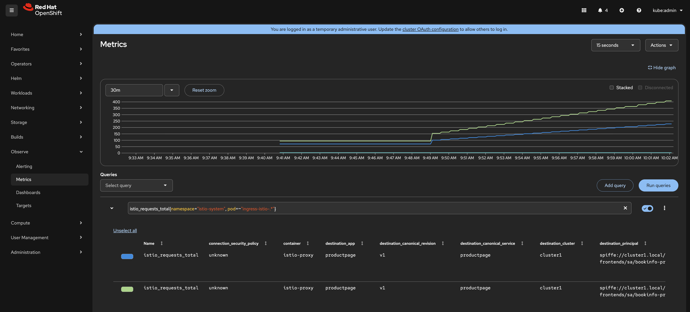

# Observability — Inspecting Istio Ambient Metrics

# Objectives
- Inspect ztunnel metrics to observe L4 mTLS connection data and L7 request telemetry
- Inspect istiod metrics to observe control plane health
- Configure OpenShift User Workload Monitoring to persistently scrape Istio Ambient components

## Prerequisites
- This lab assumes you have completed setup from labs `000-003`

## Set environment variables

```bash
export CLUSTER1=cluster1
```

## Background

Solo Istio Ambient enables `L7_ENABLED: "true"` on ztunnel (configured in lab `002`). This means ztunnel emits both **L4 TCP** and **L7 HTTP** metrics from a single endpoint — no waypoint-specific scrape is needed for request-level telemetry.

Each Istio component exposes a Prometheus-format `/metrics` endpoint. `kubectl port-forward` and `curl` are sufficient for ad-hoc inspection without deploying a full Prometheus stack.

| Component | Port | Path | What it shows |
|---|---|---|---|
| ztunnel (DaemonSet pod) | 15020 | `/metrics` | L4 TCP + L7 HTTP metrics (mTLS, request counts, response codes, latency) |
| istiod | 15014 | `/metrics` | Control plane metrics: config push latency, connected proxies |

## ztunnel Metrics (L4 + L7)

ztunnel is a DaemonSet — one pod per node. Get any ztunnel pod name:
```bash
ZTUNNEL_POD=$(kubectl get pods -n kube-system -l app=ztunnel \
  --context $CLUSTER1 -o jsonpath='{.items[0].metadata.name}')
echo $ZTUNNEL_POD
```

Port-forward to the ztunnel pod's metrics port:
```bash
kubectl port-forward -n kube-system $ZTUNNEL_POD 15020:15020 --context $CLUSTER1 &
PORT_FORWARD_PID=$!
sleep 2
```

Generate traffic through the mesh so that ztunnel records connections and requests:
```bash
for i in $(seq 1 5); do
  kubectl exec deploy/productpage-v1 -n bookinfo-frontends --context $CLUSTER1 -- \
    python3 -c "import urllib.request, json; print(json.dumps(json.load(urllib.request.urlopen('http://reviews.bookinfo-backends:9080/reviews/0')), indent=2))"
done
```

Inspect L4 TCP connection metrics — confirm mTLS is in use:
```bash
curl -s localhost:15020/metrics | grep istio_tcp_connections_opened_total
```

You should see entries tagged with `security_policy="mutual_tls"`, confirming all connections inside the mesh are mTLS-encrypted:
```
istio_tcp_connections_opened_total{...security_policy="mutual_tls",...} 5
```

Inspect L7 HTTP request metrics — observe per-request labels:
```bash
curl -s localhost:15020/metrics | grep 'istio_requests_total'
```

The output shows L7 labels including `response_code`, `source_workload`, and `destination_service`:
```
istio_requests_total{connection_security_policy="mutual_tls",destination_service="reviews.bookinfo-backends.svc.cluster.local",reporter="source",request_protocol="http",response_code="200",source_workload="productpage-v1",...} 5
```

Stop the port-forward:
```bash
kill $PORT_FORWARD_PID
```

## istiod Metrics

Port-forward to istiod's metrics port:
```bash
kubectl port-forward -n istio-system svc/istiod 15014:15014 --context $CLUSTER1 &
ISTIOD_PID=$!
sleep 2
```

Inspect config distribution counters — how many xDS pushes istiod has performed:
```bash
curl -s localhost:15014/metrics | grep pilot_xds_pushes
```

Example output:
```
pilot_xds_pushes{type="cds"} 42
pilot_xds_pushes{type="eds"} 38
pilot_xds_pushes{type="lds"} 21
pilot_xds_pushes{type="rds"} 19
```

Inspect proxy convergence latency — how long it takes for proxies to acknowledge config updates:
```bash
curl -s localhost:15014/metrics | grep pilot_proxy_convergence_time
```

Example output:
```
pilot_proxy_convergence_time_bucket{le="0.1"} 120
pilot_proxy_convergence_time_bucket{le="0.5"} 140
pilot_proxy_convergence_time_count 142
pilot_proxy_convergence_time_sum 8.3
```

Stop the port-forward:
```bash
kill $ISTIOD_PID
```

## Observability using OpenShift User Workload Monitoring

The port-forward approach above is useful for ad-hoc inspection. For persistent, Prometheus-based scraping integrated with the OpenShift console, use OpenShift User Workload Monitoring (UWM) with `PodMonitor` resources.

The Istio Ambient components expose Prometheus metrics on the following ports:

| Component | Namespace | Pod label | Port | What it shows |
|---|---|---|---|---|
| ztunnel | `kube-system` | `app=ztunnel` | 15020 | L4 TCP + L7 HTTP metrics |
| istiod | `istio-system` | `app=istiod` | 15014 | Control plane health and xDS push metrics |
| Ingress gateway | `istio-system` | `istio=ingress` | 15020 | Envoy proxy request/response metrics |

### Enable User Workload Monitoring

```bash
kubectl apply --context $CLUSTER1 -f - <<EOF
apiVersion: v1
kind: ConfigMap
metadata:
  name: cluster-monitoring-config
  namespace: openshift-monitoring
data:
  config.yaml: |
    enableUserWorkload: true
EOF
```

### PodMonitor for istiod

istiod exposes control plane metrics (xDS push counts, proxy convergence latency, connected proxies) on port `15014`:

```bash
kubectl apply --context $CLUSTER1 -f - <<EOF
apiVersion: monitoring.coreos.com/v1
kind: PodMonitor
metadata:
  name: istio-control-plane
  namespace: istio-system
spec:
  namespaceSelector:
    matchNames:
      - istio-system
  podMetricsEndpoints:
    - port: http-monitoring
      path: /metrics
  selector:
    matchLabels:
      app: istiod
EOF
```

### PodMonitor for the ingress gateway

The ingress gateway pod (an Envoy proxy) exposes request/response metrics on port `15020`. When a Gateway is provisioned via the Gateway API, the controller stamps the pod with `gateway.networking.k8s.io/gateway-name=<name>` — use that label as the selector:

```bash
kubectl apply --context $CLUSTER1 -f - <<EOF
apiVersion: monitoring.coreos.com/v1
kind: PodMonitor
metadata:
  name: istio-ingress-gateway
  namespace: istio-system
spec:
  namespaceSelector:
    matchNames:
      - istio-system
  podMetricsEndpoints:
    - port: metrics
      path: /metrics
  selector:
    matchLabels:
      gateway.networking.k8s.io/gateway-name: ingress
EOF
```

### PodMonitor for ztunnel

ztunnel runs in `kube-system`, which is a system namespace outside the default scope of User Workload Monitoring. To scrape it, the PodMonitor must be created in the `openshift-user-workload-monitoring` namespace (where the UWM Prometheus runs) and the UWM Prometheus must be granted RBAC to read pods in `kube-system`.

Grant read access to `kube-system`:
```bash
kubectl apply --context $CLUSTER1 -f - <<EOF
apiVersion: rbac.authorization.k8s.io/v1
kind: ClusterRole
metadata:
  name: uwm-ztunnel-metrics
rules:
- apiGroups: [""]
  resources: ["pods", "endpoints", "services"]
  verbs: ["get", "list", "watch"]
  resourceNames: []
---
apiVersion: rbac.authorization.k8s.io/v1
kind: ClusterRoleBinding
metadata:
  name: uwm-ztunnel-metrics
roleRef:
  apiGroup: rbac.authorization.k8s.io
  kind: ClusterRole
  name: uwm-ztunnel-metrics
subjects:
- kind: ServiceAccount
  name: prometheus-user-workload
  namespace: openshift-user-workload-monitoring
EOF
```

Create the PodMonitor in the UWM namespace so its Prometheus instance picks it up:
```bash
kubectl apply --context $CLUSTER1 -f - <<EOF
apiVersion: monitoring.coreos.com/v1
kind: PodMonitor
metadata:
  name: istio-ztunnel
  namespace: openshift-user-workload-monitoring
spec:
  namespaceSelector:
    matchNames:
      - kube-system
  podMetricsEndpoints:
    - port: ztunnel-stats
      path: /metrics
  selector:
    matchLabels:
      app: ztunnel
EOF
```

### Verify scraping

After a minute or two, confirm the targets are being scraped. From the OpenShift console navigate to **Observe → Targets** and filter by `istio` to see istiod, the gateway, and ztunnel listed as `UP`.

### Querying metrics by component

When Prometheus scrapes via PodMonitor it attaches `pod` and `namespace` labels from the scraped pod. Use these to distinguish which component a metric is coming from.

**ztunnel** — pods in `kube-system`, names prefixed `ztunnel-`:
```
istio_requests_total{namespace="kube-system", pod=~"ztunnel-.*"}
```
```
istio_tcp_connections_opened_total{namespace="kube-system", pod=~"ztunnel-.*"}
```




**istiod** — pods in `istio-system`, names prefixed `istiod-`:
```
pilot_xds_pushes{namespace="istio-system", pod=~"istiod-.*"}
```



**Ingress gateway** — pods in `istio-system`, names prefixed `ingress-istio-`:
```
istio_requests_total{namespace="istio-system", pod=~"ingress-istio-.*"}
```



## Next Steps
At this point we have completed the following objectives:
- Inspected ztunnel metrics to observe L4 mTLS connections and L7 HTTP request telemetry
- Inspected istiod metrics to observe control plane config push activity and proxy convergence latency
- Configured OpenShift User Workload Monitoring to persistently scrape all Istio Ambient components

In the next step `007` we will clean up all workshop resources.
