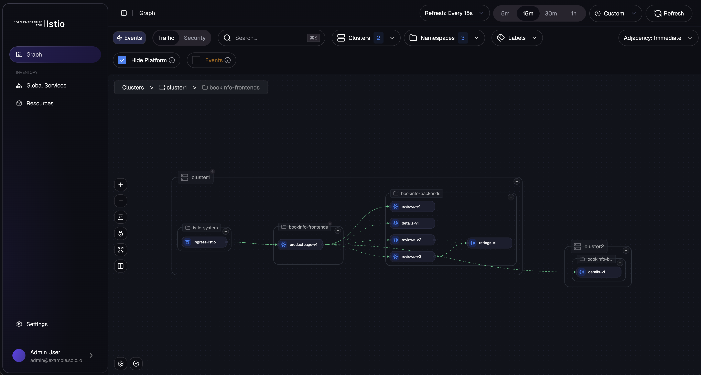
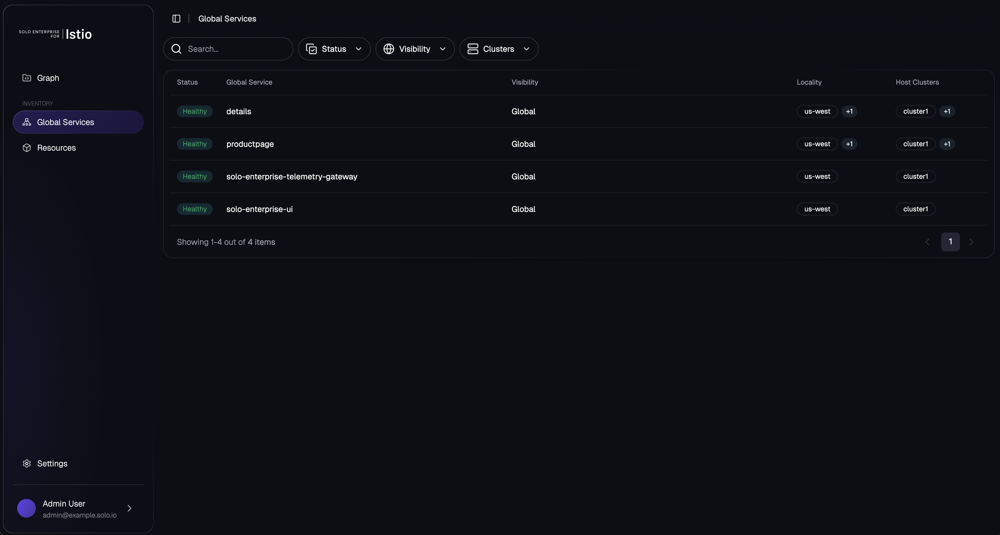
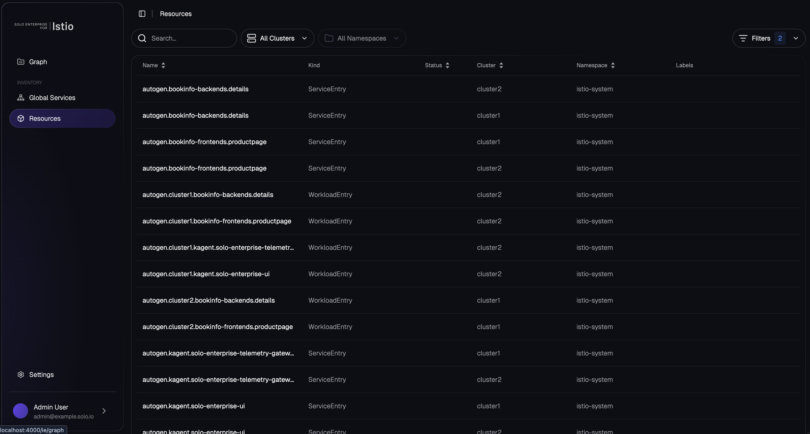

# Install the Solo Management UI on OpenShift

# Objectives
- Install the Solo Management UI on the cluster with the mesh product view
- Configure an OpenShift Route to expose the Solo UI
- Access the Solo Management UI to inspect the mesh







## Prerequisites
- This lab assumes you have completed setup from labs `000-006`

## Set environment variables

```bash
export SOLO_MANAGEMENT_UI_VERSION=0.5.1
export SOLO_MANAGEMENT_UI_OCI_REPO=us-docker.pkg.dev/solo-public/solo-enterprise-helm

export KUBECONTEXT_CLUSTER1=cluster1  # Replace with your actual kubectl context name

# Mesh name from lab 002. This must match global.multiCluster.clusterName, not the kubecontext. On KinD
# the context is "kind-cluster1" while the mesh name is "cluster1". The UI correlates its telemetry
# against the mesh name Istio reports in source_cluster and destination_cluster.
export MESH_NAME_CLUSTER1=cluster1
```

This lab assumes `SOLO_TRIAL_LICENSE_KEY` is already exported from earlier in the workshop.

## OpenShift SCC for ClickHouse

The chart's ClickHouse statefulset runs as UID/GID `101` (the upstream `clickhouse/clickhouse-server` image's `clickhouse` user). OpenShift's default `restricted-v2` SCC rejects this — UIDs must fall in the namespace's auto-assigned range (e.g. `1000760000-1000769999`). Without an `anyuid` binding, the ClickHouse pod is never created (admission denies the statefulset's pod template):
```
provider restricted-v2: .spec.securityContext.fsGroup: Invalid value: []int64{101}: 101 is not an allowed group
provider restricted-v2: .containers[0].runAsUser: Invalid value: 101: must be in the ranges: [1000760000, 1000769999]
```

Pre-grant `anyuid` to the ClickHouse service account (the SCC binding can reference a service account before it exists):
```bash
kubectl create namespace kagent --context $KUBECONTEXT_CLUSTER1 2>/dev/null || true
oc --context $KUBECONTEXT_CLUSTER1 adm policy add-scc-to-user anyuid -z management-clickhouse -n kagent
```

> **Why this is needed:** The other workloads in the chart (`solo-enterprise-ui`, `solo-enterprise-telemetry-collector`) already set `runAsNonRoot: true` with no hardcoded UID, so OpenShift can auto-assign a UID and they run cleanly under `restricted-v2`. Only ClickHouse hardcodes UID `101`.

## Install the Solo Management UI

Install the `management` chart. This installs ClickHouse (telemetry storage), the Solo Enterprise telemetry collector, and the Solo Enterprise UI with the **mesh** product view enabled. The chart enables Istio ambient integration by default — it automatically labels its own pods with `istio.io/dataplane-mode=ambient` so the UI workloads are part of the mesh.

> **OpenShift ambient probes:** With ambient enrollment, kubelet readiness/liveness probes are SNAT-rewritten in the host netns by istio-cni. This only works when OVN-Kubernetes is running in **local gateway mode** (`routingViaHost: true`) — see the OpenShift prerequisite in [002-install-istio.md](002-install-istio.md). On a default OpenShift install (shared gateway mode), the chart's pods will CrashLoop on liveness because every probe times out.

> **Private registry users:** Each component below includes a commented-out `image` override block. Uncomment and update the `registry`, `repository`, and `tag` fields to point to your private registry before running this command. For most users a single `global.image` override is sufficient — the per-component blocks are provided for finer-grained control.

```bash
helm upgrade --install management \
  oci://${SOLO_MANAGEMENT_UI_OCI_REPO}/charts/management \
  --version ${SOLO_MANAGEMENT_UI_VERSION} \
  --namespace kagent \
  --create-namespace \
  --kube-context $KUBECONTEXT_CLUSTER1 \
  --no-hooks \
  -f -<<EOF
cluster: "${MESH_NAME_CLUSTER1}"
# override (global fallback for all solo-owned images)
#global:
#  image:
#    registry: us-docker.pkg.dev/solo-public
#    repository: solo-enterprise
#    tag: ${SOLO_MANAGEMENT_UI_VERSION}
service:
  type: ClusterIP
products:
  kagent:
    enabled: false
  agentgateway:
    enabled: false
  mesh:
    enabled: true
  agentregistry:
    enabled: false
licensing:
  licenseKey: "${SOLO_TRIAL_LICENSE_KEY}"
# Reduce ClickHouse resource requests below chart defaults (2 CPU / 3Gi memory) so the pod schedules on small workshop clusters.
# Remove this block for production deployments. The chart defaults are sized for real telemetry volume.
clickhouse:
  resources:
    requests:
      cpu: 500m
      memory: 1Gi
      ephemeral-storage: 50Mi
    limits:
      cpu: 2
      memory: 4Gi
# override (tunnel server image)
#tunnelserver:
#  registry: us-docker.pkg.dev/solo-public
#  repository: solo-enterprise
#  name: solo-enterprise-tunnel-server
#  tag: ${SOLO_MANAGEMENT_UI_VERSION}
# override (UI images)
#ui:
#  backend:
#    registry: us-docker.pkg.dev/solo-public
#    repository: solo-enterprise
#    name: solo-enterprise-ui-backend
#  frontend:
#    registry: us-docker.pkg.dev/solo-public
#    repository: solo-enterprise
#    name: solo-enterprise-ui-frontend
# override (telemetry collector image)
#telemetry:
#  image:
#    registry: docker.io
#    repository: otel
#    name: opentelemetry-collector-contrib
#    tag: 0.153.0
EOF
```

Wait for the workloads to roll out:

```bash
kubectl rollout status statefulset/management-clickhouse-shard0 \
  -n kagent --context $KUBECONTEXT_CLUSTER1 --timeout=300s
kubectl rollout status statefulset/solo-enterprise-telemetry-collector \
  -n kagent --context $KUBECONTEXT_CLUSTER1 --timeout=300s
kubectl rollout status deployment/solo-enterprise-ui \
  -n kagent --context $KUBECONTEXT_CLUSTER1 --timeout=300s
```

Verify the pods:

```bash
kubectl get pods -n kagent --context $KUBECONTEXT_CLUSTER1
```

The output should look similar to:

```
NAME                                            READY   STATUS    RESTARTS   AGE
management-clickhouse-shard0-0                  1/1     Running   0          90s
solo-enterprise-telemetry-collector-0           1/1     Running   0          90s
solo-enterprise-ui-7c5f8d6b4d-abc12             1/1     Running   0          90s
```

## Configure an OpenShift Route for the Solo UI

Expose the `solo-enterprise-ui` service via an edge-terminated Route:

```bash
kubectl apply --context $KUBECONTEXT_CLUSTER1 -f - <<EOF
kind: Route
apiVersion: route.openshift.io/v1
metadata:
  name: solo-enterprise-ui
  namespace: kagent
spec:
  subdomain: solo-enterprise-ui
  to:
    kind: Service
    name: solo-enterprise-ui
    weight: 100
  port:
    targetPort: http
  tls:
    termination: edge
    insecureEdgeTerminationPolicy: Redirect
  wildcardPolicy: None
EOF
```

Get the public URL (it may take a moment before the UI is reachable through the Route):

```bash
export SOLO_UI_ADDRESS=$(oc get route solo-enterprise-ui -n kagent --context $KUBECONTEXT_CLUSTER1 \
  -o jsonpath='{.status.ingress[0].host}')

echo https://$SOLO_UI_ADDRESS
```

## Access the Solo Management UI

Using the OpenShift Route:

```bash
export SOLO_UI_ADDRESS=$(oc get route solo-enterprise-ui -n kagent --context $KUBECONTEXT_CLUSTER1 \
  -o jsonpath='{.status.ingress[0].host}')

echo https://$SOLO_UI_ADDRESS
```

Or via port-forward:

```bash
kubectl port-forward svc/solo-enterprise-ui -n kagent 8090:80 --context $KUBECONTEXT_CLUSTER1
```

Then navigate to `http://localhost:8090`. The Mesh view should show the bookinfo workloads from earlier labs.

## Adding a second cluster later

This workshop is single-cluster, but the chart is multicluster-ready. To attach a workload cluster:

1. Install Istio Ambient on the second cluster with the same shared root trust (see the multicluster workshop, labs `002-003`).
2. Use `solo-istioctl multicluster expose` and `solo-istioctl multicluster link` to wire east-west connectivity between the two clusters (multicluster workshop lab `006`).
3. Install the `relay` chart on the second cluster pointing at `solo-enterprise-ui.kagent.mesh.internal:9000` and `solo-enterprise-telemetry-gateway.kagent.mesh.internal`. The management chart has already labeled those services with `solo.io/service-scope=global`, so cross-cluster discovery works automatically.

## Next Steps

At this point we have completed the following objectives:
- Installed the Solo Management UI on the cluster with the mesh product view
- Configured an OpenShift Route to expose the Solo UI
- Accessed the Solo Management UI

In the next step `009` we will clean up all workshop resources.
