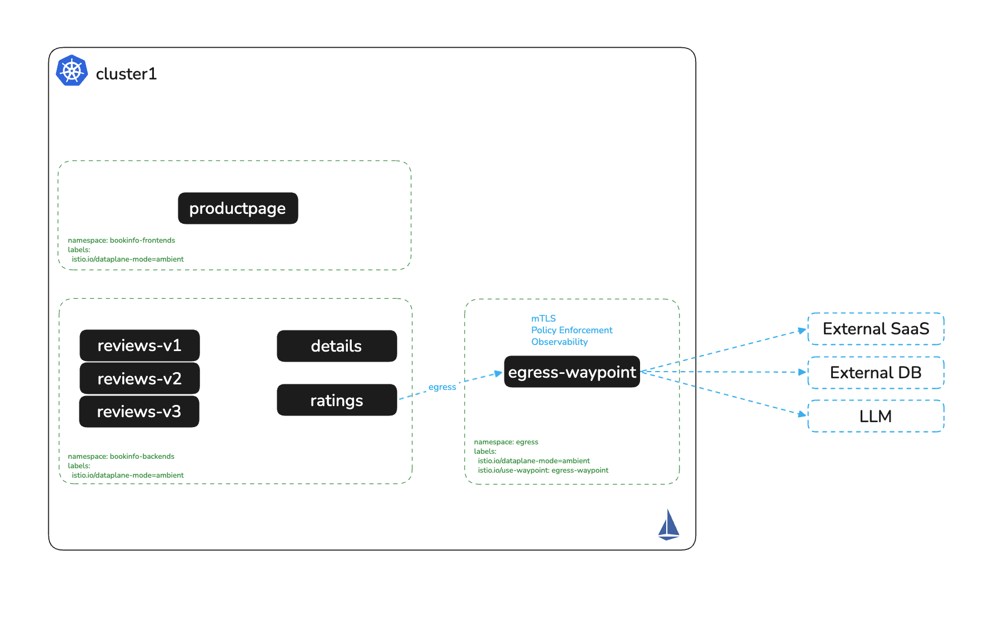

# Egress with Waypoint

# Objectives
- Deploy a shared egress waypoint in a dedicated `egress` namespace
- Route outbound traffic to an external service through the waypoint
- Enable access logging on the egress waypoint
- Enforce egress authorization policies to restrict allowed paths and source principals
- Establish a deny-by-default egress posture at the waypoint
- Build a per-app allowlist to external SaaS providers, so each workload reaches only the services it needs



## Prerequisites
- This lab assumes you have completed setup from labs `000-003`

## Set environment variables

```bash
export KUBECONTEXT_CLUSTER1=cluster1  # Replace with your actual kubectl context name
```

## Deploy the egress namespace and waypoint

Create a dedicated `egress` namespace and deploy a shared Waypoint. This Waypoint serves as a centralized control point for outbound traffic from across the mesh:
```bash
kubectl apply --context $KUBECONTEXT_CLUSTER1 -f - <<EOF
apiVersion: v1
kind: Namespace
metadata:
  labels:
    istio.io/dataplane-mode: ambient
    istio.io/use-waypoint: egress-waypoint
  name: egress
---
apiVersion: gateway.networking.k8s.io/v1
kind: Gateway
metadata:
  name: egress-waypoint
  namespace: egress
spec:
  gatewayClassName: istio-waypoint
  listeners:
  - name: mesh
    port: 15008
    protocol: HBONE
    allowedRoutes:
      namespaces:
        from: All
EOF
```

Wait for the waypoint deployment to be ready:
```bash
kubectl -n egress rollout status deployment/egress-waypoint --context $KUBECONTEXT_CLUSTER1
```

Verify the waypoint pod is running:
```bash
kubectl get pods -n egress --context $KUBECONTEXT_CLUSTER1
```

Expected output:
```
NAME                               READY   STATUS    RESTARTS   AGE
egress-waypoint-54dbfd59bd-sqwd9   1/1     Running   0          8s
```

## Enable access logging on the egress waypoint

```bash
kubectl apply --context $KUBECONTEXT_CLUSTER1 -f - <<EOF
apiVersion: telemetry.istio.io/v1
kind: Telemetry
metadata:
  name: enable-access-logging
  namespace: egress
spec:
  targetRefs:
  - kind: Gateway
    group: gateway.networking.k8s.io
    name: egress-waypoint
  accessLogging:
    - providers:
      - name: envoy
EOF
```

## Define the external service and route traffic through the waypoint

Create a ServiceEntry to represent the external service `jsonplaceholder.typicode.com`. The label `istio.io/use-waypoint` and the placement in the `egress` namespace route traffic for this service through the shared egress waypoint:
```bash
kubectl apply --context $KUBECONTEXT_CLUSTER1 -f - <<EOF
apiVersion: networking.istio.io/v1
kind: ServiceEntry
metadata:
  labels:
    istio.io/use-waypoint: egress-waypoint
  name: jsonplaceholder.typicode.com
  namespace: egress
spec:
  hosts:
  - jsonplaceholder.typicode.com
  ports:
  - name: http
    number: 80
    protocol: HTTP
  resolution: DNS
EOF
```

## Verify traffic flows through the waypoint

Open a terminal to watch egress waypoint logs in real time:
```bash
kubectl logs -n egress deploy/egress-waypoint -f --context $KUBECONTEXT_CLUSTER1
```

In a second terminal, exec into `reviews-v1` and send a request to the external service:
```bash
kubectl exec deploy/reviews-v1 -n bookinfo-backends --context $KUBECONTEXT_CLUSTER1 -- \
  curl -sI jsonplaceholder.typicode.com/posts | grep envoy
```

Expected output. Envoy headers confirm traffic passed through the waypoint:
```
server: istio-envoy
x-envoy-upstream-service-time: 255
x-envoy-decorator-operation: jsonplaceholder.typicode.com:80/*
```

You should also see a corresponding access log entry in the waypoint:
```
[2025-05-22T01:52:13.224Z] "HEAD /posts HTTP/1.1" 200 - via_upstream - "-" 0 0 206 206 "-" "curl/7.81.0" "..." "jsonplaceholder.typicode.com" "104.21.48.1:80" inbound-vip|80|http|jsonplaceholder.typicode.com ...
```

## Enforce egress policy controls

Apply an egress authorization policy that allows only the `reviews` service account to call `GET /posts` on `jsonplaceholder.typicode.com`:
```bash
cat auth-policy/egress-auth.yaml
echo
kubectl apply -f auth-policy/egress-auth.yaml --context $KUBECONTEXT_CLUSTER1
```

**Test 1, allowed:** `reviews-v1` calling the allowed path `/posts`:
```bash
kubectl exec -it deploy/reviews-v1 -n bookinfo-backends --context $KUBECONTEXT_CLUSTER1 -- \
  curl jsonplaceholder.typicode.com/posts
```
This request should succeed with a 200 response.

**Test 2, denied by path:** `reviews-v1` calling a disallowed path `/comments`:
```bash
kubectl exec -it deploy/reviews-v1 -n bookinfo-backends --context $KUBECONTEXT_CLUSTER1 -- \
  curl jsonplaceholder.typicode.com/comments
```
Expected: `RBAC: access denied`. The policy only permits `/posts`.

**Test 3, denied by principal:** `ratings-v1` calling the allowed path:
```bash
kubectl exec -it deploy/ratings-v1 -n bookinfo-backends --context $KUBECONTEXT_CLUSTER1 -- \
  curl jsonplaceholder.typicode.com/posts
```
Expected: `RBAC: access denied`. The policy only permits requests from the `bookinfo-reviews` service account.

Check the egress waypoint logs to see the RBAC deny entries:
```
[2025-05-22T01:57:28.209Z] "GET /posts HTTP/1.1" 403 - rbac_access_denied_matched_policy[none] ...
```

## Register external SaaS providers

Real workloads rarely call a single external service. A more typical requirement is that each app reaches only the SaaS providers it needs: `reviews` talks to Salesforce, `ratings` talks to Zoom, `productpage` talks to Google APIs, and nothing else gets out.

Register three SaaS destinations as ServiceEntries in the `egress` namespace. Unlike `jsonplaceholder`, these are HTTPS services, so the port is `443` and the protocol is `TLS`:
```bash
kubectl apply --context $KUBECONTEXT_CLUSTER1 -f - <<EOF
apiVersion: networking.istio.io/v1
kind: ServiceEntry
metadata:
  labels:
    istio.io/use-waypoint: egress-waypoint
  name: login.salesforce.com
  namespace: egress
spec:
  hosts:
  - login.salesforce.com
  ports:
  - name: https
    number: 443
    protocol: TLS
  resolution: DNS
  location: MESH_EXTERNAL
---
apiVersion: networking.istio.io/v1
kind: ServiceEntry
metadata:
  labels:
    istio.io/use-waypoint: egress-waypoint
  name: zoom.us
  namespace: egress
spec:
  hosts:
  - zoom.us
  ports:
  - name: https
    number: 443
    protocol: TLS
  resolution: DNS
  location: MESH_EXTERNAL
---
apiVersion: networking.istio.io/v1
kind: ServiceEntry
metadata:
  labels:
    istio.io/use-waypoint: egress-waypoint
  name: www.googleapis.com
  namespace: egress
spec:
  hosts:
  - www.googleapis.com
  ports:
  - name: https
    number: 443
    protocol: TLS
  resolution: DNS
  location: MESH_EXTERNAL
EOF
```

Confirm each ServiceEntry attached to the waypoint:
```bash
for h in login.salesforce.com zoom.us www.googleapis.com; do
  echo -n "$h: "
  kubectl get serviceentry $h -n egress --context $KUBECONTEXT_CLUSTER1 \
    -o jsonpath='{.status.conditions[0].reason}'
  echo
done
```

Expected output:
```
login.salesforce.com: WaypointAccepted
zoom.us: WaypointAccepted
www.googleapis.com: WaypointAccepted
```

Because these responses vary by provider and region, the checks below report only the HTTP status code. Any `2xx` or `3xx` means the request reached the provider; `000` means the waypoint refused it.

Send a request from `reviews-v1` to each provider:
```bash
for h in login.salesforce.com zoom.us www.googleapis.com; do
  echo -n "reviews-v1 -> $h : "
  kubectl exec deploy/reviews-v1 -n bookinfo-backends --context $KUBECONTEXT_CLUSTER1 -- \
    sh -c "curl -s -o /dev/null -w '%{http_code}\n' --max-time 10 https://$h/ || true"
done
```

Expected output, with every provider reachable:
```
reviews-v1 -> login.salesforce.com : 200
reviews-v1 -> zoom.us : 301
reviews-v1 -> www.googleapis.com : 404
```

The `jsonplaceholder-egress` policy you applied earlier only protects the ServiceEntry it targets, so it does nothing for these three new hosts. Every workload in the mesh can reach every registered SaaS provider.

## Establish a deny-by-default egress posture

> **`REGISTRY_ONLY` does not work in ambient.** In sidecar mode, setting `outboundTrafficPolicy: REGISTRY_ONLY` in `MeshConfig` blocks traffic to destinations that are not in the service registry. Ztunnel does not read `outboundTrafficPolicy` at all, so in an ambient mesh the setting is silently ignored. Deny-by-default has to be expressed as authorization instead.

An `ALLOW` policy with an empty `rules` list matches nothing, so it denies everything that is not permitted by some other `ALLOW` policy. Targeting the Gateway applies it to all traffic transiting the egress waypoint:
```bash
cat auth-policy/egress-default-deny.yaml
echo
kubectl apply -f auth-policy/egress-default-deny.yaml --context $KUBECONTEXT_CLUSTER1
```

Re-run the same three requests:
```bash
for h in login.salesforce.com zoom.us www.googleapis.com; do
  echo -n "reviews-v1 -> $h : "
  kubectl exec deploy/reviews-v1 -n bookinfo-backends --context $KUBECONTEXT_CLUSTER1 -- \
    sh -c "curl -s -o /dev/null -w '%{http_code}\n' --max-time 10 https://$h/ || true"
done
```

Expected output, with the waypoint now refusing all three:
```
reviews-v1 -> login.salesforce.com : 000
reviews-v1 -> zoom.us : 000
reviews-v1 -> www.googleapis.com : 000
```

Traffic to `jsonplaceholder` still works, because `jsonplaceholder-egress` explicitly permits it:
```bash
kubectl exec deploy/reviews-v1 -n bookinfo-backends --context $KUBECONTEXT_CLUSTER1 -- \
  curl -s -o /dev/null -w '%{http_code}\n' jsonplaceholder.typicode.com/posts
```

Expected: `200`.

> **Why the failure looks different.** For `jsonplaceholder` on port `80` the waypoint speaks HTTP and can return a readable `RBAC: access denied` body. The SaaS entries are `protocol: TLS`, so the waypoint rejects the connection before the TLS handshake completes and there is no HTTP response to read. `curl` reports status `000` and exits `35`.

> An `ALLOW` policy targeting a ServiceEntry activates deny-by-default only for that ServiceEntry: the per-app policies you add next would deny `ratings` → `login.salesforce.com` on their own. This Gateway-scoped policy extends that to every destination behind the waypoint, so a ServiceEntry registered without a matching policy is closed rather than open to the whole mesh.

## Build the per-app allowlist

With deny-by-default in place, each external service needs its own `ALLOW` policy naming the principals permitted to reach it:

| App | Service account | Allowed provider |
|---|---|---|
| `reviews` | `bookinfo-reviews` | `login.salesforce.com` |
| `ratings` | `bookinfo-ratings` | `zoom.us` |
| `productpage` | `bookinfo-productpage` | `www.googleapis.com` |
| `details` | `bookinfo-details` | *none* |

```bash
cat auth-policy/saas-egress-auth.yaml
echo
kubectl apply -f auth-policy/saas-egress-auth.yaml --context $KUBECONTEXT_CLUSTER1
```

> **A broad Gateway-scoped `ALLOW` silently disables the per-app rules.** Istio combines `ALLOW` policies with OR, so one match is enough to permit a request. A policy granting the bookinfo namespaces transit through the waypoint matches everything, so `ratings` reaches Salesforce even though only `reviews` was granted it. The config applies cleanly and the allowed pairs still return `200`, so this only surfaces when you test a pair that should be denied. Grant access on the ServiceEntry.

**Test 1, each app reaches its own provider:**
```bash
echo -n "reviews-v1 -> salesforce : "
kubectl exec deploy/reviews-v1 -n bookinfo-backends --context $KUBECONTEXT_CLUSTER1 -- \
  sh -c "curl -s -o /dev/null -w '%{http_code}\n' --max-time 10 https://login.salesforce.com/ || true"

echo -n "ratings-v1 -> zoom       : "
kubectl exec deploy/ratings-v1 -n bookinfo-backends --context $KUBECONTEXT_CLUSTER1 -- \
  sh -c "curl -s -o /dev/null -w '%{http_code}\n' --max-time 10 https://zoom.us/ || true"
```

Expected:
```
reviews-v1 -> salesforce : 200
ratings-v1 -> zoom       : 301
```

The `productpage` image ships Python rather than `curl`, so use `urllib` there:
```bash
kubectl exec deploy/productpage-v1 -n bookinfo-frontends --context $KUBECONTEXT_CLUSTER1 -- \
  python3 -c "
import urllib.request
try:
    print(urllib.request.urlopen('https://www.googleapis.com/discovery/v1/apis', timeout=10).status)
except Exception as e:
    print('denied:', type(e).__name__)
"
```

Expected: `200`.

**Test 2, an app cannot reach a provider outside its grant.** `reviews` is allowed to call Salesforce, but not Zoom:
```bash
echo -n "reviews-v1 -> zoom : "
kubectl exec deploy/reviews-v1 -n bookinfo-backends --context $KUBECONTEXT_CLUSTER1 -- \
  sh -c "curl -s -o /dev/null -w '%{http_code}\n' --max-time 10 https://zoom.us/ || true"
```

Expected: `000`. `ratings` reaches Zoom from the same namespace, which is what separates a per-app allowlist from a namespace-wide one.

**Test 3, an app with no grant reaches nothing:**
```bash
for h in login.salesforce.com zoom.us www.googleapis.com; do
  echo -n "ratings-v1 -> $h : "
  kubectl exec deploy/ratings-v1 -n bookinfo-backends --context $KUBECONTEXT_CLUSTER1 -- \
    sh -c "curl -s -o /dev/null -w '%{http_code}\n' --max-time 10 https://$h/ || true"
done
```

Expected, with Zoom permitted and everything else refused:
```
ratings-v1 -> login.salesforce.com : 000
ratings-v1 -> zoom.us : 301
ratings-v1 -> www.googleapis.com : 000
```

Check the waypoint logs, which record the two protocols differently:
```bash
kubectl logs -n egress deploy/egress-waypoint --context $KUBECONTEXT_CLUSTER1 --tail=20
```

The SaaS entries appear as `tcp` connections and `jsonplaceholder` as `http`:
```
inbound-vip|443|tcp|login.salesforce.com
inbound-vip|80|http|jsonplaceholder.typicode.com
```

> **L7 policy needs plaintext.** The earlier `jsonplaceholder` policy could match on `methods` and `paths` because that traffic is HTTP and the waypoint parses it. The SaaS connections are TLS, so the waypoint sees only the SNI host and the client identity. That is enough for a host-level allowlist, but `paths` and `methods` have no effect on them. To enforce HTTP rules against an HTTPS provider, the waypoint must originate TLS itself using a `DestinationRule`.

> **Unregistered hosts still escape.** Deny-by-default here covers everything routed through the waypoint. A host with no ServiceEntry never reaches the waypoint at all, so ztunnel passes it straight through. The waypoint denies `ratings` all three providers, yet `ratings` still reaches `https://example.com`. Closing this gap requires a Kubernetes `NetworkPolicy` that blocks application pods from dialing external IPs directly, on a CNI that enforces NetworkPolicy. See [Prevent mesh bypass with network policy](https://docs.solo.io/istio/1.30.x/ambient/traffic-management/egress/ztunnel-egress/#optional-prevent-mesh-bypass-with-network-policy) in the Solo docs.

## Cleanup

```bash
kubectl delete authorizationpolicies -n egress --all --context $KUBECONTEXT_CLUSTER1
kubectl delete serviceentry --all -n egress --context $KUBECONTEXT_CLUSTER1
kubectl delete telemetry enable-access-logging -n egress --context $KUBECONTEXT_CLUSTER1
kubectl delete gateway egress-waypoint -n egress --context $KUBECONTEXT_CLUSTER1
kubectl delete namespace egress --context $KUBECONTEXT_CLUSTER1
```

## Next Steps
At this point we have completed the following objectives:
- Deployed a shared egress waypoint
- Forced outbound traffic through the waypoint and verified via Envoy headers and access logs
- Enforced egress authorization policies by source principal and path
- Established a deny-by-default egress posture with an empty-rules `ALLOW` policy on the waypoint Gateway
- Granted each app access to only its own SaaS provider, and confirmed that the waypoint refuses ungranted app/provider pairs

In the next step `006` we will deploy a waypoint for L7 traffic management.
