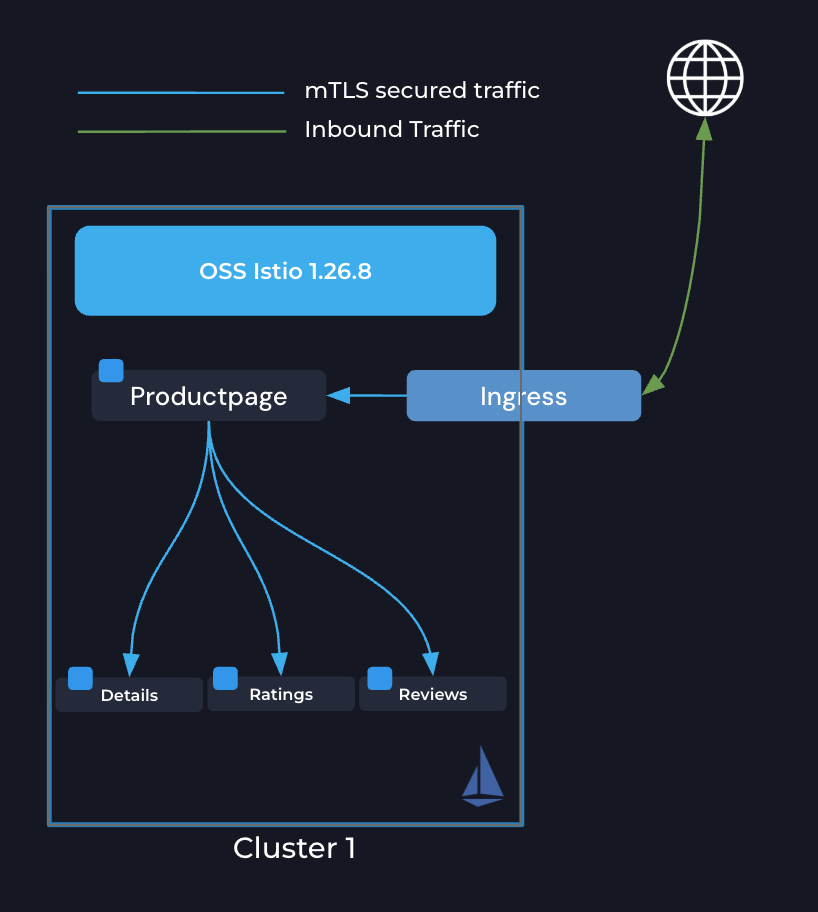

# Install Open-Source Istio (Sidecar Mode)

# Objectives
- Add the community Istio Helm repository
- Install OSS Istio (`istio-base`, `istiod`) in sidecar mode using community charts
- Install Gateway API CRDs
- Validate the install with `kubectl` and `istioctl`



## Prerequisites
- This lab assumes you have read through and completed any setup from the `000` labs

## Set Environment Variables

```bash
export KUBECONTEXT_CLUSTER1=cluster1  # Replace with your actual kubectl context name
export MESH_NAME_CLUSTER1=cluster1    # Recommended to keep as cluster1 for POC
export OSS_ISTIO_VERSION=1.26.8
```

## Add Community Istio Helm Repository

```bash
helm repo add istio https://istio-release.storage.googleapis.com/charts
helm repo update
```

Verify the repo is available:
```bash
helm search repo istio --versions | grep "$OSS_ISTIO_VERSION" | head -5
```

## Install Gateway API CRDs

Install Kubernetes Gateway API CRDs. This command is idempotent — safe to run on any cluster:
```bash
kubectl get crd gateways.gateway.networking.k8s.io --context $KUBECONTEXT_CLUSTER1 &> /dev/null || \
  { kubectl --context $KUBECONTEXT_CLUSTER1 apply -f https://github.com/kubernetes-sigs/gateway-api/releases/download/v1.4.0/standard-install.yaml; }
```

## Create the `istio-system` Namespace

```bash
kubectl create namespace istio-system --context $KUBECONTEXT_CLUSTER1
```

## Install `istio-base`

Install the Istio base chart (CRDs and cluster-scoped resources) from community charts:
```bash
helm upgrade --kube-context $KUBECONTEXT_CLUSTER1 --install istio-base istio/base \
  -n istio-system \
  --version $OSS_ISTIO_VERSION
```

## Install `istiod` (Sidecar Mode)

Install the Istio control plane in default sidecar mode. No ambient profile — this is a standard OSS install using all defaults. This is the realistic starting point: a plain community Istio deployment with no Solo-specific configuration.

```bash
helm upgrade --kube-context $KUBECONTEXT_CLUSTER1 --install istiod istio/istiod \
  -n istio-system \
  --version $OSS_ISTIO_VERSION \
  --wait
```

## Validate the Install

Check that istiod is running:
```bash
kubectl get pods -n istio-system --context $KUBECONTEXT_CLUSTER1
```

Expected output:
```
NAME                      READY   STATUS    RESTARTS   AGE
istiod-<hash>             1/1     Running   0          1m
```


## Next Steps

At this point we have completed the following objectives:
- Installed community Istio Helm repo
- Installed OSS Istio in sidecar mode (no ambient, no Solo)
- Installed Gateway API CRDs

In the next step `002` we will deploy Bookinfo with sidecar injection enabled
