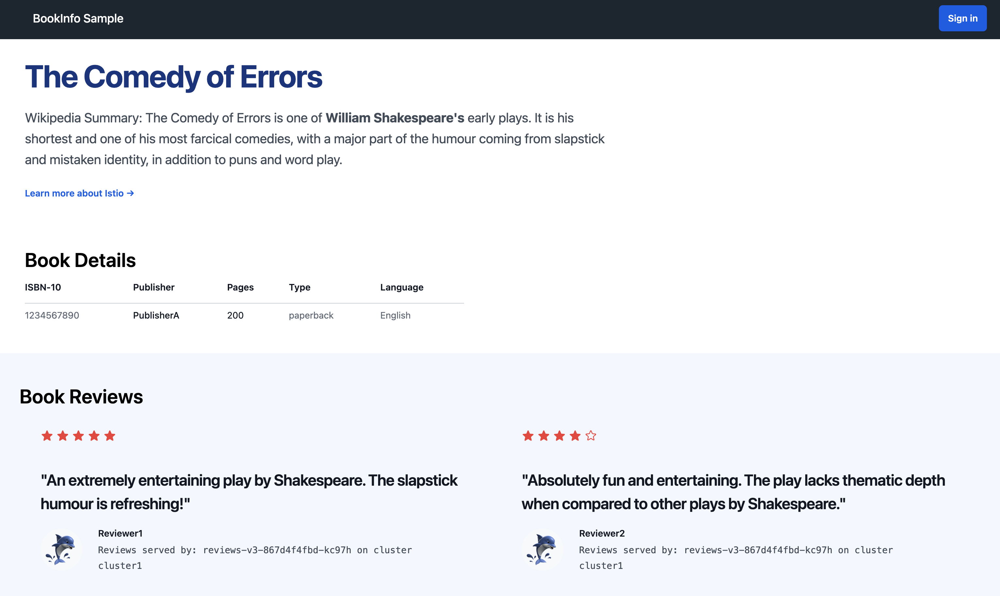

# Deploy Bookinfo with Sidecar Injection

# Objectives
- Label namespaces for automatic sidecar injection
- Deploy the Bookinfo sample application
- Validate that pods show `2/2 READY` (app container + Envoy sidecar)
- Inspect the injected sidecar proxy



## Prerequisites
- This lab assumes you have completed lab `001`

Ensure the following environment variables are set:
```bash
export CLUSTER1=cluster1
```

## Label Namespaces for Sidecar Injection

Enable automatic sidecar injection on both bookinfo namespaces. Istio will inject an Envoy proxy container into every new pod created in these namespaces:
```bash
kubectl create namespace bookinfo-frontends --context $CLUSTER1 || true
kubectl create namespace bookinfo-backends --context $CLUSTER1 || true

kubectl label namespace bookinfo-frontends istio-injection=enabled --context $CLUSTER1
kubectl label namespace bookinfo-backends istio-injection=enabled --context $CLUSTER1
```

Verify the labels are applied:
```bash
kubectl get namespace bookinfo-frontends bookinfo-backends --show-labels --context $CLUSTER1
```

## Deploy Bookinfo Application

Deploy bookinfo frontends (productpage) in bookinfo-frontends namespace:
```bash
kubectl apply -f bookinfo/bookinfo-frontends.yaml --context $CLUSTER1
```

Deploy bookinfo backends (details, ratings, reviews) in bookinfo-backends namespace:
```bash
kubectl apply -f bookinfo/bookinfo-backends.yaml --context $CLUSTER1
```

Wait for all deployments to be ready:
```bash
for deploy in $(kubectl get deploy -n bookinfo-frontends --context $CLUSTER1 -o jsonpath='{.items[*].metadata.name}'); do
  echo "Waiting for frontend deployment '$deploy' to be ready..."
  kubectl rollout status deploy/"$deploy" -n bookinfo-frontends --watch --timeout=90s --context $CLUSTER1
done

for deploy in $(kubectl get deploy -n bookinfo-backends --context $CLUSTER1 -o jsonpath='{.items[*].metadata.name}'); do
  echo "Waiting for backend deployment '$deploy' to be ready..."
  kubectl rollout status deploy/"$deploy" -n bookinfo-backends --watch --timeout=90s --context $CLUSTER1
done
```

## Validate Sidecar Injection

**Key observation:** Pods should show `2/2 READY` — that is the app container plus the injected Envoy sidecar proxy.

```bash
kubectl get pods -n bookinfo-frontends --context $CLUSTER1
kubectl get pods -n bookinfo-backends --context $CLUSTER1
```

Expected output:
```
NAME                             READY   STATUS    RESTARTS   AGE
productpage-v1-<hash>            2/2     Running   0          1m

NAME                             READY   STATUS    RESTARTS   AGE
details-v1-<hash>                2/2     Running   0          1m
ratings-v1-<hash>                2/2     Running   0          1m
reviews-v1-<hash>                2/2     Running   0          1m
reviews-v2-<hash>                2/2     Running   0          1m
reviews-v3-<hash>                2/2     Running   0          1m
```

The `2/2` means two containers per pod: the application container and the Envoy sidecar. After migration to ambient in lab `005`, these will show `1/1`.

Check the proxy status across all sidecar-injected workloads:
```bash
istioctl proxy-status --context $CLUSTER1
```

This shows all Envoy sidecars synced to istiod. Once we migrate to ambient, ztunnel replaces these per-pod proxies.

Inspect the containers in a pod to see the injected sidecar:
```bash
kubectl get pod -n bookinfo-frontends --context $CLUSTER1 \
  -o jsonpath='{range .items[0].spec.containers[*]}{.name}{"\n"}{end}'
```

You should see two containers: `productpage` and `istio-proxy` (the Envoy sidecar).

## Validate Application Access via Port-Forward

Port-forward to the productpage service to confirm the app is working:
```bash
kubectl port-forward svc/productpage -n bookinfo-frontends 9080:9080 --context $CLUSTER1
```

Navigate to http://localhost:9080/productpage or verify with curl:
```bash
curl http://localhost:9080/productpage | grep -o "<title>.*</title>"
```

## Next Steps

At this point we have completed the following objectives:
- Labeled namespaces for automatic sidecar injection
- Deployed Bookinfo with sidecars — pods show `2/2 READY`
- Validated the injected Envoy proxy with `proxy-status`

In the next step `003` we will expose Bookinfo via the Gateway API ingress
