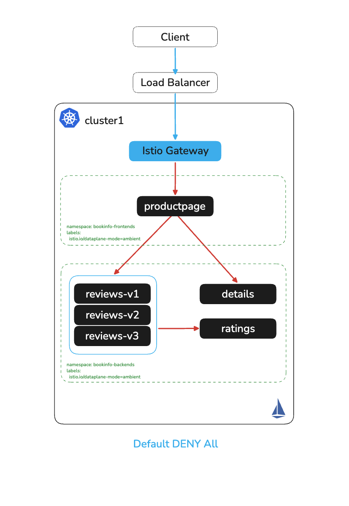
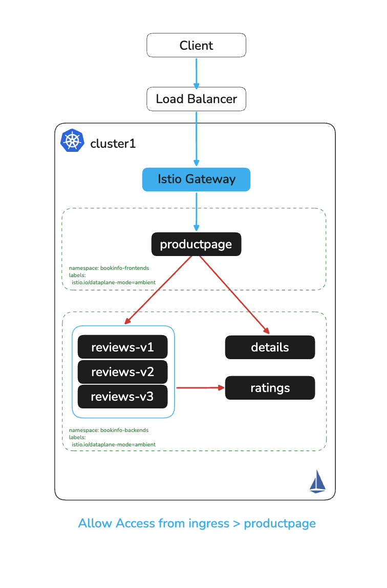
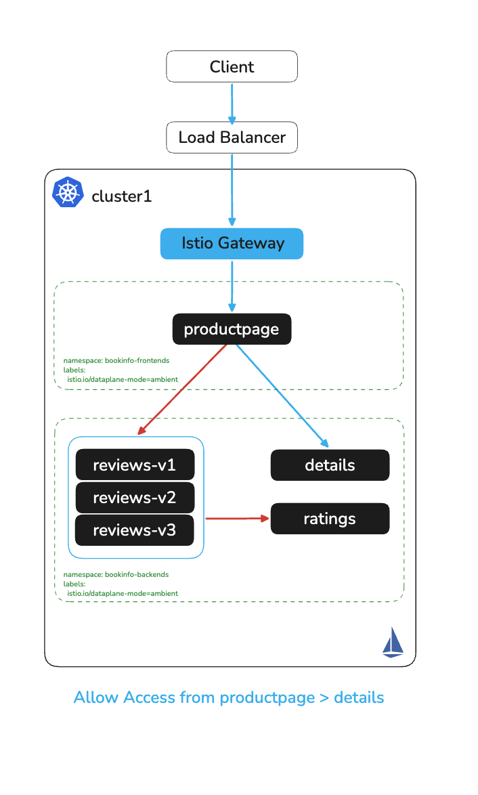
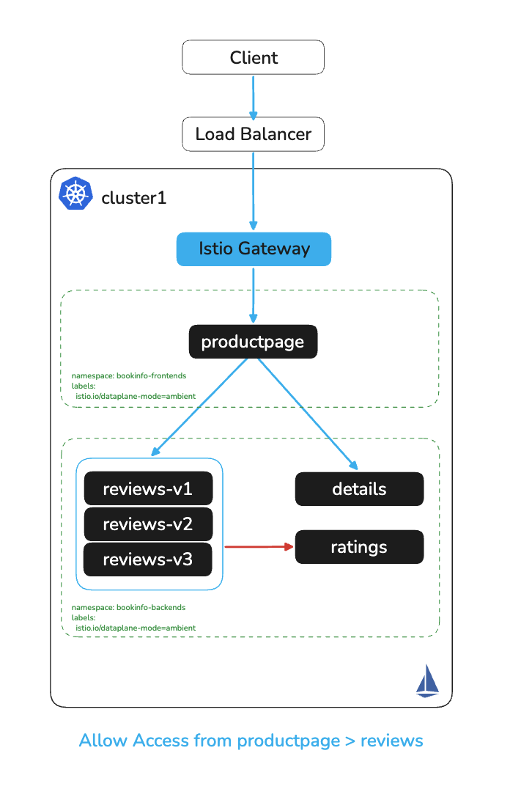
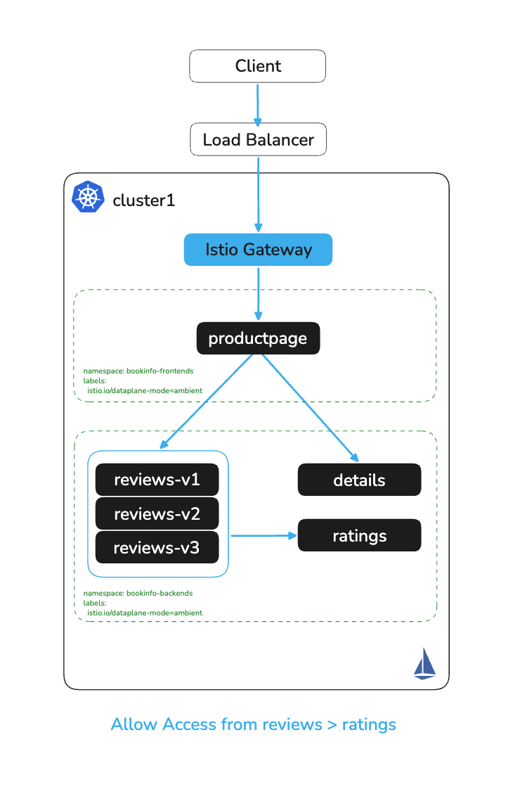

# Enforce Mesh Access Control Policies

# Objectives
- Apply a deny-all authorization policy to establish a zero-trust baseline
- Incrementally allow traffic between bookinfo services using Istio AuthorizationPolicy
- Validate each policy change using the browser or curl
- Observe policy enforcement in ztunnel logs

## Prerequisites
- This lab assumes you have completed labs `000`–`005`
- Bookinfo namespaces are enrolled in ambient mesh (pods show `1/1 READY`, HBONE protocol)

Ensure the following environment variables are set:
```bash
export CLUSTER1=cluster1
```

## Access Control

Bookinfo is a great application to demonstrate access control because it has distinct frontend and backend services, allowing fine-grained policies to be applied and tested across service boundaries.

Because workloads are now in ambient mode, ztunnel enforces all L4 authorization policies. ztunnel intercepts every connection and evaluates whether the source workload identity (SPIFFE) is permitted to reach the destination — without any changes to application code.

Check that the application pods are running in ambient mode:
```bash
kubectl get pods -n bookinfo-frontends --context $CLUSTER1
kubectl get pods -n bookinfo-backends --context $CLUSTER1
```

Set the `SVC` variable to the ingress gateway LoadBalancer address:
```bash
SVC=$(kubectl -n istio-system get svc ingress-istio --context $CLUSTER1 --no-headers | awk '{ print $4 }')
```

> **Important:** Do NOT use `kubectl port-forward` to test authorization policies. Port-forward connects directly to the pod via the Kubernetes API server and bypasses ztunnel entirely — policies will appear to have no effect. You must send traffic through the ingress gateway so it flows through the real network path that ztunnel intercepts.
>
> **No LoadBalancer?** If your cluster has no external LoadBalancer, use port-forward to the *ingress gateway service* (not the productpage service directly), set `SVC=localhost:8080`, and forward the ingress port:
> ```bash
> kubectl port-forward svc/ingress-istio -n istio-system 8080:80 --context $CLUSTER1
> ```
> Traffic through this port-forward still passes through the ingress gateway Envoy → ztunnel → productpage path, so policies ARE enforced.

Navigate to the bookinfo application in your browser:
```bash
echo http://$SVC/productpage
```

Or verify with curl:
```bash
curl -s http://$SVC/productpage | grep -A 10 "Simple Bookstore App"
```

Throughout this lab you can either refresh the browser or use curl to validate each policy change.

### Configure Deny-All Auth Policy

Apply a deny-all authorization policy to both bookinfo namespaces. This establishes a zero-trust baseline — no traffic is allowed until explicitly permitted:
```bash
cat auth-policy/allow-nothing.yaml
echo
kubectl apply -f auth-policy/allow-nothing.yaml --context $CLUSTER1
```

If you refresh the bookinfo page in the browser you should now see `upstream connect error or disconnect/reset before headers. reset reason: connection termination`

Or using curl:
```bash
curl -s http://$SVC/productpage
```

Take a look at the `ztunnel` logs to see the rejection — ztunnel is enforcing the policy at the connection level:
```bash
kubectl logs -n istio-system -l app=ztunnel --context $CLUSTER1 -f --prefix
```



### Allow Access from Istio Ingress to Productpage

Allow the Istio ingress gateway to access productpage:
```bash
cat auth-policy/productpage-auth.yaml
echo
kubectl apply -f auth-policy/productpage-auth.yaml --context $CLUSTER1
```

Refresh the application in the browser — you should now be able to access the productpage app, but notice that the details, ratings, and reviews applications are unavailable.

Or using curl:
```bash
curl -s http://$SVC/productpage | grep -A 10 "Simple Bookstore App"
curl -s http://$SVC/productpage | grep -A 10 details
curl -s http://$SVC/productpage | grep -A 10 reviews
```

Take a look at the `ztunnel` logs — this time you will see a successful connection from the ingress gateway to productpage, but a `401 Unauthorized` for connections from productpage to reviews, ratings, and details:
```bash
kubectl logs -n istio-system -l app=ztunnel --context $CLUSTER1 -f --prefix
```



### Allow Access from Productpage to Details

```bash
cat auth-policy/details-auth.yaml
echo
kubectl apply -f auth-policy/details-auth.yaml --context $CLUSTER1
```

Refresh the application — productpage and details should now be accessible, but ratings and reviews are still unavailable.

Or using curl:
```bash
curl -s http://$SVC/productpage | grep -A 10 "Simple Bookstore App"
curl -s http://$SVC/productpage | grep -A 10 details
curl -s http://$SVC/productpage | grep -A 10 reviews
```



### Allow Access from Productpage to Reviews

```bash
cat auth-policy/reviews-auth.yaml
echo
kubectl apply -f auth-policy/reviews-auth.yaml --context $CLUSTER1
```

Refresh the application — productpage, details, and reviews should now be accessible. Ratings is still blocked (no stars visible).

Or using curl:
```bash
curl -s http://$SVC/productpage | grep -A 10 "Simple Bookstore App"
curl -s http://$SVC/productpage | grep -A 10 details
curl -s http://$SVC/productpage | grep -A 10 reviews
```



### Allow Access from Reviews to Ratings

```bash
cat auth-policy/ratings-auth.yaml
echo
kubectl apply -f auth-policy/ratings-auth.yaml --context $CLUSTER1
```

The application should now be fully accessible. You have established full zero-trust using Istio authorization policies enforced by ztunnel — without sidecars.

Or using curl:
```bash
curl -s http://$SVC/productpage | grep -A 10 "Simple Bookstore App"
curl -s http://$SVC/productpage | grep -A 10 details
curl -s http://$SVC/productpage | grep -A 10 reviews
```



## Cleanup

Remove the authorization policies:
```bash
kubectl delete authorizationpolicies --all -n bookinfo-frontends --context $CLUSTER1
kubectl delete authorizationpolicies --all -n bookinfo-backends --context $CLUSTER1
```

## Next Steps

At this point we have completed the following objectives:
- Applied a deny-all authorization policy for zero-trust baseline
- Incrementally allowed traffic between bookinfo services
- Validated ztunnel log enforcement
- Fully restored application access

In the next step `007` we will configure L7 traffic management with waypoints.
